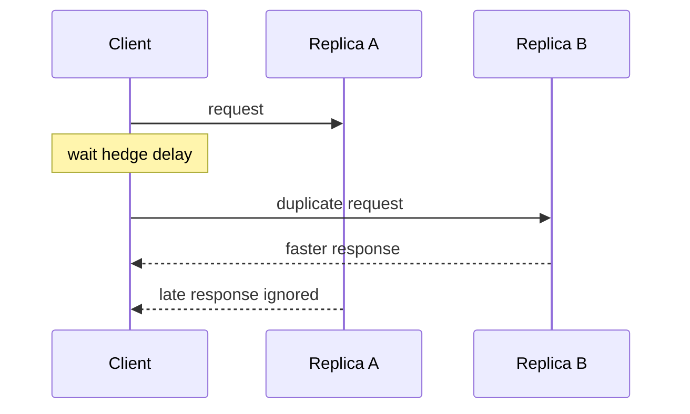
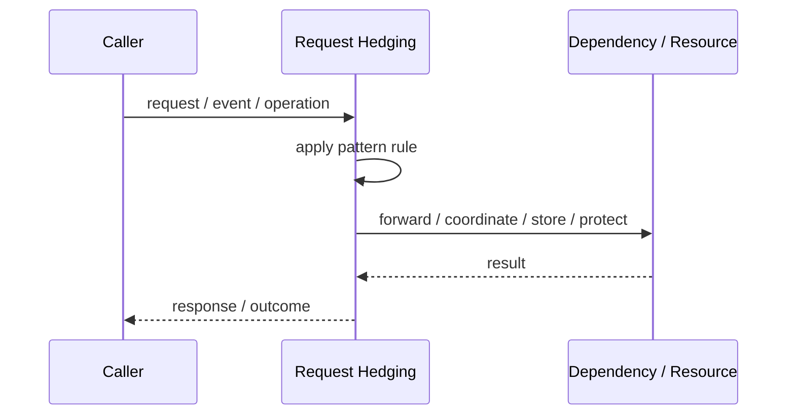
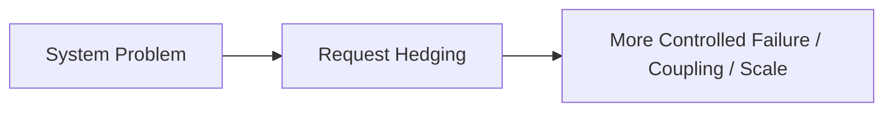

# Request Hedging

## Core Idea

Request Hedging sends a duplicate request after a short delay and uses the first successful response, reducing tail latency at the cost of extra load.

---

## Problem It Solves

Long-tail latency can hurt user experience even when most requests are fast.

---

## 3 Concrete Examples

### Example 1: Search Query Hedging

A search request is duplicated to another replica if the first replica is slow.

### Example 2: Read-Only Profile Lookup

A duplicate read goes to another region after a delay.

### Example 3: Recommendation Service

Slow recommendation calls are hedged to another instance.

---

## Architect Questions

- Is the operation safe to duplicate?
- What delay triggers the hedge?
- How much extra load is acceptable?
- Which response wins?
- How are duplicate side effects prevented?
- Does hedging make overload worse?

---

## Main Diagram



---

## Runtime / Responsibility Flow



---

## Implementation Shape

```txt
1. Identify the exact failure, scaling, coupling, or consistency problem.
2. Define the boundary where this pattern applies.
3. Define ownership: who owns data, policy, configuration, and failure handling.
4. Define the happy path and the failure path.
5. Add observability: logs, metrics, tracing, alerts, and dashboards.
6. Add tests for normal behavior, failure behavior, retry behavior, and edge cases.
7. Keep the pattern focused. Do not let it become a dumping ground for unrelated business logic.
```

---

## When to Use

- Tail latency matters.
- Requests are read-only or safely idempotent.
- Replicas are independent enough that a second request may be faster.

---

## When Not to Use

- Operations have side effects.
- The system is already overloaded.
- Extra duplicate traffic is unacceptable.

---

## Common Smell That Suggests This Pattern

```txt
The current design is failing because one part of the system is overloaded,
too tightly coupled,
not isolated enough,
or not reliable enough under failure.
```

---

## Common Mistakes

```txt
Using the pattern name without enforcing the actual boundary.

Adding distributed-systems complexity before the problem is real.

Ignoring failure modes.

Ignoring duplicate requests or duplicate messages.

Forgetting observability.

Letting the pattern hide business logic instead of clarifying it.
```

---

## Best Visual Summary



## Final Meaning

Request Hedging is useful only when it solves a real architectural pressure. If the pressure is not real yet, this pattern can become unnecessary complexity.
