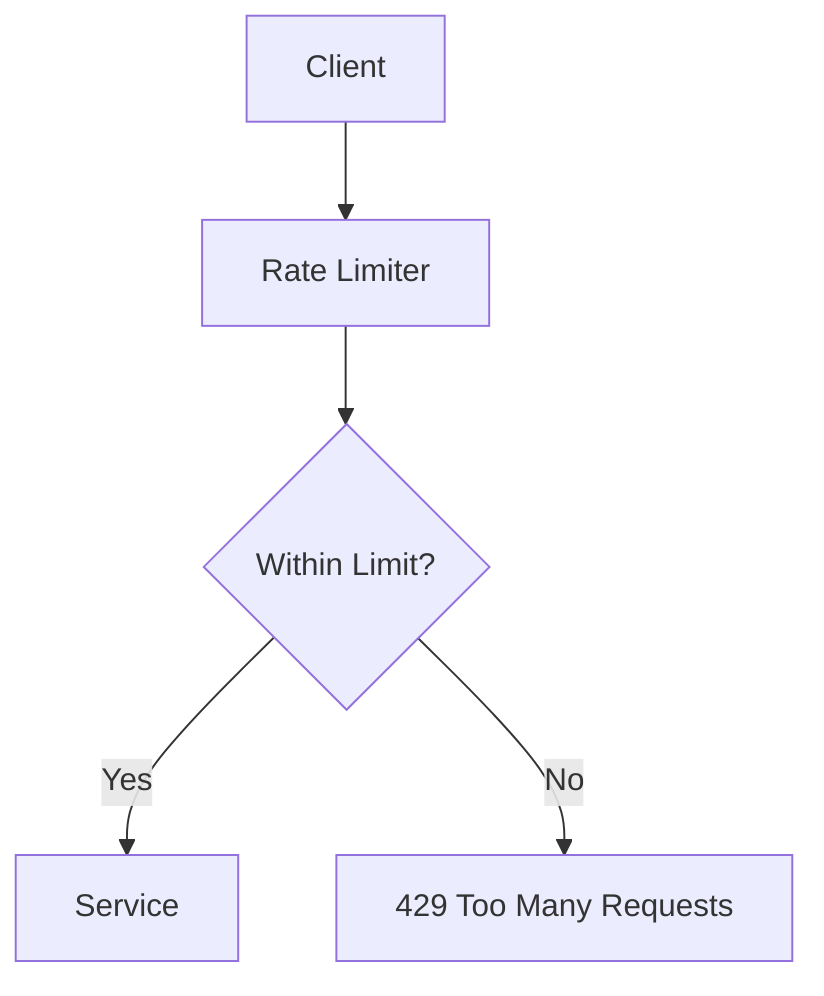
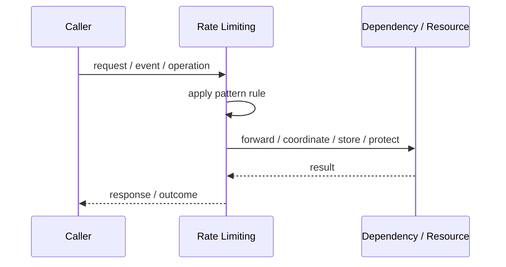
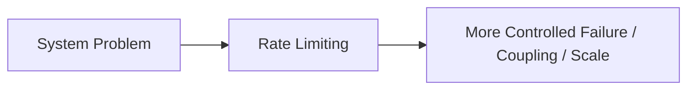

# Rate Limiting

## Core Idea

Rate Limiting restricts how many requests are allowed over a time window or budget.

---

## Problem It Solves

Clients or tenants can send too many requests and degrade service for everyone.

---

## 3 Concrete Examples

### Example 1: Public API Quotas

A partner can make 1,000 requests per minute.

### Example 2: Login Protection

A user can attempt login only a limited number of times.

### Example 3: Tenant Fairness

One tenant cannot consume all shared API capacity.

---

## Architect Questions

- What identity is limited: user, API key, IP, tenant, or route?
- What limit and time window are fair?
- What response is returned when limit is exceeded?
- Should limits be global or per instance?
- Do premium customers get higher limits?
- How are limits monitored and adjusted?

---

## Main Diagram



---

## Runtime / Responsibility Flow



---

## Implementation Shape

```txt
1. Identify the exact failure, scaling, coupling, or consistency problem.
2. Define the boundary where this pattern applies.
3. Define ownership: who owns data, policy, configuration, and failure handling.
4. Define the happy path and the failure path.
5. Add observability: logs, metrics, tracing, alerts, and dashboards.
6. Add tests for normal behavior, failure behavior, retry behavior, and edge cases.
7. Keep the pattern focused. Do not let it become a dumping ground for unrelated business logic.
```

---

## When to Use

- Shared resources need protection.
- APIs are exposed to clients or tenants.
- Fairness and abuse prevention matter.

---

## When Not to Use

- Traffic is fully trusted and low volume.
- Limits would break critical internal workflows.
- You cannot identify callers reliably.

---

## Common Smell That Suggests This Pattern

```txt
The current design is failing because one part of the system is overloaded,
too tightly coupled,
not isolated enough,
or not reliable enough under failure.
```

---

## Common Mistakes

```txt
Using the pattern name without enforcing the actual boundary.

Adding distributed-systems complexity before the problem is real.

Ignoring failure modes.

Ignoring duplicate requests or duplicate messages.

Forgetting observability.

Letting the pattern hide business logic instead of clarifying it.
```

---

## Best Visual Summary



## Final Meaning

Rate Limiting is useful only when it solves a real architectural pressure. If the pressure is not real yet, this pattern can become unnecessary complexity.
