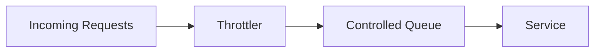
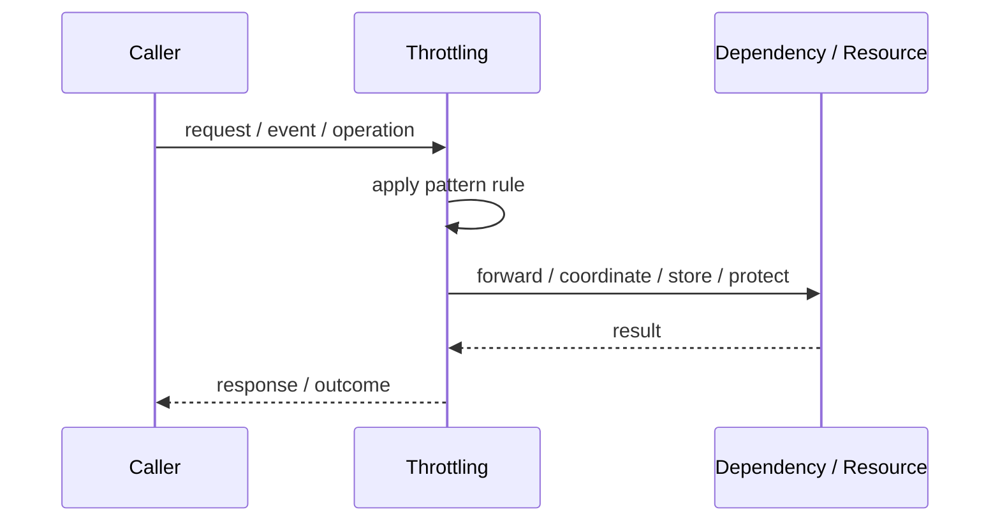
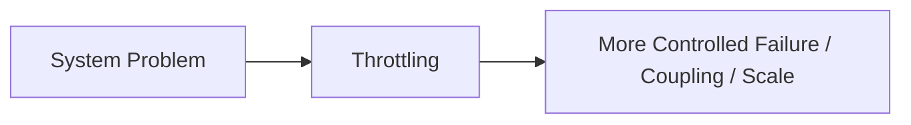

# Throttling

## Core Idea

Throttling controls request throughput by delaying, shaping, or rejecting work when the system is under pressure.

---

## Problem It Solves

A system needs to slow down request processing to protect resources or maintain stability.

---

## 3 Concrete Examples

### Example 1: Background Job Throttling

A worker processes only 100 jobs per second.

### Example 2: Upload Throttling

Large file uploads are slowed during peak traffic.

### Example 3: Downstream Protection

A service limits calls to a slow dependency.

---

## Architect Questions

- Should requests be delayed or rejected?
- What resource is being protected?
- Is throttling static or adaptive?
- Who gets priority when capacity is low?
- How is backpressure communicated?
- How is user experience affected?

---

## Main Diagram



---

## Runtime / Responsibility Flow



---

## Implementation Shape

```txt
1. Identify the exact failure, scaling, coupling, or consistency problem.
2. Define the boundary where this pattern applies.
3. Define ownership: who owns data, policy, configuration, and failure handling.
4. Define the happy path and the failure path.
5. Add observability: logs, metrics, tracing, alerts, and dashboards.
6. Add tests for normal behavior, failure behavior, retry behavior, and edge cases.
7. Keep the pattern focused. Do not let it become a dumping ground for unrelated business logic.
```

---

## When to Use

- You need controlled throughput.
- Downstream systems need protection.
- Delaying work is acceptable.

---

## When Not to Use

- Requests must be processed immediately.
- Queues could grow without bound.
- Rejecting with rate limits would be clearer.

---

## Common Smell That Suggests This Pattern

```txt
The current design is failing because one part of the system is overloaded,
too tightly coupled,
not isolated enough,
or not reliable enough under failure.
```

---

## Common Mistakes

```txt
Using the pattern name without enforcing the actual boundary.

Adding distributed-systems complexity before the problem is real.

Ignoring failure modes.

Ignoring duplicate requests or duplicate messages.

Forgetting observability.

Letting the pattern hide business logic instead of clarifying it.
```

---

## Best Visual Summary



## Final Meaning

Throttling is useful only when it solves a real architectural pressure. If the pressure is not real yet, this pattern can become unnecessary complexity.
