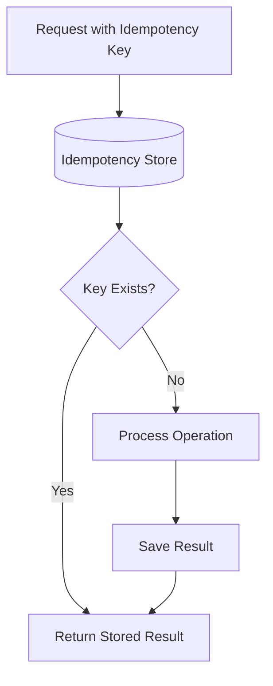
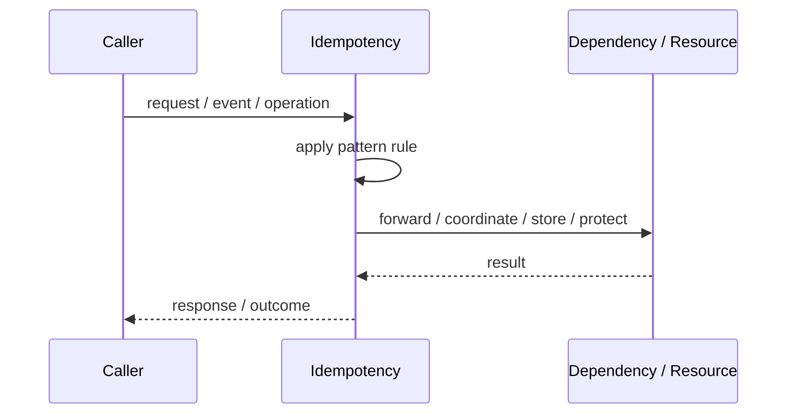
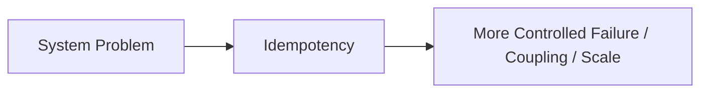

# Idempotency

## Core Idea

Idempotency ensures the same request can be repeated without changing the result after the first successful execution.

---

## Problem It Solves

Retries or duplicate requests can accidentally perform the same operation multiple times.

---

## 3 Concrete Examples

### Example 1: Payment Charge

Same idempotency key prevents charging a customer twice.

### Example 2: Order Creation

Duplicate create-order requests return the same order.

### Example 3: Message Consumer

Processing the same event twice does not create duplicate side effects.

---

## Architect Questions

- Which operations may be repeated?
- What key identifies the logical operation?
- Where are request outcomes stored?
- How long should idempotency records live?
- What response should duplicates receive?
- How are partial failures handled?

---

## Main Diagram



---

## Runtime / Responsibility Flow



---

## Implementation Shape

```txt
1. Identify the exact failure, scaling, coupling, or consistency problem.
2. Define the boundary where this pattern applies.
3. Define ownership: who owns data, policy, configuration, and failure handling.
4. Define the happy path and the failure path.
5. Add observability: logs, metrics, tracing, alerts, and dashboards.
6. Add tests for normal behavior, failure behavior, retry behavior, and edge cases.
7. Keep the pattern focused. Do not let it become a dumping ground for unrelated business logic.
```

---

## When to Use

- Clients retry requests.
- Operations have side effects.
- Duplicate execution would be harmful.

---

## When Not to Use

- Operations are naturally read-only.
- There is no stable operation key.
- The system cannot store operation results or status.

---

## Common Smell That Suggests This Pattern

```txt
The current design is failing because one part of the system is overloaded,
too tightly coupled,
not isolated enough,
or not reliable enough under failure.
```

---

## Common Mistakes

```txt
Using the pattern name without enforcing the actual boundary.

Adding distributed-systems complexity before the problem is real.

Ignoring failure modes.

Ignoring duplicate requests or duplicate messages.

Forgetting observability.

Letting the pattern hide business logic instead of clarifying it.
```

---

## Best Visual Summary



## Final Meaning

Idempotency is useful only when it solves a real architectural pressure. If the pressure is not real yet, this pattern can become unnecessary complexity.
