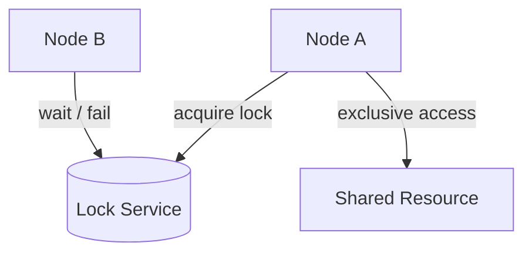
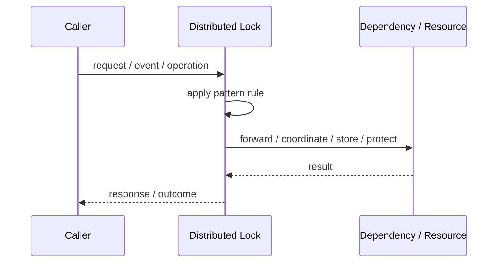
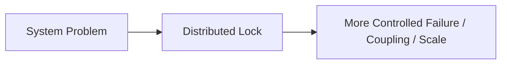

# Distributed Lock

## Core Idea

A Distributed Lock coordinates access across processes or machines so only one actor holds the lock at a time.

---

## Problem It Solves

Multiple nodes need exclusive access to a shared resource or critical section.

---

## 3 Concrete Examples

### Example 1: Single Job Runner

Only one instance processes a scheduled job.

### Example 2: Inventory Reservation

Only one process modifies a scarce inventory item at a time.

### Example 3: Migration Guard

Only one node runs a schema/data migration.

---

## Architect Questions

- What resource requires exclusive access?
- How is the lock acquired and released?
- Does the lock have a timeout or lease?
- How is stale lock ownership handled?
- Do we need fencing tokens?
- Can the operation be redesigned to avoid locking?

---

## Main Diagram



---

## Runtime / Responsibility Flow



---

## Implementation Shape

```txt
1. Identify the exact failure, scaling, coupling, or consistency problem.
2. Define the boundary where this pattern applies.
3. Define ownership: who owns data, policy, configuration, and failure handling.
4. Define the happy path and the failure path.
5. Add observability: logs, metrics, tracing, alerts, and dashboards.
6. Add tests for normal behavior, failure behavior, retry behavior, and edge cases.
7. Keep the pattern focused. Do not let it become a dumping ground for unrelated business logic.
```

---

## When to Use

- Exclusive access is necessary.
- A reliable coordination store exists.
- Critical sections are short and controlled.

---

## When Not to Use

- You can use optimistic concurrency instead.
- Long-running locks are needed.
- Lock failure would corrupt data.

---

## Common Smell That Suggests This Pattern

```txt
The current design is failing because one part of the system is overloaded,
too tightly coupled,
not isolated enough,
or not reliable enough under failure.
```

---

## Common Mistakes

```txt
Using the pattern name without enforcing the actual boundary.

Adding distributed-systems complexity before the problem is real.

Ignoring failure modes.

Ignoring duplicate requests or duplicate messages.

Forgetting observability.

Letting the pattern hide business logic instead of clarifying it.
```

---

## Best Visual Summary



## Final Meaning

Distributed Lock is useful only when it solves a real architectural pressure. If the pressure is not real yet, this pattern can become unnecessary complexity.
