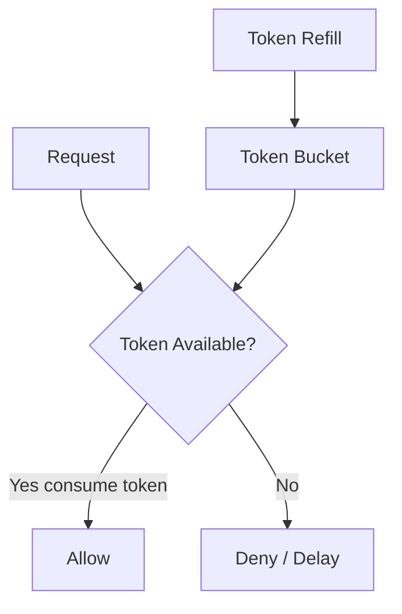
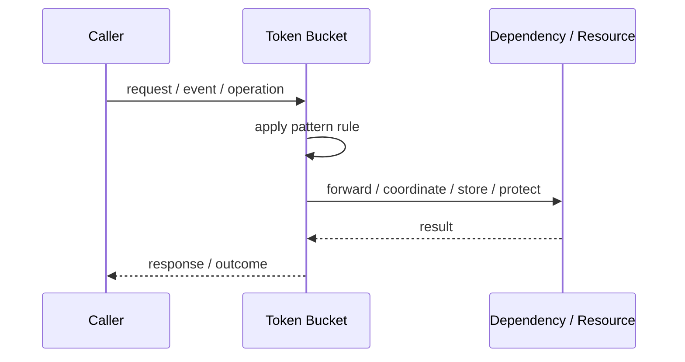
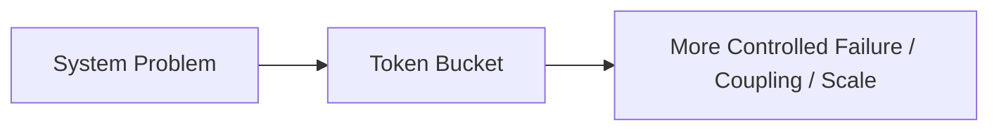

# Token Bucket

## Core Idea

Token Bucket adds tokens at a fixed rate. Requests consume tokens. If tokens are available, requests pass; if not, they are rejected or delayed.

---

## Problem It Solves

A system needs rate limiting that allows bursts up to a limit while maintaining an average rate.

---

## 3 Concrete Examples

### Example 1: API Burst Control

A client can burst briefly but is limited over time.

### Example 2: Upload Bandwidth Control

A user can send bursts while staying within average bandwidth.

### Example 3: Tenant Request Budget

Each tenant receives tokens at a configured rate.

---

## Architect Questions

- What is the token refill rate?
- What is the bucket capacity?
- How many tokens does each request cost?
- Are requests rejected or queued when empty?
- Is the bucket per user, tenant, IP, or route?
- Does the limiter need to be distributed?

---

## Main Diagram



---

## Runtime / Responsibility Flow



---

## Implementation Shape

```txt
1. Identify the exact failure, scaling, coupling, or consistency problem.
2. Define the boundary where this pattern applies.
3. Define ownership: who owns data, policy, configuration, and failure handling.
4. Define the happy path and the failure path.
5. Add observability: logs, metrics, tracing, alerts, and dashboards.
6. Add tests for normal behavior, failure behavior, retry behavior, and edge cases.
7. Keep the pattern focused. Do not let it become a dumping ground for unrelated business logic.
```

---

## When to Use

- Bursts should be allowed.
- Average rate must be controlled.
- Caller-specific quotas are needed.

---

## When Not to Use

- Traffic must be smoothed strictly with no bursts.
- A simple fixed window is sufficient.
- Distributed coordination overhead is too high.

---

## Common Smell That Suggests This Pattern

```txt
The current design is failing because one part of the system is overloaded,
too tightly coupled,
not isolated enough,
or not reliable enough under failure.
```

---

## Common Mistakes

```txt
Using the pattern name without enforcing the actual boundary.

Adding distributed-systems complexity before the problem is real.

Ignoring failure modes.

Ignoring duplicate requests or duplicate messages.

Forgetting observability.

Letting the pattern hide business logic instead of clarifying it.
```

---

## Best Visual Summary



## Final Meaning

Token Bucket is useful only when it solves a real architectural pressure. If the pressure is not real yet, this pattern can become unnecessary complexity.
