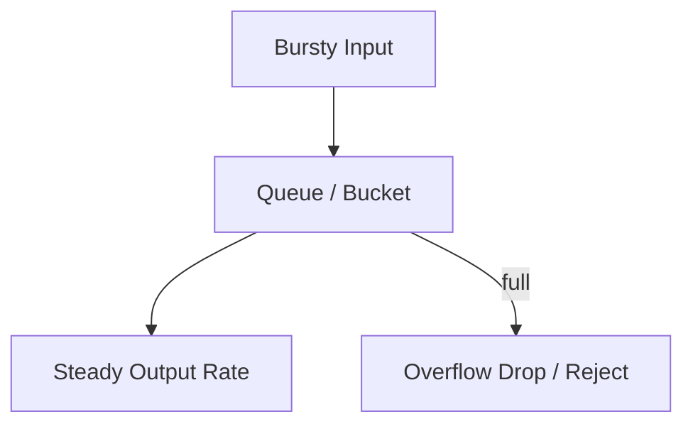
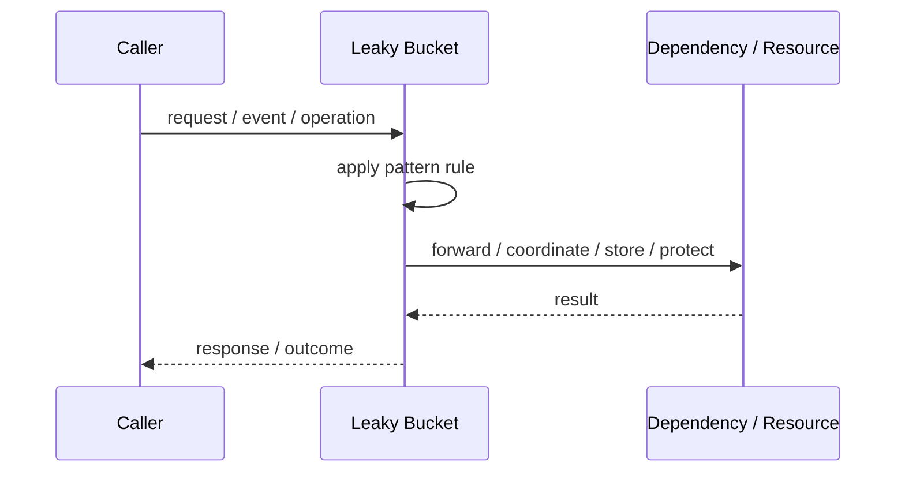
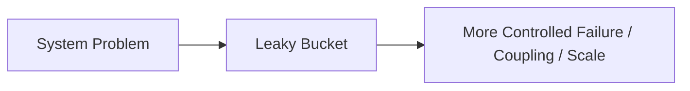

# Leaky Bucket

## Core Idea

Leaky Bucket queues incoming requests and releases them at a fixed rate. Excess requests overflow and are dropped or rejected.

---

## Problem It Solves

Bursty traffic must be smoothed into a steady output rate.

---

## 3 Concrete Examples

### Example 1: Smooth API Calls to Downstream

Requests are drained toward a legacy API at a steady rate.

### Example 2: Network Traffic Shaping

Bursty packets are smoothed to a stable output rate.

### Example 3: Job Dispatch Control

Jobs are accepted quickly but processed at a controlled rate.

---

## Architect Questions

- What output rate is safe?
- How large can the queue be?
- What happens when the bucket overflows?
- Is latency from queueing acceptable?
- Which requests get priority?
- Do callers receive backpressure?

---

## Main Diagram



---

## Runtime / Responsibility Flow



---

## Implementation Shape

```txt
1. Identify the exact failure, scaling, coupling, or consistency problem.
2. Define the boundary where this pattern applies.
3. Define ownership: who owns data, policy, configuration, and failure handling.
4. Define the happy path and the failure path.
5. Add observability: logs, metrics, tracing, alerts, and dashboards.
6. Add tests for normal behavior, failure behavior, retry behavior, and edge cases.
7. Keep the pattern focused. Do not let it become a dumping ground for unrelated business logic.
```

---

## When to Use

- You need steady output.
- Downstream cannot handle bursts.
- Queueing delay is acceptable.

---

## When Not to Use

- Bursts should be allowed.
- Low latency is more important than smoothing.
- Queues could grow and hide overload.

---

## Common Smell That Suggests This Pattern

```txt
The current design is failing because one part of the system is overloaded,
too tightly coupled,
not isolated enough,
or not reliable enough under failure.
```

---

## Common Mistakes

```txt
Using the pattern name without enforcing the actual boundary.

Adding distributed-systems complexity before the problem is real.

Ignoring failure modes.

Ignoring duplicate requests or duplicate messages.

Forgetting observability.

Letting the pattern hide business logic instead of clarifying it.
```

---

## Best Visual Summary



## Final Meaning

Leaky Bucket is useful only when it solves a real architectural pressure. If the pressure is not real yet, this pattern can become unnecessary complexity.
