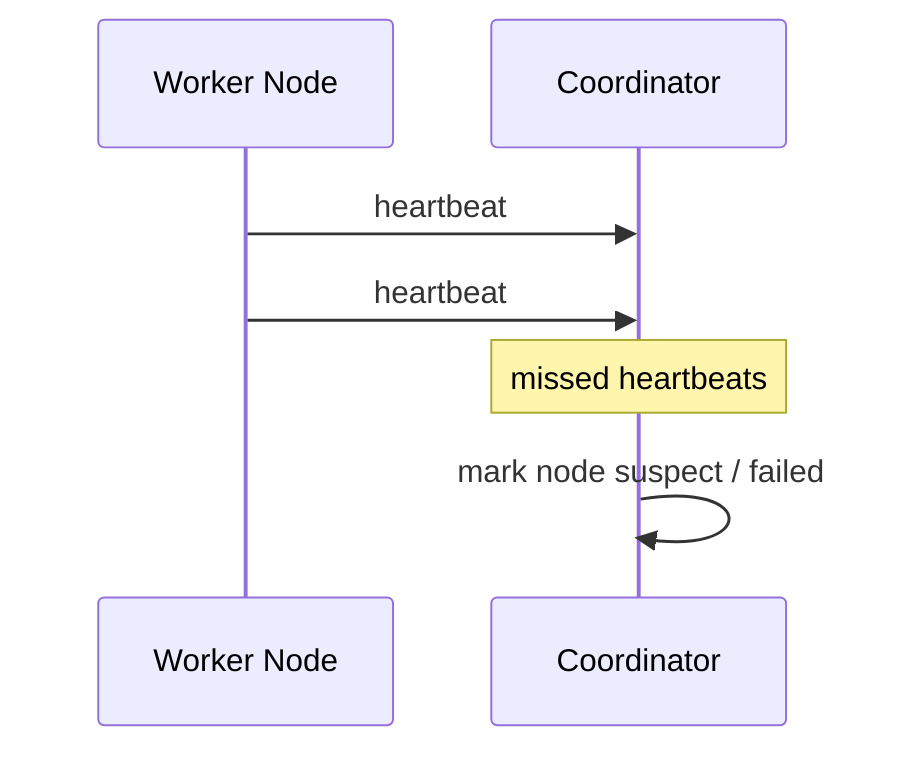
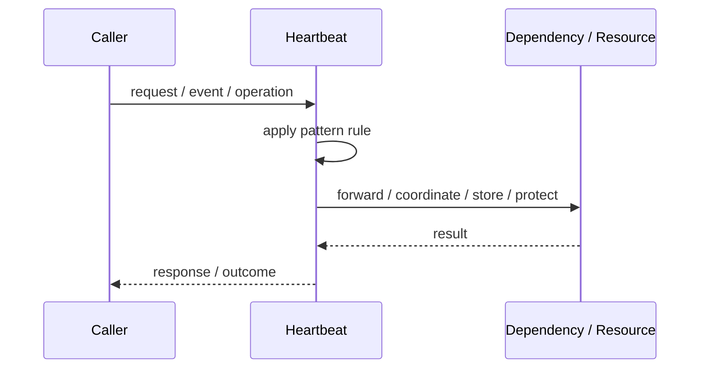
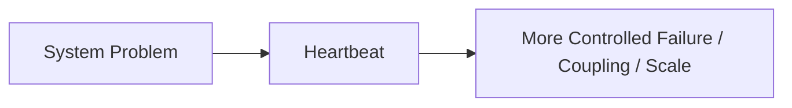

# Heartbeat

## Core Idea

Heartbeat sends periodic signals from one component to another. Missing heartbeats indicate possible failure.

---

## Problem It Solves

Distributed nodes need to detect whether other nodes are alive or failed.

---

## 3 Concrete Examples

### Example 1: Worker Health

Workers send heartbeats to a coordinator.

### Example 2: Cluster Membership

Nodes monitor each other for liveness.

### Example 3: IoT Device Monitoring

Devices periodically report they are online.

---

## Architect Questions

- Who sends heartbeats to whom?
- What interval is used?
- How many missed heartbeats indicate failure?
- What false positives are acceptable?
- What recovery action happens after failure detection?
- How are network partitions handled?

---

## Main Diagram



---

## Runtime / Responsibility Flow



---

## Implementation Shape

```txt
1. Identify the exact failure, scaling, coupling, or consistency problem.
2. Define the boundary where this pattern applies.
3. Define ownership: who owns data, policy, configuration, and failure handling.
4. Define the happy path and the failure path.
5. Add observability: logs, metrics, tracing, alerts, and dashboards.
6. Add tests for normal behavior, failure behavior, retry behavior, and edge cases.
7. Keep the pattern focused. Do not let it become a dumping ground for unrelated business logic.
```

---

## When to Use

- Liveness detection is needed.
- Nodes or devices can disappear.
- A coordinator or peers need failure signals.

---

## When Not to Use

- Failure detection must be perfectly accurate.
- Network delays make false positives unacceptable.
- Passive health checks are enough.

---

## Common Smell That Suggests This Pattern

```txt
The current design is failing because one part of the system is overloaded,
too tightly coupled,
not isolated enough,
or not reliable enough under failure.
```

---

## Common Mistakes

```txt
Using the pattern name without enforcing the actual boundary.

Adding distributed-systems complexity before the problem is real.

Ignoring failure modes.

Ignoring duplicate requests or duplicate messages.

Forgetting observability.

Letting the pattern hide business logic instead of clarifying it.
```

---

## Best Visual Summary



## Final Meaning

Heartbeat is useful only when it solves a real architectural pressure. If the pressure is not real yet, this pattern can become unnecessary complexity.
