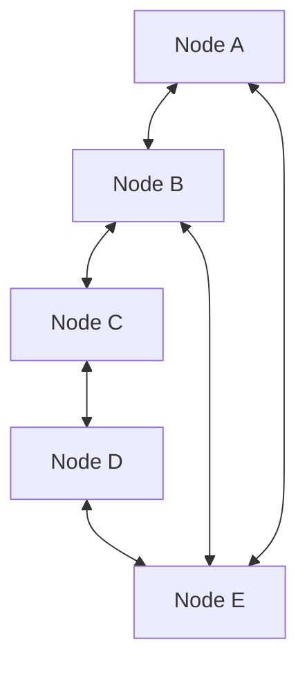
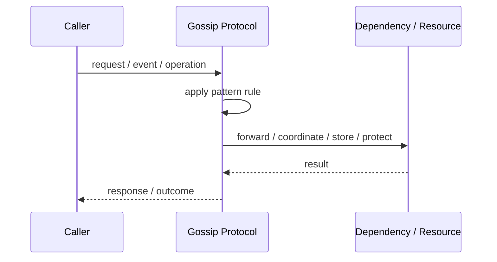
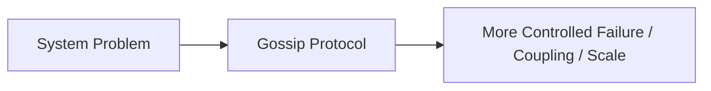

# Gossip Protocol

## Core Idea

Gossip Protocol spreads information by having nodes periodically exchange state with random peers.

---

## Problem It Solves

Cluster state needs to spread across many nodes without relying on one central coordinator.

---

## 3 Concrete Examples

### Example 1: Cluster Membership

Nodes gossip which members are alive.

### Example 2: Configuration Spread

Config updates propagate gradually across nodes.

### Example 3: Failure Suspicion

Nodes share suspected failures with peers.

---

## Architect Questions

- What information should be gossiped?
- How often should nodes gossip?
- How are peers selected?
- How is stale or conflicting state resolved?
- How fast must convergence happen?
- How much network overhead is acceptable?

---

## Main Diagram



---

## Runtime / Responsibility Flow



---

## Implementation Shape

```txt
1. Identify the exact failure, scaling, coupling, or consistency problem.
2. Define the boundary where this pattern applies.
3. Define ownership: who owns data, policy, configuration, and failure handling.
4. Define the happy path and the failure path.
5. Add observability: logs, metrics, tracing, alerts, and dashboards.
6. Add tests for normal behavior, failure behavior, retry behavior, and edge cases.
7. Keep the pattern focused. Do not let it become a dumping ground for unrelated business logic.
```

---

## When to Use

- Large clusters need decentralized state spread.
- Eventual convergence is acceptable.
- Central coordination should be avoided.

---

## When Not to Use

- Immediate consistency is required.
- The cluster is small and centralized state is simpler.
- Network overhead must be minimal.

---

## Common Smell That Suggests This Pattern

```txt
The current design is failing because one part of the system is overloaded,
too tightly coupled,
not isolated enough,
or not reliable enough under failure.
```

---

## Common Mistakes

```txt
Using the pattern name without enforcing the actual boundary.

Adding distributed-systems complexity before the problem is real.

Ignoring failure modes.

Ignoring duplicate requests or duplicate messages.

Forgetting observability.

Letting the pattern hide business logic instead of clarifying it.
```

---

## Best Visual Summary



## Final Meaning

Gossip Protocol is useful only when it solves a real architectural pressure. If the pressure is not real yet, this pattern can become unnecessary complexity.
