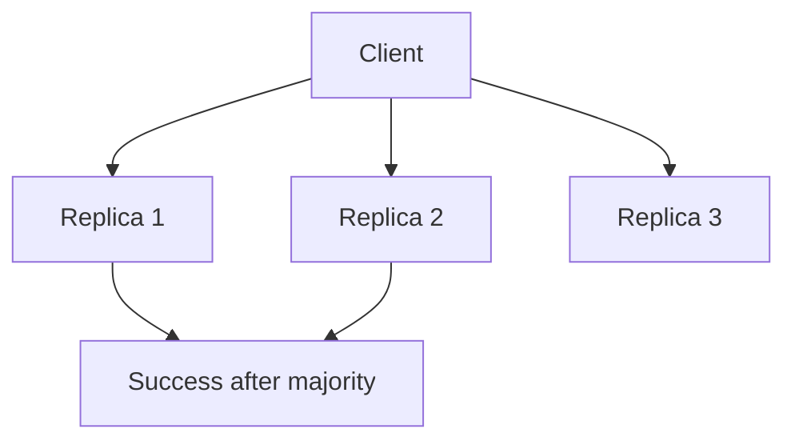
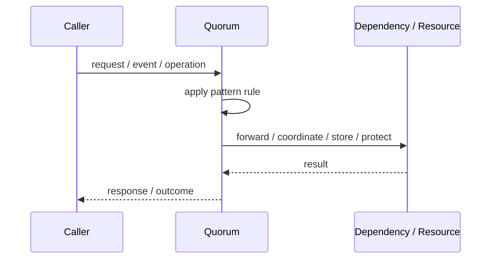
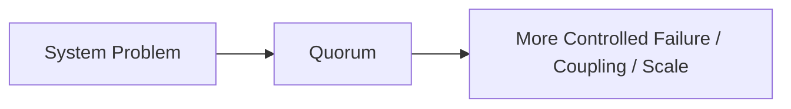

# Quorum

## Core Idea

Quorum requires a minimum number of participants to respond or agree before an operation succeeds.

---

## Problem It Solves

A distributed system needs enough nodes to agree before accepting a read, write, or decision.

---

## 3 Concrete Examples

### Example 1: Replicated Database Write

A write succeeds after 2 of 3 replicas acknowledge.

### Example 2: Leader Election

A candidate wins after majority votes.

### Example 3: Distributed Read

A read uses enough replicas to avoid stale data under configured consistency.

---

## Architect Questions

- What quorum size is required?
- How many failures must be tolerated?
- Are reads and writes quorum-based?
- What consistency level is needed?
- What happens if quorum cannot be reached?
- How are stale replicas repaired?

---

## Main Diagram



---

## Runtime / Responsibility Flow



---

## Implementation Shape

```txt
1. Identify the exact failure, scaling, coupling, or consistency problem.
2. Define the boundary where this pattern applies.
3. Define ownership: who owns data, policy, configuration, and failure handling.
4. Define the happy path and the failure path.
5. Add observability: logs, metrics, tracing, alerts, and dashboards.
6. Add tests for normal behavior, failure behavior, retry behavior, and edge cases.
7. Keep the pattern focused. Do not let it become a dumping ground for unrelated business logic.
```

---

## When to Use

- Replicated systems need consistency control.
- You can tolerate some node failures.
- Majority agreement is meaningful.

---

## When Not to Use

- Single-node systems.
- Low latency is more important than consistency.
- Network partitions are common and quorum failures would be unacceptable.

---

## Common Smell That Suggests This Pattern

```txt
The current design is failing because one part of the system is overloaded,
too tightly coupled,
not isolated enough,
or not reliable enough under failure.
```

---

## Common Mistakes

```txt
Using the pattern name without enforcing the actual boundary.

Adding distributed-systems complexity before the problem is real.

Ignoring failure modes.

Ignoring duplicate requests or duplicate messages.

Forgetting observability.

Letting the pattern hide business logic instead of clarifying it.
```

---

## Best Visual Summary



## Final Meaning

Quorum is useful only when it solves a real architectural pressure. If the pressure is not real yet, this pattern can become unnecessary complexity.
