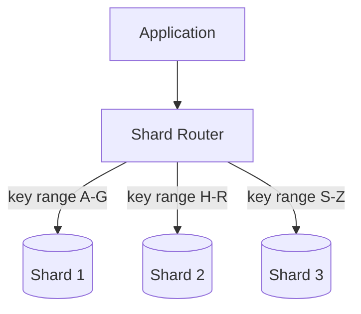
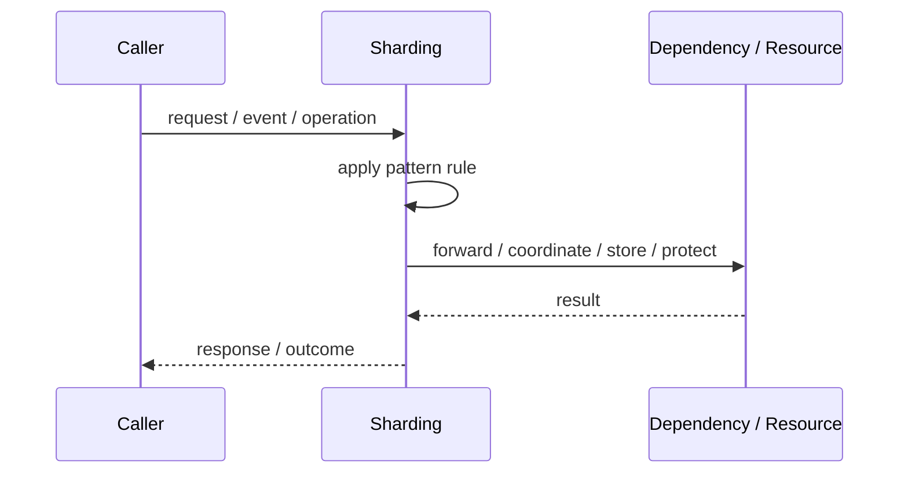
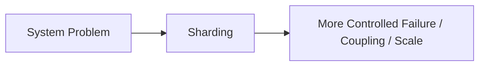

# Sharding

## Core Idea

Sharding partitions data across multiple shards, usually by key, so each shard owns part of the data.

---

## Problem It Solves

A dataset or workload is too large for one database or node.

---

## 3 Concrete Examples

### Example 1: User Sharding

Users are assigned to shards by user ID.

### Example 2: Tenant Sharding

Each tenant or tenant group is stored on a shard.

### Example 3: Geographic Sharding

Data is partitioned by region.

---

## Architect Questions

- What shard key distributes data evenly?
- How are hot shards avoided?
- How are cross-shard queries handled?
- How is resharding performed?
- How are transactions handled across shards?
- How will routing know which shard owns data?

---

## Main Diagram



---

## Runtime / Responsibility Flow



---

## Implementation Shape

```txt
1. Identify the exact failure, scaling, coupling, or consistency problem.
2. Define the boundary where this pattern applies.
3. Define ownership: who owns data, policy, configuration, and failure handling.
4. Define the happy path and the failure path.
5. Add observability: logs, metrics, tracing, alerts, and dashboards.
6. Add tests for normal behavior, failure behavior, retry behavior, and edge cases.
7. Keep the pattern focused. Do not let it become a dumping ground for unrelated business logic.
```

---

## When to Use

- One database cannot handle data size or throughput.
- A good partition key exists.
- Cross-shard operations are limited.

---

## When Not to Use

- A single database can still scale.
- Queries require frequent joins across all data.
- The shard key would create hotspots.

---

## Common Smell That Suggests This Pattern

```txt
The current design is failing because one part of the system is overloaded,
too tightly coupled,
not isolated enough,
or not reliable enough under failure.
```

---

## Common Mistakes

```txt
Using the pattern name without enforcing the actual boundary.

Adding distributed-systems complexity before the problem is real.

Ignoring failure modes.

Ignoring duplicate requests or duplicate messages.

Forgetting observability.

Letting the pattern hide business logic instead of clarifying it.
```

---

## Best Visual Summary



## Final Meaning

Sharding is useful only when it solves a real architectural pressure. If the pressure is not real yet, this pattern can become unnecessary complexity.
