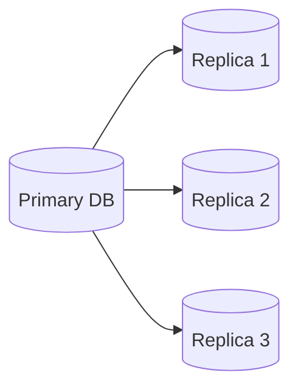
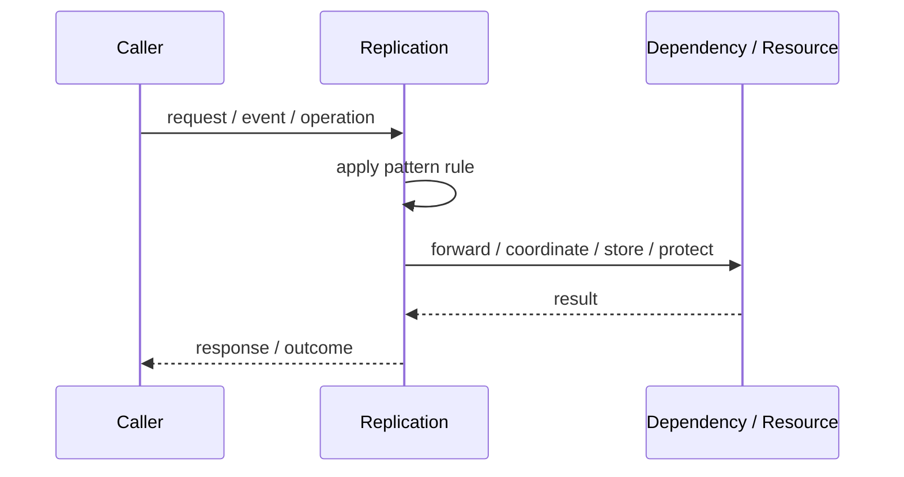
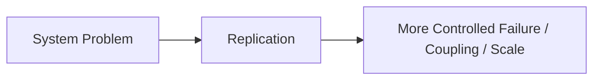

# Replication

## Core Idea

Replication copies data from one node to others, synchronously or asynchronously.

---

## Problem It Solves

A system needs copies of data for availability, read scaling, disaster recovery, or locality.

---

## 3 Concrete Examples

### Example 1: Read Replicas

Read traffic goes to replicas while writes go to primary.

### Example 2: Cross-Region Disaster Recovery

Data is replicated to another region.

### Example 3: Multi-Replica Database

Several replicas hold copies for high availability.

---

## Architect Questions

- Is replication synchronous or asynchronous?
- What is the source of truth?
- Can reads be stale?
- How is failover handled?
- How are conflicts resolved?
- What replication lag is acceptable?

---

## Main Diagram



---

## Runtime / Responsibility Flow



---

## Implementation Shape

```txt
1. Identify the exact failure, scaling, coupling, or consistency problem.
2. Define the boundary where this pattern applies.
3. Define ownership: who owns data, policy, configuration, and failure handling.
4. Define the happy path and the failure path.
5. Add observability: logs, metrics, tracing, alerts, and dashboards.
6. Add tests for normal behavior, failure behavior, retry behavior, and edge cases.
7. Keep the pattern focused. Do not let it become a dumping ground for unrelated business logic.
```

---

## When to Use

- Read scaling is needed.
- Availability and failover matter.
- Disaster recovery is required.
- Geographic locality is useful.

---

## When Not to Use

- Strictly fresh reads are required everywhere and async replication is used.
- Conflict handling is not understood.
- Replication complexity is unnecessary for the scale.

---

## Common Smell That Suggests This Pattern

```txt
The current design is failing because one part of the system is overloaded,
too tightly coupled,
not isolated enough,
or not reliable enough under failure.
```

---

## Common Mistakes

```txt
Using the pattern name without enforcing the actual boundary.

Adding distributed-systems complexity before the problem is real.

Ignoring failure modes.

Ignoring duplicate requests or duplicate messages.

Forgetting observability.

Letting the pattern hide business logic instead of clarifying it.
```

---

## Best Visual Summary



## Final Meaning

Replication is useful only when it solves a real architectural pressure. If the pressure is not real yet, this pattern can become unnecessary complexity.
