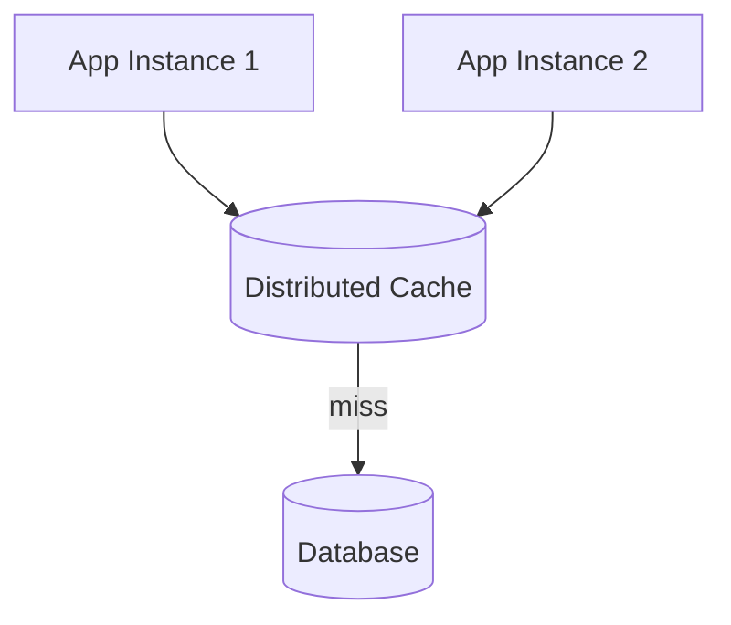
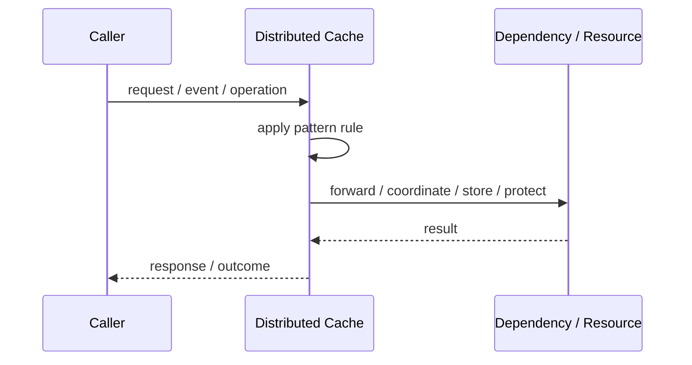
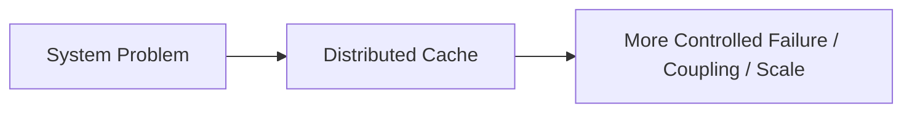

# Distributed Cache

## Core Idea

A Distributed Cache stores frequently accessed data across a cache cluster so multiple application instances can reuse it.

---

## Problem It Solves

Repeated reads or expensive computations overload databases or services.

---

## 3 Concrete Examples

### Example 1: Session Cache

User sessions are stored in Redis for many app instances.

### Example 2: Product Catalog Cache

Hot product data is cached to reduce database load.

### Example 3: Computed Result Cache

Expensive report summaries are cached across workers.

---

## Architect Questions

- What data should be cached?
- What is the TTL?
- How is cache invalidation handled?
- Can stale data be tolerated?
- What happens if the cache is down?
- Does caching introduce consistency bugs?

---

## Main Diagram



---

## Runtime / Responsibility Flow



---

## Implementation Shape

```txt
1. Identify the exact failure, scaling, coupling, or consistency problem.
2. Define the boundary where this pattern applies.
3. Define ownership: who owns data, policy, configuration, and failure handling.
4. Define the happy path and the failure path.
5. Add observability: logs, metrics, tracing, alerts, and dashboards.
6. Add tests for normal behavior, failure behavior, retry behavior, and edge cases.
7. Keep the pattern focused. Do not let it become a dumping ground for unrelated business logic.
```

---

## When to Use

- Repeated reads are expensive.
- Stale data is acceptable within limits.
- Multiple app instances need shared cached data.

---

## When Not to Use

- Data changes constantly and must always be fresh.
- Invalidation rules are unclear.
- The cache would become the source of truth accidentally.

---

## Common Smell That Suggests This Pattern

```txt
The current design is failing because one part of the system is overloaded,
too tightly coupled,
not isolated enough,
or not reliable enough under failure.
```

---

## Common Mistakes

```txt
Using the pattern name without enforcing the actual boundary.

Adding distributed-systems complexity before the problem is real.

Ignoring failure modes.

Ignoring duplicate requests or duplicate messages.

Forgetting observability.

Letting the pattern hide business logic instead of clarifying it.
```

---

## Best Visual Summary



## Final Meaning

Distributed Cache is useful only when it solves a real architectural pressure. If the pressure is not real yet, this pattern can become unnecessary complexity.
