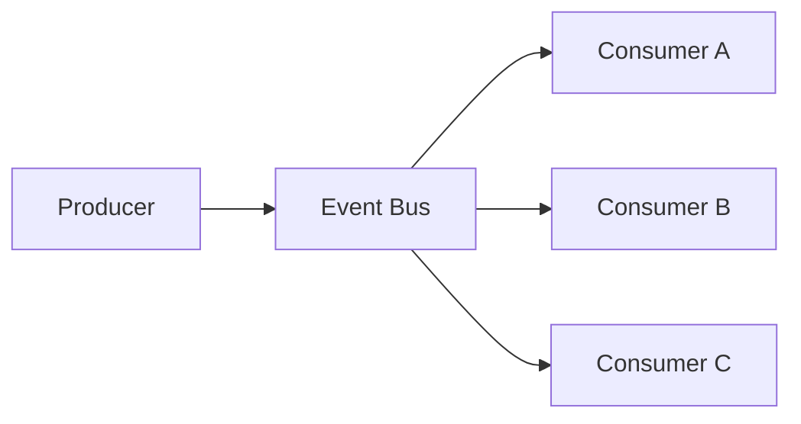
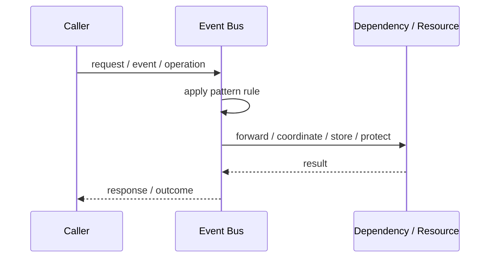
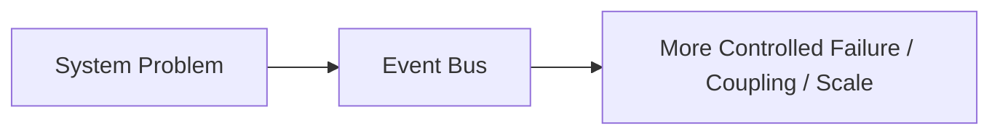

# Event Bus

## Core Idea

An Event Bus carries events from producers to interested consumers.

---

## Problem It Solves

Multiple components need to publish and subscribe to events without direct coupling.

---

## 3 Concrete Examples

### Example 1: OrderPlaced Bus

Order service publishes and notification, inventory, analytics consumers react.

### Example 2: Frontend Event Bus

UI components react to application-level events.

### Example 3: Internal Modular Monolith Bus

Modules publish domain events inside one app.

---

## Architect Questions

- What events are published?
- Who owns event schemas?
- Which consumers subscribe?
- Is delivery synchronous or asynchronous?
- Are events durable?
- How are retries and dead letters handled?

---

## Main Diagram



---

## Runtime / Responsibility Flow



---

## Implementation Shape

```txt
1. Identify the exact failure, scaling, coupling, or consistency problem.
2. Define the boundary where this pattern applies.
3. Define ownership: who owns data, policy, configuration, and failure handling.
4. Define the happy path and the failure path.
5. Add observability: logs, metrics, tracing, alerts, and dashboards.
6. Add tests for normal behavior, failure behavior, retry behavior, and edge cases.
7. Keep the pattern focused. Do not let it become a dumping ground for unrelated business logic.
```

---

## When to Use

- Multiple consumers react to the same event.
- Producers should not know consumers.
- Loose coupling and extensibility matter.

---

## When Not to Use

- A direct call is clearer.
- Event flow would hide important business workflow.
- No one owns event schemas or reliability.

---

## Common Smell That Suggests This Pattern

```txt
The current design is failing because one part of the system is overloaded,
too tightly coupled,
not isolated enough,
or not reliable enough under failure.
```

---

## Common Mistakes

```txt
Using the pattern name without enforcing the actual boundary.

Adding distributed-systems complexity before the problem is real.

Ignoring failure modes.

Ignoring duplicate requests or duplicate messages.

Forgetting observability.

Letting the pattern hide business logic instead of clarifying it.
```

---

## Best Visual Summary



## Final Meaning

Event Bus is useful only when it solves a real architectural pressure. If the pressure is not real yet, this pattern can become unnecessary complexity.
