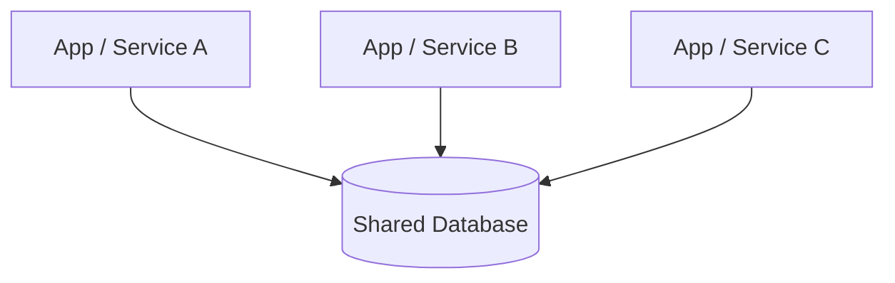
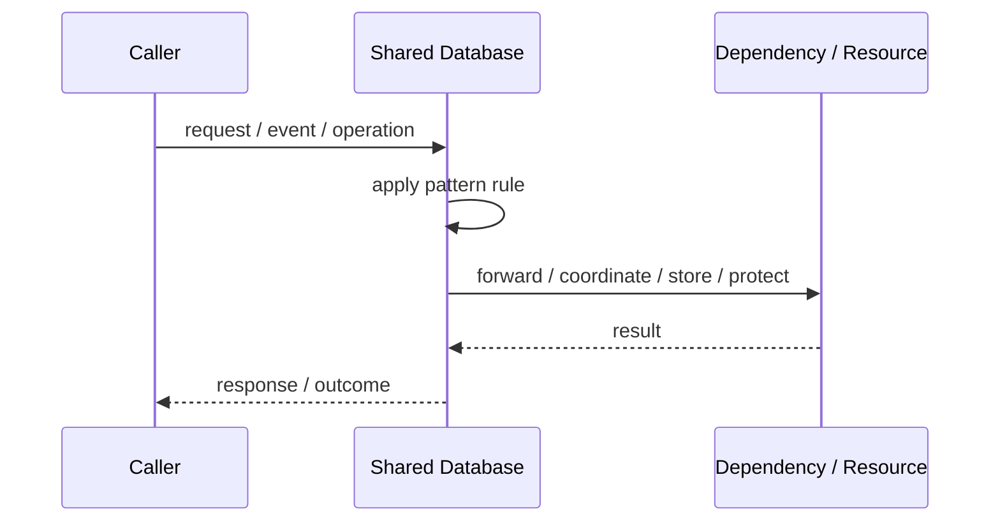
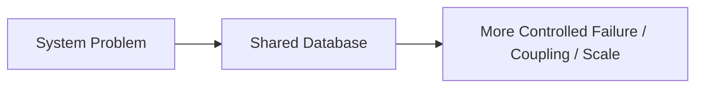

# Shared Database

## Core Idea

Shared Database means multiple parts of the system read or write the same database directly.

---

## Problem It Solves

Multiple applications or services need access to the same data store.

---

## 3 Concrete Examples

### Example 1: Legacy Enterprise DB

Several applications share one customer database.

### Example 2: Modular Monolith DB

Modules share one physical database but ideally own separate tables.

### Example 3: Reporting Access

Reporting tools read from the operational database.

---

## Architect Questions

- Who owns each table?
- Which components can write?
- Can schema changes break multiple systems?
- Is direct database access creating coupling?
- Should access move behind APIs?
- Are transactions simpler because of the shared DB?

---

## Main Diagram



---

## Runtime / Responsibility Flow



---

## Implementation Shape

```txt
1. Identify the exact failure, scaling, coupling, or consistency problem.
2. Define the boundary where this pattern applies.
3. Define ownership: who owns data, policy, configuration, and failure handling.
4. Define the happy path and the failure path.
5. Add observability: logs, metrics, tracing, alerts, and dashboards.
6. Add tests for normal behavior, failure behavior, retry behavior, and edge cases.
7. Keep the pattern focused. Do not let it become a dumping ground for unrelated business logic.
```

---

## When to Use

- A monolith or modular monolith uses one database.
- Strong local transactions are important.
- The team can enforce table ownership discipline.

---

## When Not to Use

- Independent services need independent evolution.
- Many services directly mutate each other's data.
- Schema changes frequently break unrelated systems.

---

## Common Smell That Suggests This Pattern

```txt
The current design is failing because one part of the system is overloaded,
too tightly coupled,
not isolated enough,
or not reliable enough under failure.
```

---

## Common Mistakes

```txt
Using the pattern name without enforcing the actual boundary.

Adding distributed-systems complexity before the problem is real.

Ignoring failure modes.

Ignoring duplicate requests or duplicate messages.

Forgetting observability.

Letting the pattern hide business logic instead of clarifying it.
```

---

## Best Visual Summary



## Final Meaning

Shared Database is useful only when it solves a real architectural pressure. If the pressure is not real yet, this pattern can become unnecessary complexity.
