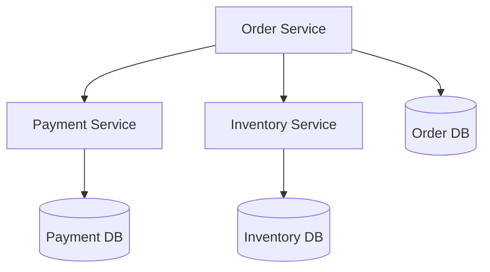
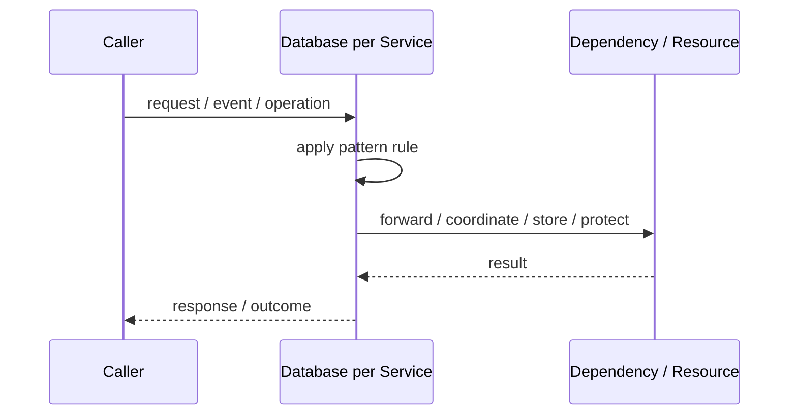
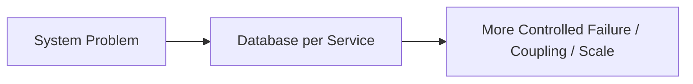

# Database per Service

## Core Idea

Database per Service means each service owns its data store and other services access that data only through service APIs or events.

---

## Problem It Solves

Microservices sharing one database become tightly coupled and cannot evolve independently.

---

## 3 Concrete Examples

### Example 1: Order Service DB

Only Order service writes order data.

### Example 2: Payment Service DB

Payment data is hidden behind payment APIs/events.

### Example 3: Inventory Service DB

Inventory owns stock records and publishes changes.

---

## Architect Questions

- Which service owns which data?
- How do other services get needed data?
- Can workflows tolerate eventual consistency?
- How are distributed transactions avoided?
- How are read models or projections built?
- How is reporting handled across services?

---

## Main Diagram



---

## Runtime / Responsibility Flow



---

## Implementation Shape

```txt
1. Identify the exact failure, scaling, coupling, or consistency problem.
2. Define the boundary where this pattern applies.
3. Define ownership: who owns data, policy, configuration, and failure handling.
4. Define the happy path and the failure path.
5. Add observability: logs, metrics, tracing, alerts, and dashboards.
6. Add tests for normal behavior, failure behavior, retry behavior, and edge cases.
7. Keep the pattern focused. Do not let it become a dumping ground for unrelated business logic.
```

---

## When to Use

- Services need independent ownership and deployment.
- Data boundaries are clear.
- Eventual consistency and integration patterns are understood.

---

## When Not to Use

- The system needs simple ACID transactions across all data.
- Service boundaries are unclear.
- The team is not ready for distributed data complexity.

---

## Common Smell That Suggests This Pattern

```txt
The current design is failing because one part of the system is overloaded,
too tightly coupled,
not isolated enough,
or not reliable enough under failure.
```

---

## Common Mistakes

```txt
Using the pattern name without enforcing the actual boundary.

Adding distributed-systems complexity before the problem is real.

Ignoring failure modes.

Ignoring duplicate requests or duplicate messages.

Forgetting observability.

Letting the pattern hide business logic instead of clarifying it.
```

---

## Best Visual Summary



## Final Meaning

Database per Service is useful only when it solves a real architectural pressure. If the pressure is not real yet, this pattern can become unnecessary complexity.
