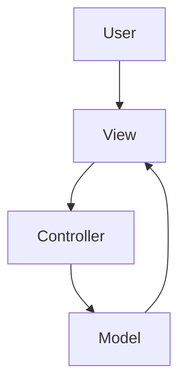
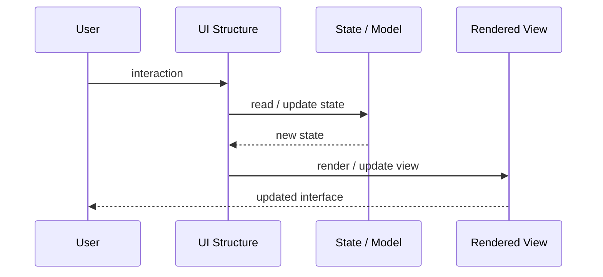

# MVC

## Core Idea

MVC separates an application into Model, View, and Controller responsibilities.

---

## Problem It Solves

UI rendering, input handling, and business/data logic become tangled in the same place.

---

## 3 Concrete Examples

### Example 1: Server-Rendered Web App

A controller receives a request, loads a model, and returns a rendered view.

### Example 2: Admin Dashboard

Controllers handle button actions while models represent users, products, or orders.

### Example 3: Desktop GUI

The controller responds to UI events, updates the model, and refreshes the view.

---

## Architect Questions

- What is the model?
- What does the view render?
- What user input does the controller handle?
- Where should validation live?
- Are controllers becoming too large?
- Does the model contain behavior or only data?

---

## Main Diagram



---

## Runtime / UI Flow



---

## Implementation Shape

```txt
1. Identify the UI problem: state complexity, rendering complexity, team ownership, reuse, testability, or event flow.
2. Define responsibilities: view, model, controller/presenter/viewmodel, state container, component, or frontend boundary.
3. Define data flow: one-way, two-way binding, events, actions, subscriptions, or store updates.
4. Define state ownership: local component state, shared state, global state, server state, or URL state.
5. Define rendering and update behavior.
6. Add tests for user interactions, state transitions, rendering, and edge cases.
7. Keep the pattern focused. Do not centralize or split UI structure without a real reason.
```

---

## When to Use

- You need to separate input handling, rendering, and model logic.
- The framework naturally supports MVC.
- Controllers can stay thin.

---

## When Not to Use

- Controllers become god objects.
- The UI is tiny and does not need structure.
- Business logic leaks into View or Controller.

---

## Common Smell That Suggests This Pattern

```txt
UI state is duplicated,
event flow is hard to trace,
components are too large,
screens are hard to test,
or multiple teams are stepping on the same frontend code.
```

---

## Common Mistakes

```txt
Putting business logic in the view.

Making controllers, presenters, or ViewModels too large.

Putting all state in a global store.

Creating components that are reusable in theory but impossible to understand.

Using micro frontends to solve team problems that are really coordination problems.

Ignoring cleanup for subscriptions and observers.

Optimizing rendering before measuring rendering problems.
```

---

## Best Visual Summary


## Final Meaning

MVC is useful when it makes UI state, rendering, user interaction, or frontend ownership easier to reason about. If the UI is simple, avoid adding ceremony.
