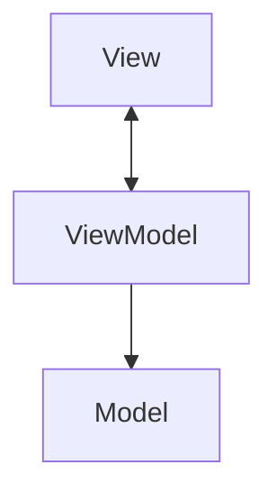
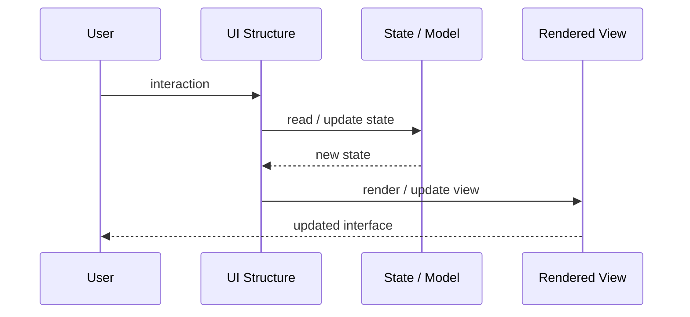
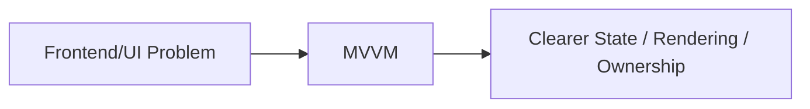

# MVVM

## Core Idea

MVVM separates the View from presentation state and behavior using a ViewModel that the View binds to.

---

## Problem It Solves

UI code becomes overloaded with state management, formatting, commands, and domain object manipulation.

---

## 3 Concrete Examples

### Example 1: Form Screen

A ViewModel exposes form fields, validation state, and submit commands to the View.

### Example 2: Desktop App with Binding

A WPF-style UI binds controls to observable ViewModel properties.

### Example 3: Mobile Screen

A ViewModel loads data, tracks loading/error state, and exposes display-ready values.

---

## Architect Questions

- What presentation state should the ViewModel expose?
- What commands should the ViewModel handle?
- Can the ViewModel be tested without rendering UI?
- What formatting belongs in the ViewModel versus the View?
- How are model updates reflected in the View?
- Is the ViewModel becoming a duplicate domain model?

---

## Main Diagram



---

## Runtime / UI Flow



---

## Implementation Shape

```txt
1. Identify the UI problem: state complexity, rendering complexity, team ownership, reuse, testability, or event flow.
2. Define responsibilities: view, model, controller/presenter/viewmodel, state container, component, or frontend boundary.
3. Define data flow: one-way, two-way binding, events, actions, subscriptions, or store updates.
4. Define state ownership: local component state, shared state, global state, server state, or URL state.
5. Define rendering and update behavior.
6. Add tests for user interactions, state transitions, rendering, and edge cases.
7. Keep the pattern focused. Do not centralize or split UI structure without a real reason.
```

---

## When to Use

- The UI framework supports binding.
- Presentation state is complex.
- You want testable UI behavior outside the View.

---

## When Not to Use

- The framework does not support binding well.
- ViewModels duplicate domain models without value.
- The screen is simple enough for local state.

---

## Common Smell That Suggests This Pattern

```txt
UI state is duplicated,
event flow is hard to trace,
components are too large,
screens are hard to test,
or multiple teams are stepping on the same frontend code.
```

---

## Common Mistakes

```txt
Putting business logic in the view.

Making controllers, presenters, or ViewModels too large.

Putting all state in a global store.

Creating components that are reusable in theory but impossible to understand.

Using micro frontends to solve team problems that are really coordination problems.

Ignoring cleanup for subscriptions and observers.

Optimizing rendering before measuring rendering problems.
```

---

## Best Visual Summary



## Final Meaning

MVVM is useful when it makes UI state, rendering, user interaction, or frontend ownership easier to reason about. If the UI is simple, avoid adding ceremony.
