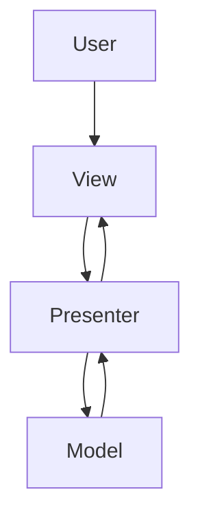
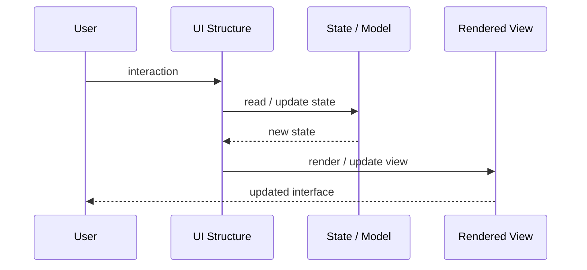
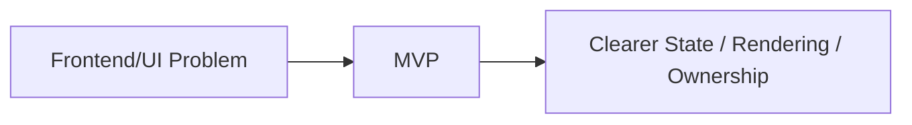

# MVP

## Core Idea

MVP separates presentation logic into a Presenter that coordinates between a passive View and the Model.

---

## Problem It Solves

UI behavior is hard to test because it is embedded directly inside the View.

---

## 3 Concrete Examples

### Example 1: Legacy Web Form

The View forwards button clicks to the Presenter, which updates the View.

### Example 2: Mobile Screen Presenter

The Presenter loads data and calls view.showLoading(), view.showData(), or view.showError().

### Example 3: Desktop Dialog

The Presenter validates input and tells the View which messages to display.

---

## Architect Questions

- Can the View be passive?
- What user actions does the Presenter handle?
- How does the Presenter update the View?
- Can the Presenter be tested with a mock View?
- Where does model access happen?
- Would MVVM fit the framework better?

---

## Main Diagram



---

## Runtime / UI Flow



---

## Implementation Shape

```txt
1. Identify the UI problem: state complexity, rendering complexity, team ownership, reuse, testability, or event flow.
2. Define responsibilities: view, model, controller/presenter/viewmodel, state container, component, or frontend boundary.
3. Define data flow: one-way, two-way binding, events, actions, subscriptions, or store updates.
4. Define state ownership: local component state, shared state, global state, server state, or URL state.
5. Define rendering and update behavior.
6. Add tests for user interactions, state transitions, rendering, and edge cases.
7. Keep the pattern focused. Do not centralize or split UI structure without a real reason.
```

---

## When to Use

- You want a passive View and testable Presenter.
- The framework does not provide strong binding.
- UI behavior needs to be separated from rendering code.

---

## When Not to Use

- The framework favors MVVM or component state.
- Presenter and View become tightly coupled anyway.
- The View is not actually passive.

---

## Common Smell That Suggests This Pattern

```txt
UI state is duplicated,
event flow is hard to trace,
components are too large,
screens are hard to test,
or multiple teams are stepping on the same frontend code.
```

---

## Common Mistakes

```txt
Putting business logic in the view.

Making controllers, presenters, or ViewModels too large.

Putting all state in a global store.

Creating components that are reusable in theory but impossible to understand.

Using micro frontends to solve team problems that are really coordination problems.

Ignoring cleanup for subscriptions and observers.

Optimizing rendering before measuring rendering problems.
```

---

## Best Visual Summary



## Final Meaning

MVP is useful when it makes UI state, rendering, user interaction, or frontend ownership easier to reason about. If the UI is simple, avoid adding ceremony.
