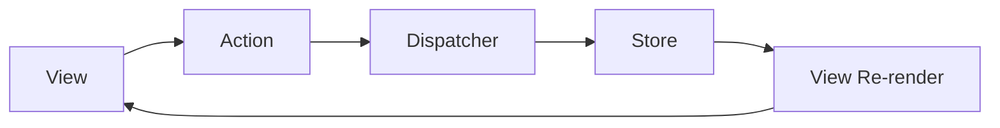
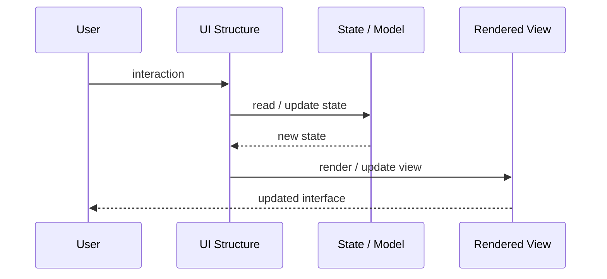
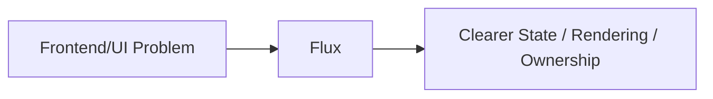

# Flux

## Core Idea

Flux uses one-way data flow where actions go through a dispatcher to stores, and views render from stores.

---

## Problem It Solves

Complex UI state becomes unpredictable when many components update each other directly in multiple directions.

---

## 3 Concrete Examples

### Example 1: Notification UI

User actions dispatch events that update notification stores, then views re-render.

### Example 2: Shopping Cart UI

Add/remove item actions flow through dispatcher into a cart store.

### Example 3: Dashboard Filters

Filter change actions update store state and all dependent views render consistently.

---

## Architect Questions

- What actions can happen in the UI?
- What stores own the state?
- Is data flow one-way?
- How are async effects handled?
- How do views subscribe to store changes?
- Is Flux too heavy for this UI?

---

## Main Diagram



---

## Runtime / UI Flow



---

## Implementation Shape

```txt
1. Identify the UI problem: state complexity, rendering complexity, team ownership, reuse, testability, or event flow.
2. Define responsibilities: view, model, controller/presenter/viewmodel, state container, component, or frontend boundary.
3. Define data flow: one-way, two-way binding, events, actions, subscriptions, or store updates.
4. Define state ownership: local component state, shared state, global state, server state, or URL state.
5. Define rendering and update behavior.
6. Add tests for user interactions, state transitions, rendering, and edge cases.
7. Keep the pattern focused. Do not centralize or split UI structure without a real reason.
```

---

## When to Use

- One-way data flow would make state changes predictable.
- Multiple views depend on shared stores.
- UI actions need a consistent event flow.

---

## When Not to Use

- State flow is simple.
- Dispatcher/store ceremony adds more complexity than clarity.
- Async effects are not well-defined.

---

## Common Smell That Suggests This Pattern

```txt
UI state is duplicated,
event flow is hard to trace,
components are too large,
screens are hard to test,
or multiple teams are stepping on the same frontend code.
```

---

## Common Mistakes

```txt
Putting business logic in the view.

Making controllers, presenters, or ViewModels too large.

Putting all state in a global store.

Creating components that are reusable in theory but impossible to understand.

Using micro frontends to solve team problems that are really coordination problems.

Ignoring cleanup for subscriptions and observers.

Optimizing rendering before measuring rendering problems.
```

---

## Best Visual Summary



## Final Meaning

Flux is useful when it makes UI state, rendering, user interaction, or frontend ownership easier to reason about. If the UI is simple, avoid adding ceremony.
