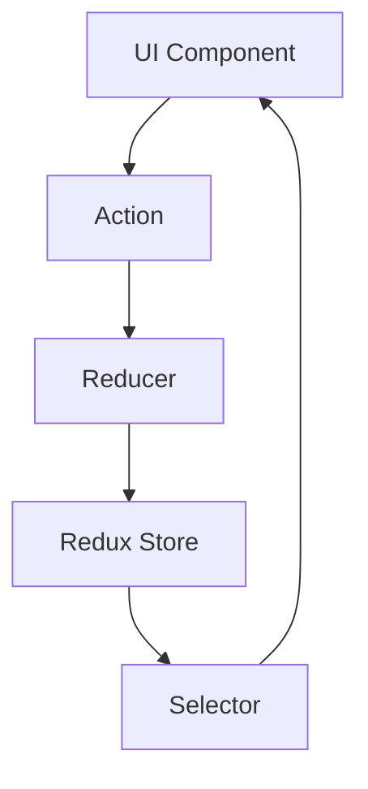
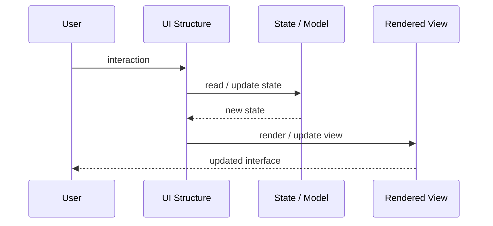
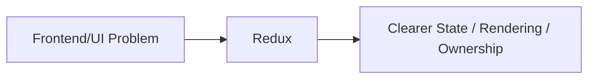

# Redux

## Core Idea

Redux centralizes application state in a store and updates it through dispatched actions and pure reducers.

---

## Problem It Solves

Shared UI/application state becomes scattered, inconsistent, and difficult to debug across components.

---

## 3 Concrete Examples

### Example 1: Global Auth State

Login/logout actions update a central store used by navigation, profile, and protected routes.

### Example 2: Complex Form Builder

Form layout, selected fields, validation, and undo history are managed in Redux.

### Example 3: E-Commerce Cart

Cart actions update a predictable store that many components can read.

---

## Architect Questions

- What state is truly global?
- What actions describe state changes?
- Can reducers stay pure?
- How are side effects handled?
- Do we need time-travel/debug tooling?
- Is Redux overkill for local component state?

---

## Main Diagram



---

## Runtime / UI Flow



---

## Implementation Shape

```txt
1. Identify the UI problem: state complexity, rendering complexity, team ownership, reuse, testability, or event flow.
2. Define responsibilities: view, model, controller/presenter/viewmodel, state container, component, or frontend boundary.
3. Define data flow: one-way, two-way binding, events, actions, subscriptions, or store updates.
4. Define state ownership: local component state, shared state, global state, server state, or URL state.
5. Define rendering and update behavior.
6. Add tests for user interactions, state transitions, rendering, and edge cases.
7. Keep the pattern focused. Do not centralize or split UI structure without a real reason.
```

---

## When to Use

- Shared application state is complex.
- Predictable state transitions and debugging matter.
- Actions/reducers/selectors can be clearly defined.

---

## When Not to Use

- Most state is local.
- Boilerplate outweighs benefit.
- Reducers contain side effects or mutate state directly.

---

## Common Smell That Suggests This Pattern

```txt
UI state is duplicated,
event flow is hard to trace,
components are too large,
screens are hard to test,
or multiple teams are stepping on the same frontend code.
```

---

## Common Mistakes

```txt
Putting business logic in the view.

Making controllers, presenters, or ViewModels too large.

Putting all state in a global store.

Creating components that are reusable in theory but impossible to understand.

Using micro frontends to solve team problems that are really coordination problems.

Ignoring cleanup for subscriptions and observers.

Optimizing rendering before measuring rendering problems.
```

---

## Best Visual Summary



## Final Meaning

Redux is useful when it makes UI state, rendering, user interaction, or frontend ownership easier to reason about. If the UI is simple, avoid adding ceremony.
