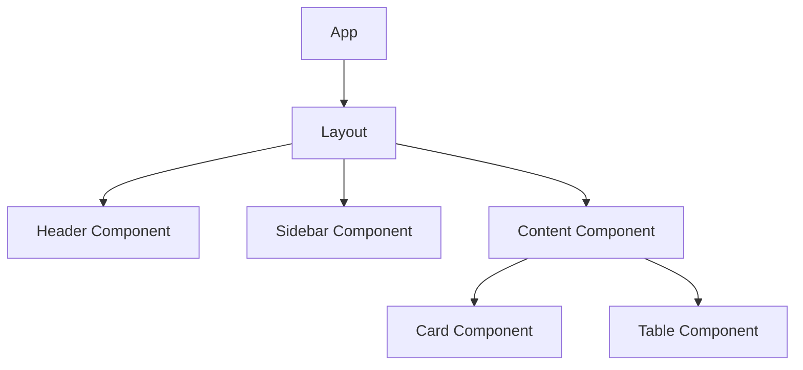
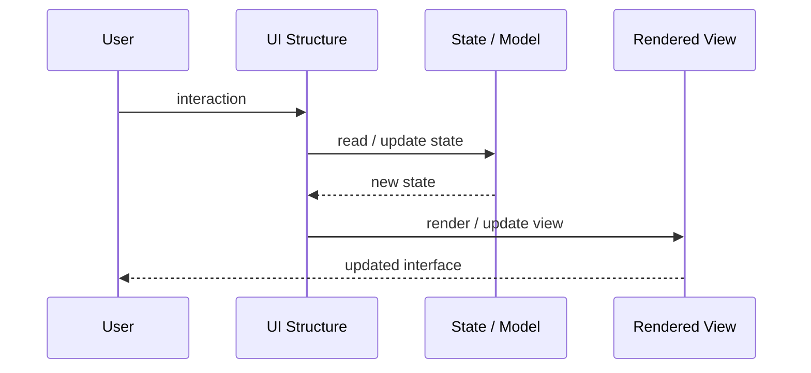
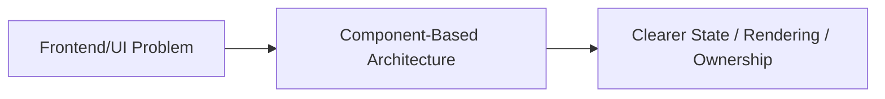

# Component-Based Architecture

## Core Idea

Component-Based Architecture builds UI from reusable, self-contained components with clear inputs, outputs, and composition rules.

---

## Problem It Solves

UI code becomes duplicated, inconsistent, and hard to maintain when screens are built as large custom pages.

---

## 3 Concrete Examples

### Example 1: Design System Components

Buttons, modals, cards, tables, and forms are reused across the app.

### Example 2: Dashboard Widgets

Charts, KPI tiles, filters, and tables are composed into dashboards.

### Example 3: Product Page

Image gallery, price block, reviews, and recommendations are separate components.

---

## Architect Questions

- What parts of the UI are reusable?
- What props/inputs does each component need?
- What events/outputs does it emit?
- Is state local or lifted up?
- Are components presentational or container components?
- How is visual consistency enforced?

---

## Main Diagram



---

## Runtime / UI Flow



---

## Implementation Shape

```txt
1. Identify the UI problem: state complexity, rendering complexity, team ownership, reuse, testability, or event flow.
2. Define responsibilities: view, model, controller/presenter/viewmodel, state container, component, or frontend boundary.
3. Define data flow: one-way, two-way binding, events, actions, subscriptions, or store updates.
4. Define state ownership: local component state, shared state, global state, server state, or URL state.
5. Define rendering and update behavior.
6. Add tests for user interactions, state transitions, rendering, and edge cases.
7. Keep the pattern focused. Do not centralize or split UI structure without a real reason.
```

---

## When to Use

- UI can be composed from reusable parts.
- Consistency and reuse matter.
- Screens are becoming large and duplicated.

---

## When Not to Use

- Components are too coupled to reuse.
- Every component becomes a giant configurable monster.
- There is no shared design or ownership discipline.

---

## Common Smell That Suggests This Pattern

```txt
UI state is duplicated,
event flow is hard to trace,
components are too large,
screens are hard to test,
or multiple teams are stepping on the same frontend code.
```

---

## Common Mistakes

```txt
Putting business logic in the view.

Making controllers, presenters, or ViewModels too large.

Putting all state in a global store.

Creating components that are reusable in theory but impossible to understand.

Using micro frontends to solve team problems that are really coordination problems.

Ignoring cleanup for subscriptions and observers.

Optimizing rendering before measuring rendering problems.
```

---

## Best Visual Summary



## Final Meaning

Component-Based Architecture is useful when it makes UI state, rendering, user interaction, or frontend ownership easier to reason about. If the UI is simple, avoid adding ceremony.
