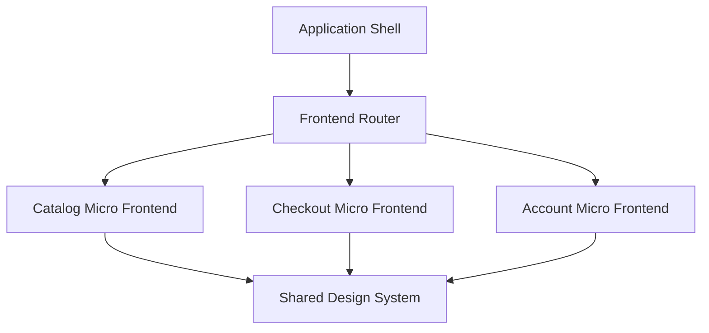
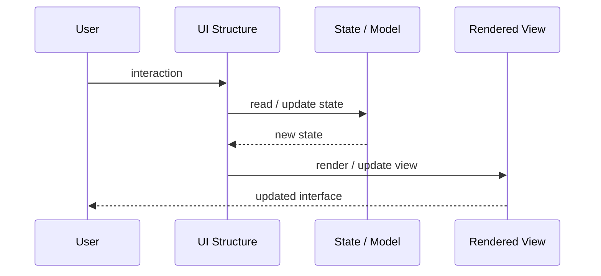

# Micro Frontends

## Core Idea

Micro Frontends split a frontend into independently owned and deployable frontend applications or slices.

---

## Problem It Solves

A large frontend becomes a bottleneck when many teams need independent ownership, release cycles, and technology choices.

---

## 3 Concrete Examples

### Example 1: E-Commerce Frontend

Catalog, checkout, account, and support sections are owned by separate teams.

### Example 2: Enterprise Portal

Different business units ship independent frontend modules into one shell.

### Example 3: Migration Strategy

A legacy Angular area is gradually replaced by React micro frontends.

---

## Architect Questions

- What frontend boundaries map to team or business ownership?
- How are micro frontends composed?
- How is routing handled?
- How is shared design system/versioning handled?
- How is cross-app state avoided or shared safely?
- Does independent deployment justify the added complexity?

---

## Main Diagram



---

## Runtime / UI Flow



---

## Implementation Shape

```txt
1. Identify the UI problem: state complexity, rendering complexity, team ownership, reuse, testability, or event flow.
2. Define responsibilities: view, model, controller/presenter/viewmodel, state container, component, or frontend boundary.
3. Define data flow: one-way, two-way binding, events, actions, subscriptions, or store updates.
4. Define state ownership: local component state, shared state, global state, server state, or URL state.
5. Define rendering and update behavior.
6. Add tests for user interactions, state transitions, rendering, and edge cases.
7. Keep the pattern focused. Do not centralize or split UI structure without a real reason.
```

---

## When to Use

- Multiple teams need independent frontend ownership.
- Independent deployment is valuable.
- Frontend domains have clear boundaries.

---

## When Not to Use

- One team owns the frontend.
- Shared state and styling are deeply coupled.
- Independent deployment does not justify runtime complexity.

---

## Common Smell That Suggests This Pattern

```txt
UI state is duplicated,
event flow is hard to trace,
components are too large,
screens are hard to test,
or multiple teams are stepping on the same frontend code.
```

---

## Common Mistakes

```txt
Putting business logic in the view.

Making controllers, presenters, or ViewModels too large.

Putting all state in a global store.

Creating components that are reusable in theory but impossible to understand.

Using micro frontends to solve team problems that are really coordination problems.

Ignoring cleanup for subscriptions and observers.

Optimizing rendering before measuring rendering problems.
```

---

## Best Visual Summary


## Final Meaning

Micro Frontends is useful when it makes UI state, rendering, user interaction, or frontend ownership easier to reason about. If the UI is simple, avoid adding ceremony.
