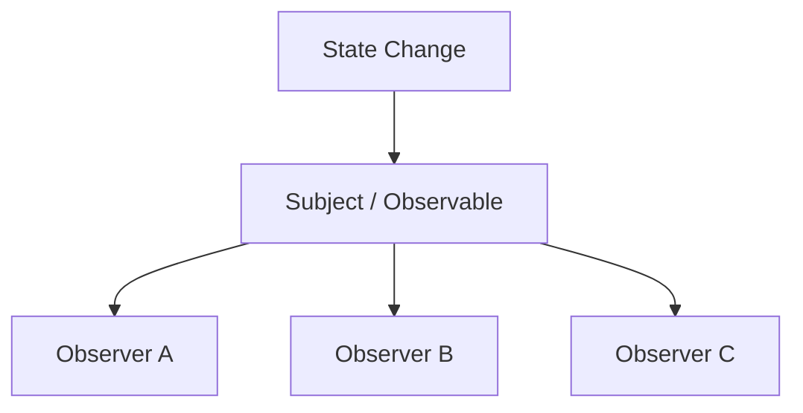
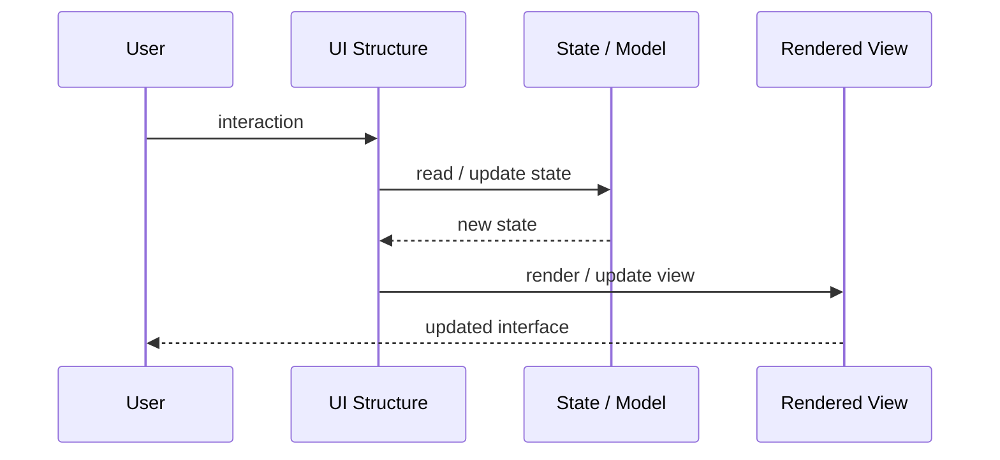
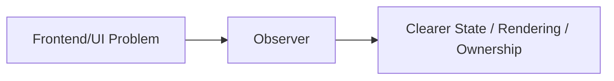

# Observer

## Core Idea

Observer lets objects subscribe to changes from a subject and get notified when state changes.

---

## Problem It Solves

Multiple UI elements or objects need to react to changes without being tightly coupled to the source.

---

## 3 Concrete Examples

### Example 1: Form Field Updates

Validation messages and submit button state react when form values change.

### Example 2: Theme Changes

Multiple components update when the app theme changes.

### Example 3: Model-View Updates

Views subscribe to model changes and refresh when data changes.

---

## Architect Questions

- What object is observed?
- Who subscribes to changes?
- What event payload is sent?
- How are subscriptions removed?
- Can notification order matter?
- Could too many observers make flow hard to trace?

---

## Main Diagram



---

## Runtime / UI Flow



---

## Implementation Shape

```txt
1. Identify the UI problem: state complexity, rendering complexity, team ownership, reuse, testability, or event flow.
2. Define responsibilities: view, model, controller/presenter/viewmodel, state container, component, or frontend boundary.
3. Define data flow: one-way, two-way binding, events, actions, subscriptions, or store updates.
4. Define state ownership: local component state, shared state, global state, server state, or URL state.
5. Define rendering and update behavior.
6. Add tests for user interactions, state transitions, rendering, and edge cases.
7. Keep the pattern focused. Do not centralize or split UI structure without a real reason.
```

---

## When to Use

- Multiple objects need to react to state changes.
- The subject should not know concrete observers.
- Loose event notification is useful.

---

## When Not to Use

- Notification flow becomes impossible to trace.
- Observers are not unsubscribed and leak memory.
- Strict ordering or transactions are required.

---

## Common Smell That Suggests This Pattern

```txt
UI state is duplicated,
event flow is hard to trace,
components are too large,
screens are hard to test,
or multiple teams are stepping on the same frontend code.
```

---

## Common Mistakes

```txt
Putting business logic in the view.

Making controllers, presenters, or ViewModels too large.

Putting all state in a global store.

Creating components that are reusable in theory but impossible to understand.

Using micro frontends to solve team problems that are really coordination problems.

Ignoring cleanup for subscriptions and observers.

Optimizing rendering before measuring rendering problems.
```

---

## Best Visual Summary



## Final Meaning

Observer is useful when it makes UI state, rendering, user interaction, or frontend ownership easier to reason about. If the UI is simple, avoid adding ceremony.
