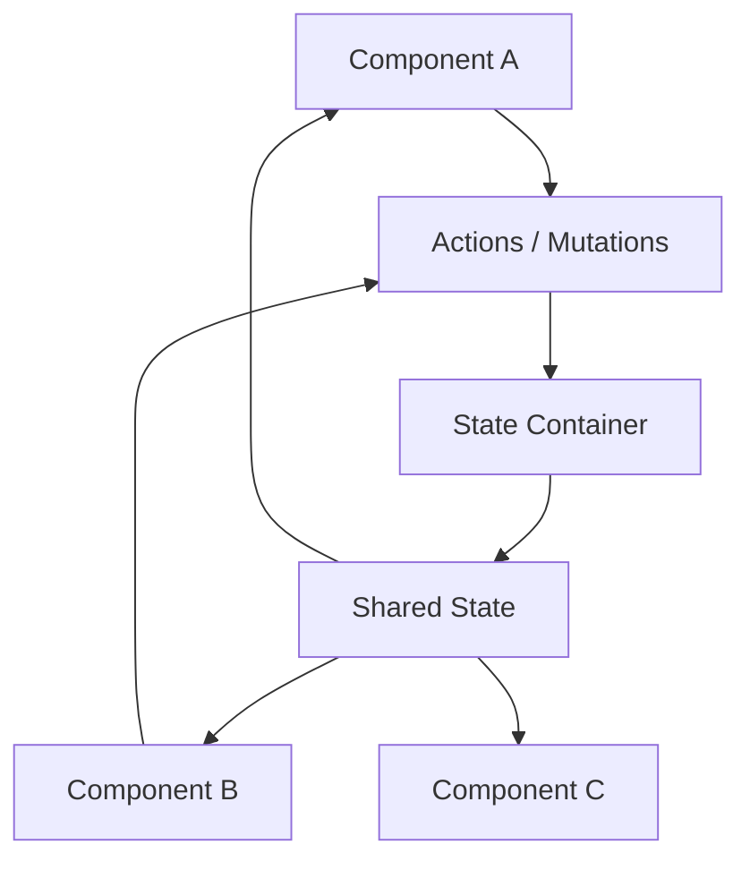
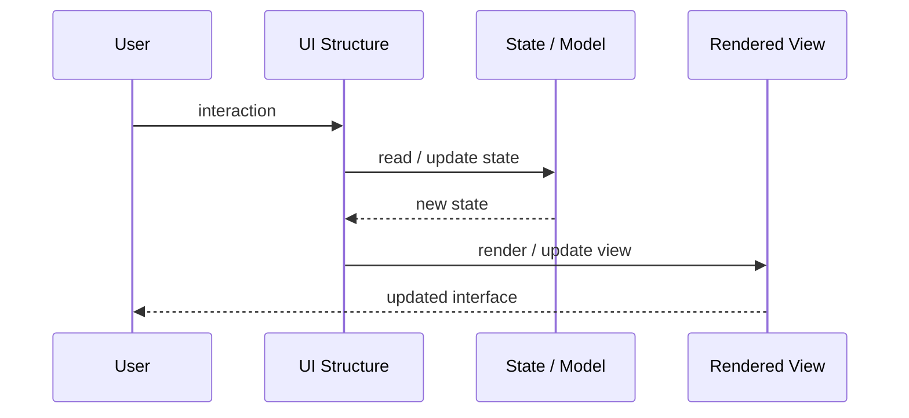
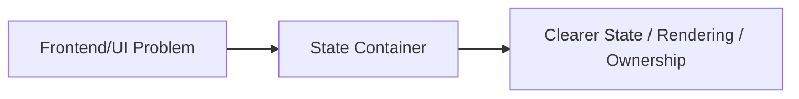

# State Container

## Core Idea

State Container centralizes shared state and provides controlled ways to read and update it.

---

## Problem It Solves

State is scattered across components, causing prop drilling, duplicated state, and inconsistent UI behavior.

---

## 3 Concrete Examples

### Example 1: Auth State Container

User identity and permissions are stored centrally for navigation and route guards.

### Example 2: Editor State

Selected object, undo history, canvas settings, and tool mode live in one state container.

### Example 3: Dashboard Filters

Date range, selected customers, and active filters are centralized and reused by many widgets.

---

## Architect Questions

- What state must be shared?
- What state should stay local?
- How is state updated?
- Are updates immutable?
- How are derived values selected?
- How is state debugged and tested?

---

## Main Diagram



---

## Runtime / UI Flow



---

## Implementation Shape

```txt
1. Identify the UI problem: state complexity, rendering complexity, team ownership, reuse, testability, or event flow.
2. Define responsibilities: view, model, controller/presenter/viewmodel, state container, component, or frontend boundary.
3. Define data flow: one-way, two-way binding, events, actions, subscriptions, or store updates.
4. Define state ownership: local component state, shared state, global state, server state, or URL state.
5. Define rendering and update behavior.
6. Add tests for user interactions, state transitions, rendering, and edge cases.
7. Keep the pattern focused. Do not centralize or split UI structure without a real reason.
```

---

## When to Use

- State is shared across many components.
- Prop drilling or duplicated state is becoming painful.
- Controlled state updates improve predictability.

---

## When Not to Use

- State is mostly local.
- The container becomes a global dumping ground.
- Updates are uncontrolled and unpredictable.

---

## Common Smell That Suggests This Pattern

```txt
UI state is duplicated,
event flow is hard to trace,
components are too large,
screens are hard to test,
or multiple teams are stepping on the same frontend code.
```

---

## Common Mistakes

```txt
Putting business logic in the view.

Making controllers, presenters, or ViewModels too large.

Putting all state in a global store.

Creating components that are reusable in theory but impossible to understand.

Using micro frontends to solve team problems that are really coordination problems.

Ignoring cleanup for subscriptions and observers.

Optimizing rendering before measuring rendering problems.
```

---

## Best Visual Summary



## Final Meaning

State Container is useful when it makes UI state, rendering, user interaction, or frontend ownership easier to reason about. If the UI is simple, avoid adding ceremony.
