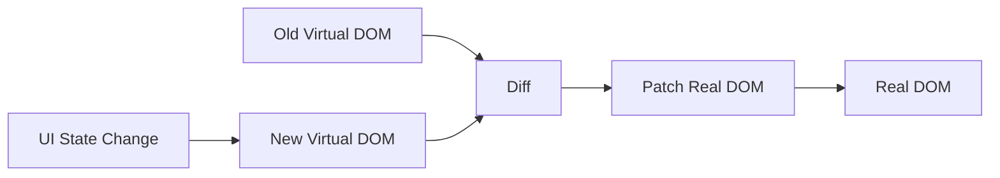
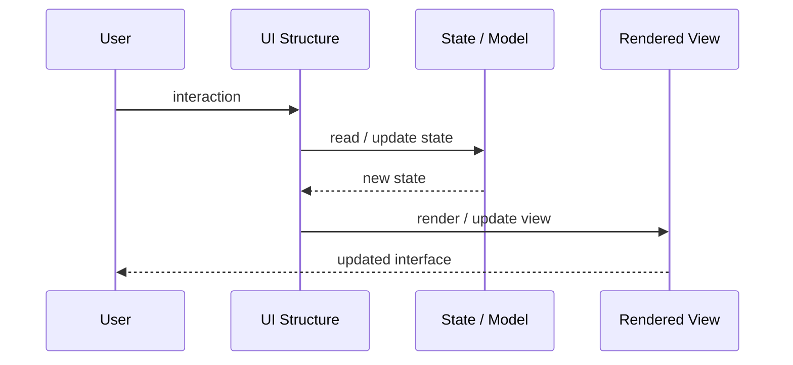
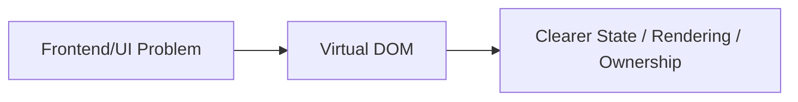

# Virtual DOM

## Core Idea

Virtual DOM represents UI as an in-memory tree and efficiently updates the real DOM by diffing changes.

---

## Problem It Solves

Direct DOM manipulation is expensive and error-prone when UI state changes frequently.

---

## 3 Concrete Examples

### Example 1: React Component Update

A component state change creates a new virtual tree and only changed DOM nodes are patched.

### Example 2: Dynamic List Rendering

A list update reuses unchanged items and updates only inserted/removed elements.

### Example 3: Conditional UI

When app state changes, the virtual DOM diff determines minimal real DOM updates.

---

## Architect Questions

- How often does UI state change?
- What triggers re-rendering?
- Are keys used correctly for lists?
- Is diffing overhead acceptable?
- Can unnecessary renders be avoided?
- Would direct DOM or fine-grained reactivity be better?

---

## Main Diagram



---

## Runtime / UI Flow



---

## Implementation Shape

```txt
1. Identify the UI problem: state complexity, rendering complexity, team ownership, reuse, testability, or event flow.
2. Define responsibilities: view, model, controller/presenter/viewmodel, state container, component, or frontend boundary.
3. Define data flow: one-way, two-way binding, events, actions, subscriptions, or store updates.
4. Define state ownership: local component state, shared state, global state, server state, or URL state.
5. Define rendering and update behavior.
6. Add tests for user interactions, state transitions, rendering, and edge cases.
7. Keep the pattern focused. Do not centralize or split UI structure without a real reason.
```

---

## When to Use

- UI changes frequently.
- Declarative rendering is preferred.
- The framework uses diffing to simplify DOM updates.

---

## When Not to Use

- The UI is static or tiny.
- Fine-grained reactivity or direct rendering is more efficient.
- Unnecessary re-renders dominate performance.

---

## Common Smell That Suggests This Pattern

```txt
UI state is duplicated,
event flow is hard to trace,
components are too large,
screens are hard to test,
or multiple teams are stepping on the same frontend code.
```

---

## Common Mistakes

```txt
Putting business logic in the view.

Making controllers, presenters, or ViewModels too large.

Putting all state in a global store.

Creating components that are reusable in theory but impossible to understand.

Using micro frontends to solve team problems that are really coordination problems.

Ignoring cleanup for subscriptions and observers.

Optimizing rendering before measuring rendering problems.
```

---

## Best Visual Summary



## Final Meaning

Virtual DOM is useful when it makes UI state, rendering, user interaction, or frontend ownership easier to reason about. If the UI is simple, avoid adding ceremony.
