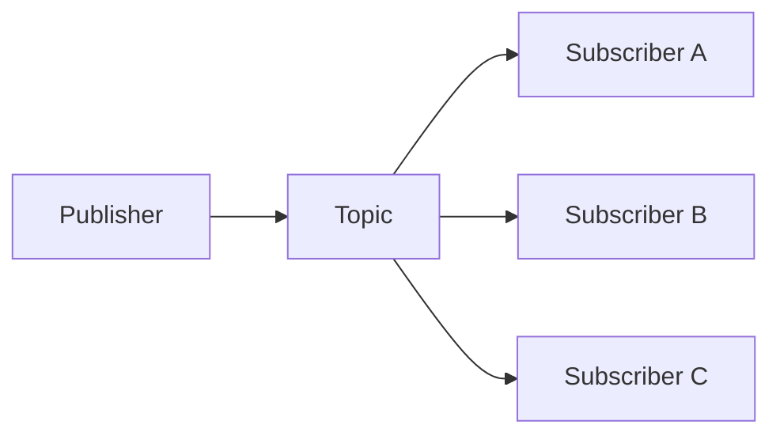
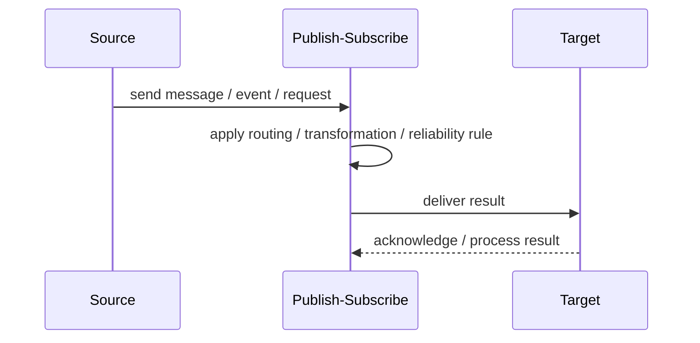
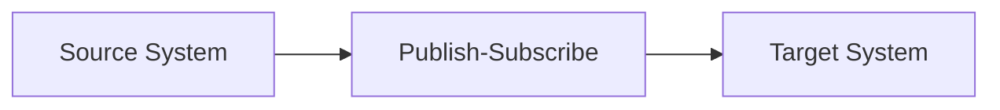

# Publish-Subscribe

## Core Idea

Publish-Subscribe lets one producer publish a message to a topic while multiple independent subscribers receive copies of that message.

---

## Problem It Solves

A producer needs to notify multiple consumers without knowing who they are or how many exist.

---

## 3 Concrete Examples

### Example 1: Order Events

An order service publishes OrderPlaced and email, inventory, analytics, and audit subscribers all react independently.

### Example 2: User Registration

A user service publishes UserRegistered and onboarding, CRM, and notification systems subscribe.

### Example 3: IoT Sensor Updates

A sensor publishes temperature readings and dashboards, alerting, and storage consumers receive the same readings.

---

## Architect Questions

- What topic or event type should be published?
- Who owns the event schema?
- Do all subscribers need every message?
- Is delivery durable or best-effort?
- Can subscribers process messages independently?
- How are retries and failed subscribers handled?

---

## Main Diagram



---

## Runtime / Responsibility Flow



---

## Implementation Shape

```txt
1. Identify the integration problem: delivery, routing, transformation, ordering, correlation, reliability, or decoupling.
2. Define the message contract: fields, schema, headers, metadata, IDs, and versioning.
3. Define the channel: queue, topic, stream, bus, broker, or direct integration.
4. Define failure behavior: retries, dead letters, timeouts, duplicates, replay, and poison messages.
5. Define ownership: who owns schemas, topics, routing rules, and operational support.
6. Add observability: correlation IDs, logs, metrics, tracing, message age, consumer lag, and DLQ alerts.
7. Keep the pattern focused. Do not hide unclear business workflow inside messaging infrastructure.
```

---

## When to Use

- One event should notify many independent consumers.
- The producer should not know subscribers.
- Adding new consumers should not require producer changes.

---

## When Not to Use

- Only one known consumer exists and direct communication is simpler.
- Subscribers require strict synchronous response.
- Event contracts are not owned.

---

## Common Smell That Suggests This Pattern

```txt
Systems are becoming tightly coupled through point-to-point calls,
message formats do not match,
consumers need asynchronous decoupling,
or failures are being lost instead of handled.
```

---

## Common Mistakes

```txt
Using messaging when a simple direct call is clearer.

Forgetting idempotency.

Ignoring duplicate messages.

Ignoring ordering and correlation.

Letting messages become undocumented contracts.

Treating the broker as magic instead of designing failure behavior.

Putting business rules in routing glue where nobody owns them.
```

---

## Best Visual Summary



## Final Meaning

Publish-Subscribe is useful when it solves a real integration pressure. If the integration problem is simple, adding messaging machinery can make the system harder to understand.
