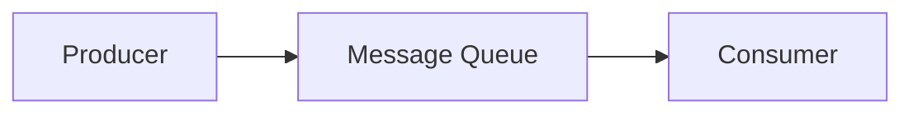
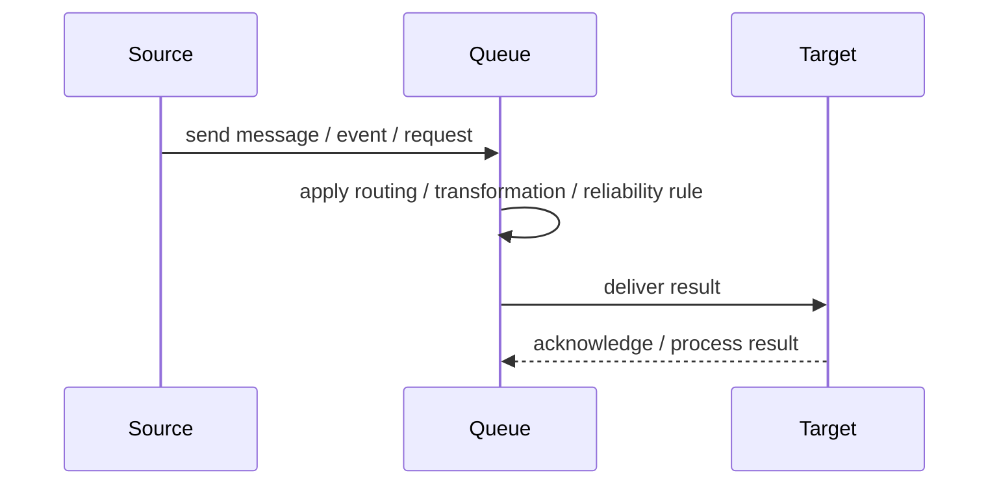
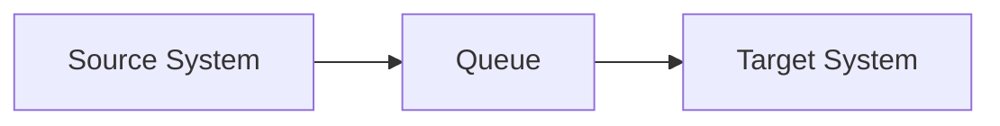

# Queue

## Core Idea

A Queue stores messages until consumers are ready to process them, usually delivering each message to one consumer.

---

## Problem It Solves

A producer and consumer operate at different speeds or availability levels and need asynchronous decoupling.

---

## 3 Concrete Examples

### Example 1: Email Queue

A web app enqueues email jobs while background workers send them later.

### Example 2: Image Processing

Uploaded images are placed on a queue and workers resize them asynchronously.

### Example 3: Order Fulfillment

Order events are queued for warehouse processing so checkout is not blocked.

---

## Architect Questions

- What work should be asynchronous?
- How long can messages wait?
- What is the retry policy?
- What happens when processing fails?
- How many consumers can process the queue?
- Does message order matter?

---

## Main Diagram



---

## Runtime / Responsibility Flow



---

## Implementation Shape

```txt
1. Identify the integration problem: delivery, routing, transformation, ordering, correlation, reliability, or decoupling.
2. Define the message contract: fields, schema, headers, metadata, IDs, and versioning.
3. Define the channel: queue, topic, stream, bus, broker, or direct integration.
4. Define failure behavior: retries, dead letters, timeouts, duplicates, replay, and poison messages.
5. Define ownership: who owns schemas, topics, routing rules, and operational support.
6. Add observability: correlation IDs, logs, metrics, tracing, message age, consumer lag, and DLQ alerts.
7. Keep the pattern focused. Do not hide unclear business workflow inside messaging infrastructure.
```

---

## When to Use

- Producer and consumer speeds differ.
- Work should be processed asynchronously.
- Temporary consumer downtime should not lose work.

---

## When Not to Use

- Immediate response is required.
- The system cannot tolerate eventual processing.
- Message ordering or duplication cannot be handled.

---

## Common Smell That Suggests This Pattern

```txt
Systems are becoming tightly coupled through point-to-point calls,
message formats do not match,
consumers need asynchronous decoupling,
or failures are being lost instead of handled.
```

---

## Common Mistakes

```txt
Using messaging when a simple direct call is clearer.

Forgetting idempotency.

Ignoring duplicate messages.

Ignoring ordering and correlation.

Letting messages become undocumented contracts.

Treating the broker as magic instead of designing failure behavior.

Putting business rules in routing glue where nobody owns them.
```

---

## Best Visual Summary



## Final Meaning

Queue is useful when it solves a real integration pressure. If the integration problem is simple, adding messaging machinery can make the system harder to understand.
