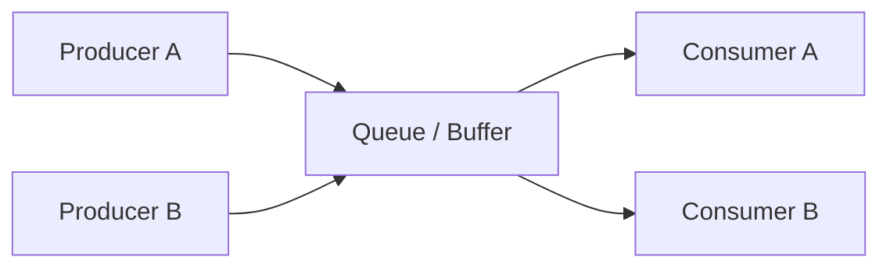
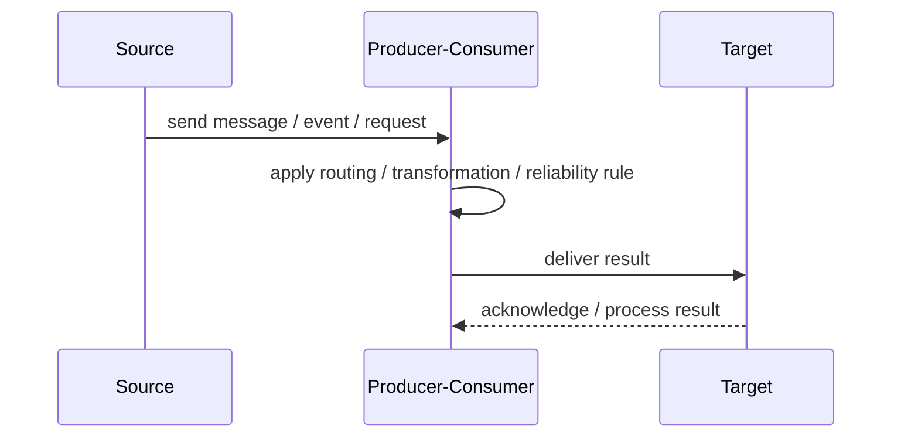
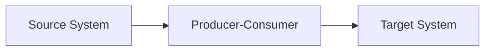

# Producer-Consumer

## Core Idea

Producer-Consumer separates components that create work from components that process work, usually through a queue or buffer.

---

## Problem It Solves

Work creation and work processing need to be decoupled so each can scale or fail independently.

---

## 3 Concrete Examples

### Example 1: Video Encoding

Upload service produces encoding jobs and worker consumers encode videos.

### Example 2: Log Processing

Applications produce logs and log processors consume them.

### Example 3: Report Generation

Users request reports and background consumers generate them.

---

## Architect Questions

- What work is produced?
- Who consumes the work?
- Can consumers scale horizontally?
- What happens if consumers are slower than producers?
- Is ordering important?
- How are poison messages handled?

---

## Main Diagram



---

## Runtime / Responsibility Flow



---

## Implementation Shape

```txt
1. Identify the integration problem: delivery, routing, transformation, ordering, correlation, reliability, or decoupling.
2. Define the message contract: fields, schema, headers, metadata, IDs, and versioning.
3. Define the channel: queue, topic, stream, bus, broker, or direct integration.
4. Define failure behavior: retries, dead letters, timeouts, duplicates, replay, and poison messages.
5. Define ownership: who owns schemas, topics, routing rules, and operational support.
6. Add observability: correlation IDs, logs, metrics, tracing, message age, consumer lag, and DLQ alerts.
7. Keep the pattern focused. Do not hide unclear business workflow inside messaging infrastructure.
```

---

## When to Use

- Work creation and work processing should scale separately.
- Background processing is needed.
- Consumers can process units of work independently.

---

## When Not to Use

- Producer must immediately know final processing result.
- Work units are not independent.
- Queue buildup would hide overload.

---

## Common Smell That Suggests This Pattern

```txt
Systems are becoming tightly coupled through point-to-point calls,
message formats do not match,
consumers need asynchronous decoupling,
or failures are being lost instead of handled.
```

---

## Common Mistakes

```txt
Using messaging when a simple direct call is clearer.

Forgetting idempotency.

Ignoring duplicate messages.

Ignoring ordering and correlation.

Letting messages become undocumented contracts.

Treating the broker as magic instead of designing failure behavior.

Putting business rules in routing glue where nobody owns them.
```

---

## Best Visual Summary



## Final Meaning

Producer-Consumer is useful when it solves a real integration pressure. If the integration problem is simple, adding messaging machinery can make the system harder to understand.
