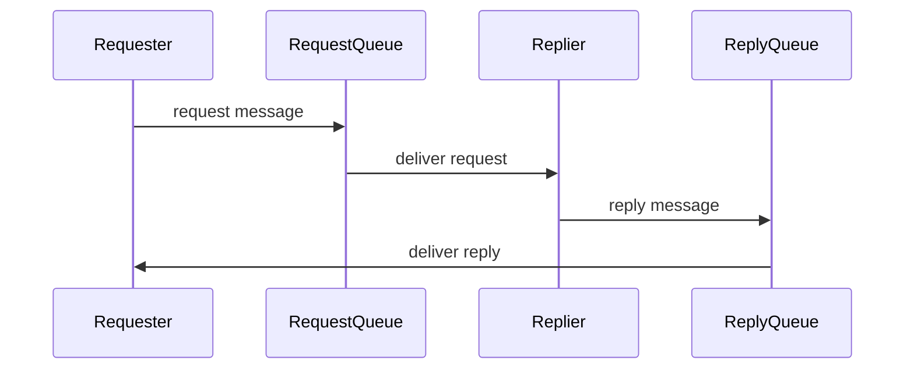
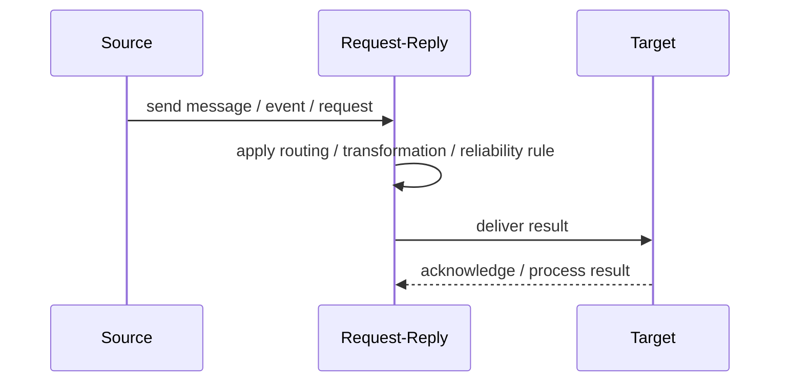
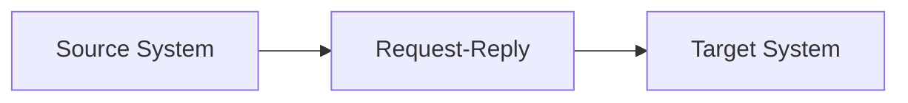

# Request-Reply

## Core Idea

Request-Reply sends a request message and expects a related reply message, often over asynchronous messaging.

---

## Problem It Solves

A sender needs a response from another component but communication still goes through messaging infrastructure.

---

## 3 Concrete Examples

### Example 1: Credit Check

Loan service sends a credit-check request and waits for a credit decision reply.

### Example 2: Inventory Availability

Order service requests inventory availability and receives a reply message.

### Example 3: Document Conversion

A client requests conversion and receives a reply with the converted file location.

---

## Architect Questions

- Where should replies be sent?
- How is the request correlated to the reply?
- What timeout should the requester use?
- Is the requester blocked or async?
- What happens if the reply never arrives?
- Can duplicate replies occur?

---

## Main Diagram



---

## Runtime / Responsibility Flow



---

## Implementation Shape

```txt
1. Identify the integration problem: delivery, routing, transformation, ordering, correlation, reliability, or decoupling.
2. Define the message contract: fields, schema, headers, metadata, IDs, and versioning.
3. Define the channel: queue, topic, stream, bus, broker, or direct integration.
4. Define failure behavior: retries, dead letters, timeouts, duplicates, replay, and poison messages.
5. Define ownership: who owns schemas, topics, routing rules, and operational support.
6. Add observability: correlation IDs, logs, metrics, tracing, message age, consumer lag, and DLQ alerts.
7. Keep the pattern focused. Do not hide unclear business workflow inside messaging infrastructure.
```

---

## When to Use

- A response is required but messaging is the transport.
- The requester can use correlation and timeout handling.
- The responder can process asynchronously.

---

## When Not to Use

- A normal synchronous call is simpler.
- Timeout and correlation handling are not designed.
- Replies are not actually required.

---

## Common Smell That Suggests This Pattern

```txt
Systems are becoming tightly coupled through point-to-point calls,
message formats do not match,
consumers need asynchronous decoupling,
or failures are being lost instead of handled.
```

---

## Common Mistakes

```txt
Using messaging when a simple direct call is clearer.

Forgetting idempotency.

Ignoring duplicate messages.

Ignoring ordering and correlation.

Letting messages become undocumented contracts.

Treating the broker as magic instead of designing failure behavior.

Putting business rules in routing glue where nobody owns them.
```

---

## Best Visual Summary



## Final Meaning

Request-Reply is useful when it solves a real integration pressure. If the integration problem is simple, adding messaging machinery can make the system harder to understand.
