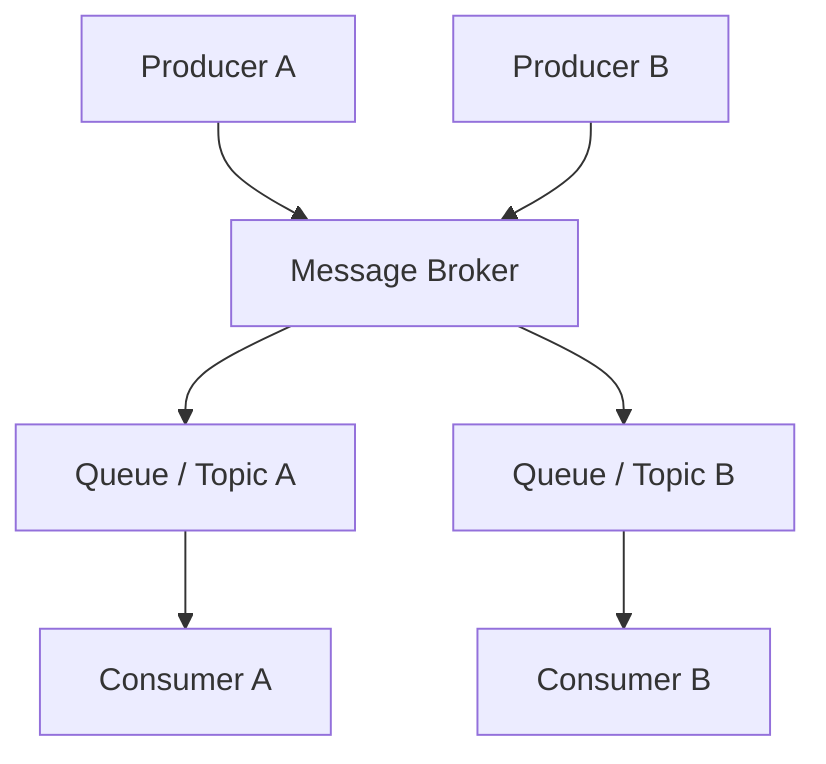
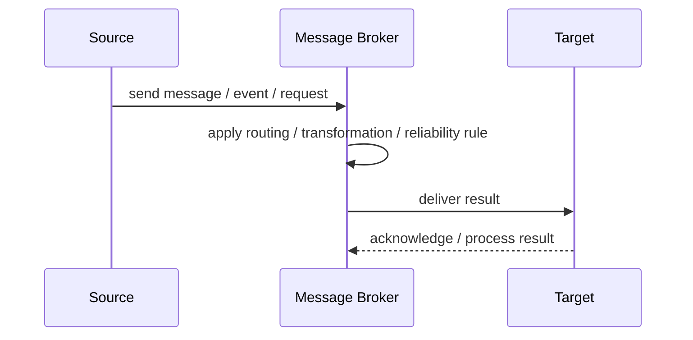
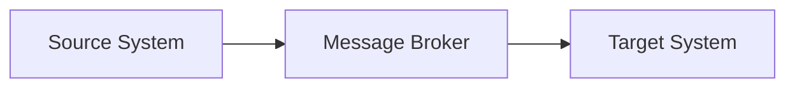

# Message Broker

## Core Idea

A Message Broker receives messages from producers, routes them, stores them when needed, and delivers them to consumers.

---

## Problem It Solves

Applications need reliable asynchronous communication without directly connecting every producer to every consumer.

---

## 3 Concrete Examples

### Example 1: Enterprise Integration

A broker routes order, payment, and shipment messages between systems.

### Example 2: Microservice Messaging

Services publish commands and events through a broker like RabbitMQ or ActiveMQ.

### Example 3: Legacy System Bridge

A broker buffers messages between a modern API and a slow legacy system.

---

## Architect Questions

- What routing patterns are needed?
- Are messages durable?
- How are queues and topics organized?
- What delivery guarantees are required?
- How are retries and dead letters handled?
- Can the broker become a bottleneck?

---

## Main Diagram



---

## Runtime / Responsibility Flow



---

## Implementation Shape

```txt
1. Identify the integration problem: delivery, routing, transformation, ordering, correlation, reliability, or decoupling.
2. Define the message contract: fields, schema, headers, metadata, IDs, and versioning.
3. Define the channel: queue, topic, stream, bus, broker, or direct integration.
4. Define failure behavior: retries, dead letters, timeouts, duplicates, replay, and poison messages.
5. Define ownership: who owns schemas, topics, routing rules, and operational support.
6. Add observability: correlation IDs, logs, metrics, tracing, message age, consumer lag, and DLQ alerts.
7. Keep the pattern focused. Do not hide unclear business workflow inside messaging infrastructure.
```

---

## When to Use

- Many applications need mediated messaging.
- Durable delivery, routing, and retries are needed.
- Direct point-to-point integrations are becoming messy.

---

## When Not to Use

- The system is small and direct calls are enough.
- Broker operations are not supported.
- The broker would centralize too much business logic.

---

## Common Smell That Suggests This Pattern

```txt
Systems are becoming tightly coupled through point-to-point calls,
message formats do not match,
consumers need asynchronous decoupling,
or failures are being lost instead of handled.
```

---

## Common Mistakes

```txt
Using messaging when a simple direct call is clearer.

Forgetting idempotency.

Ignoring duplicate messages.

Ignoring ordering and correlation.

Letting messages become undocumented contracts.

Treating the broker as magic instead of designing failure behavior.

Putting business rules in routing glue where nobody owns them.
```

---

## Best Visual Summary



## Final Meaning

Message Broker is useful when it solves a real integration pressure. If the integration problem is simple, adding messaging machinery can make the system harder to understand.
