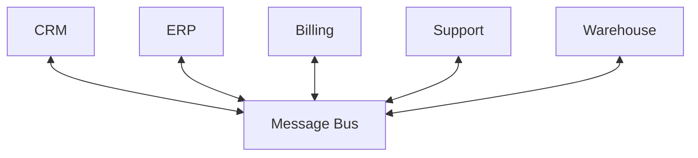
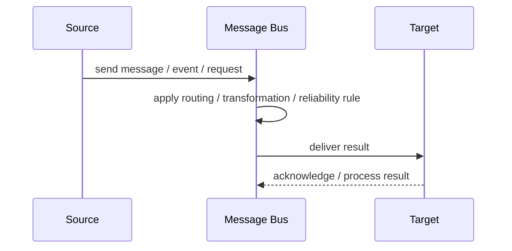
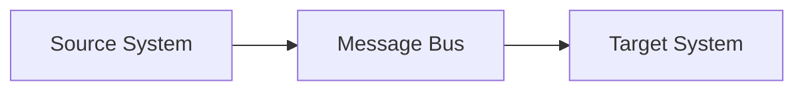

# Message Bus

## Core Idea

A Message Bus provides a shared communication backbone where applications exchange messages using common standards and routing.

---

## Problem It Solves

Many applications need to communicate without point-to-point integration becoming unmanageable.

---

## 3 Concrete Examples

### Example 1: Enterprise App Bus

CRM, ERP, billing, and support systems exchange messages through a shared bus.

### Example 2: Internal Platform Bus

Company services publish and consume integration events on a standard bus.

### Example 3: Legacy Modernization

Old systems and new systems are connected through a bus during migration.

---

## Architect Questions

- What systems connect to the bus?
- What message standards are enforced?
- Does the bus route, transform, or only transport?
- Who governs schemas and topics?
- How is access controlled?
- Can the bus become a centralized bottleneck?

---

## Main Diagram



---

## Runtime / Responsibility Flow



---

## Implementation Shape

```txt
1. Identify the integration problem: delivery, routing, transformation, ordering, correlation, reliability, or decoupling.
2. Define the message contract: fields, schema, headers, metadata, IDs, and versioning.
3. Define the channel: queue, topic, stream, bus, broker, or direct integration.
4. Define failure behavior: retries, dead letters, timeouts, duplicates, replay, and poison messages.
5. Define ownership: who owns schemas, topics, routing rules, and operational support.
6. Add observability: correlation IDs, logs, metrics, tracing, message age, consumer lag, and DLQ alerts.
7. Keep the pattern focused. Do not hide unclear business workflow inside messaging infrastructure.
```

---

## When to Use

- Many enterprise systems need a shared communication backbone.
- Common message standards are valuable.
- Governance and interoperability matter.

---

## When Not to Use

- A simple broker or API integration is enough.
- Governance would slow delivery without value.
- The bus becomes a bottleneck or dumping ground.

---

## Common Smell That Suggests This Pattern

```txt
Systems are becoming tightly coupled through point-to-point calls,
message formats do not match,
consumers need asynchronous decoupling,
or failures are being lost instead of handled.
```

---

## Common Mistakes

```txt
Using messaging when a simple direct call is clearer.

Forgetting idempotency.

Ignoring duplicate messages.

Ignoring ordering and correlation.

Letting messages become undocumented contracts.

Treating the broker as magic instead of designing failure behavior.

Putting business rules in routing glue where nobody owns them.
```

---

## Best Visual Summary



## Final Meaning

Message Bus is useful when it solves a real integration pressure. If the integration problem is simple, adding messaging machinery can make the system harder to understand.
