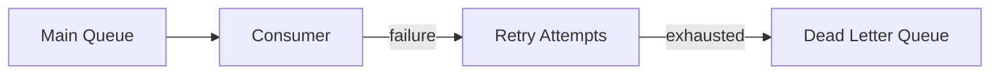
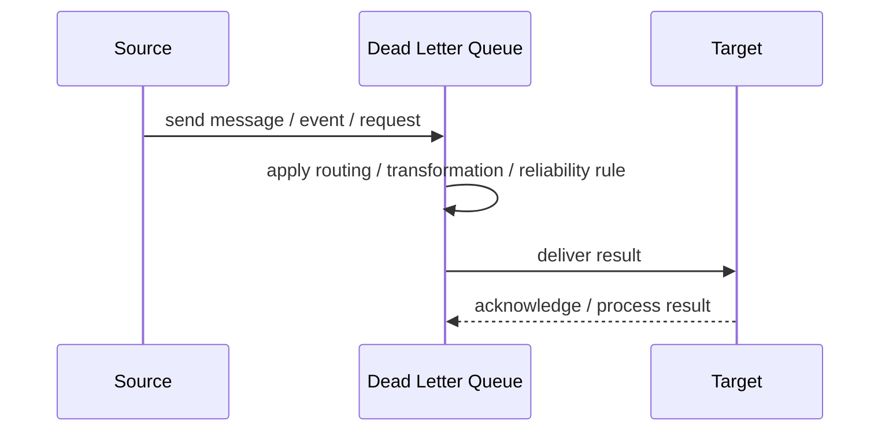
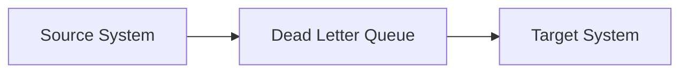

# Dead Letter Queue

## Core Idea

A Dead Letter Queue stores messages that cannot be delivered or processed successfully after configured attempts.

---

## Problem It Solves

Failed messages should not block normal processing or disappear without investigation.

---

## 3 Concrete Examples

### Example 1: Poison Order Message

A malformed order event fails repeatedly and is moved to a DLQ.

### Example 2: Email Failure

A notification job with invalid recipient data goes to a DLQ after retries.

### Example 3: Schema Mismatch

A consumer cannot parse a new event version, so the message is dead-lettered.

---

## Architect Questions

- What failures move a message to the DLQ?
- How many retries happen first?
- Who monitors the DLQ?
- Can messages be replayed after fixing the issue?
- How are poison messages diagnosed?
- How long are DLQ messages retained?

---

## Main Diagram



---

## Runtime / Responsibility Flow



---

## Implementation Shape

```txt
1. Identify the integration problem: delivery, routing, transformation, ordering, correlation, reliability, or decoupling.
2. Define the message contract: fields, schema, headers, metadata, IDs, and versioning.
3. Define the channel: queue, topic, stream, bus, broker, or direct integration.
4. Define failure behavior: retries, dead letters, timeouts, duplicates, replay, and poison messages.
5. Define ownership: who owns schemas, topics, routing rules, and operational support.
6. Add observability: correlation IDs, logs, metrics, tracing, message age, consumer lag, and DLQ alerts.
7. Keep the pattern focused. Do not hide unclear business workflow inside messaging infrastructure.
```

---

## When to Use

- Messages can fail repeatedly.
- Poison messages should not block processing.
- Failures need investigation and replay.

---

## When Not to Use

- Failures are already handled safely.
- No one will monitor or act on the DLQ.
- Messages contain no useful diagnostic information.

---

## Common Smell That Suggests This Pattern

```txt
Systems are becoming tightly coupled through point-to-point calls,
message formats do not match,
consumers need asynchronous decoupling,
or failures are being lost instead of handled.
```

---

## Common Mistakes

```txt
Using messaging when a simple direct call is clearer.

Forgetting idempotency.

Ignoring duplicate messages.

Ignoring ordering and correlation.

Letting messages become undocumented contracts.

Treating the broker as magic instead of designing failure behavior.

Putting business rules in routing glue where nobody owns them.
```

---

## Best Visual Summary



## Final Meaning

Dead Letter Queue is useful when it solves a real integration pressure. If the integration problem is simple, adding messaging machinery can make the system harder to understand.
