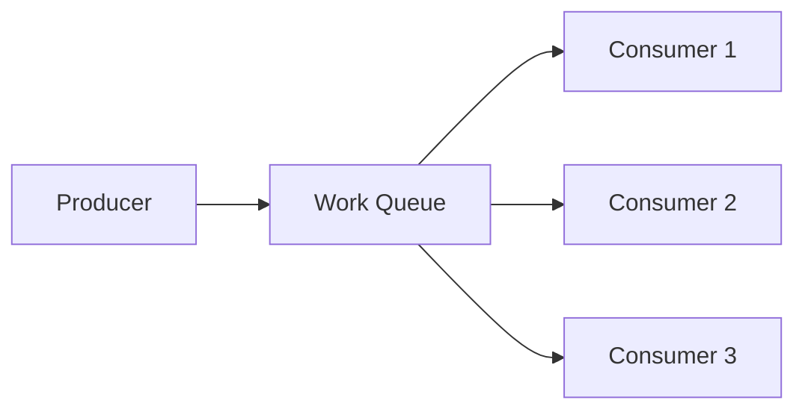
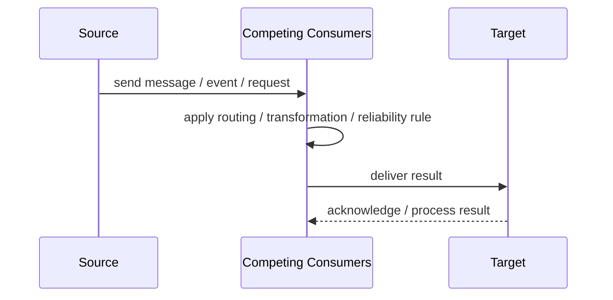
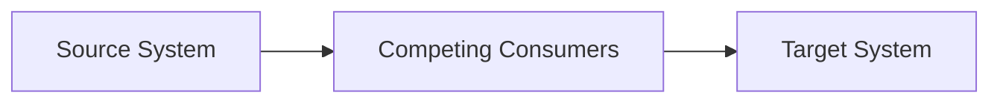

# Competing Consumers

## Core Idea

Competing Consumers use multiple consumers reading from the same queue so work can be processed in parallel.

---

## Problem It Solves

A single consumer cannot process messages fast enough or needs failover support.

---

## 3 Concrete Examples

### Example 1: Email Workers

Several workers consume from the same email queue.

### Example 2: Image Resizing Fleet

Multiple workers process image resize jobs in parallel.

### Example 3: Order Fulfillment Workers

Warehouse tasks are distributed among multiple consumers.

---

## Architect Questions

- Can messages be processed independently?
- Does processing order matter?
- How many consumers are needed?
- Can duplicate processing happen?
- How are failures retried?
- Is the consumer logic idempotent?

---

## Main Diagram



---

## Runtime / Responsibility Flow



---

## Implementation Shape

```txt
1. Identify the integration problem: delivery, routing, transformation, ordering, correlation, reliability, or decoupling.
2. Define the message contract: fields, schema, headers, metadata, IDs, and versioning.
3. Define the channel: queue, topic, stream, bus, broker, or direct integration.
4. Define failure behavior: retries, dead letters, timeouts, duplicates, replay, and poison messages.
5. Define ownership: who owns schemas, topics, routing rules, and operational support.
6. Add observability: correlation IDs, logs, metrics, tracing, message age, consumer lag, and DLQ alerts.
7. Keep the pattern focused. Do not hide unclear business workflow inside messaging infrastructure.
```

---

## When to Use

- Queue throughput must scale.
- Messages can be processed independently.
- Consumer failover is useful.

---

## When Not to Use

- Strict global ordering is required.
- Processing is not idempotent.
- Consumers fight over shared state.

---

## Common Smell That Suggests This Pattern

```txt
Systems are becoming tightly coupled through point-to-point calls,
message formats do not match,
consumers need asynchronous decoupling,
or failures are being lost instead of handled.
```

---

## Common Mistakes

```txt
Using messaging when a simple direct call is clearer.

Forgetting idempotency.

Ignoring duplicate messages.

Ignoring ordering and correlation.

Letting messages become undocumented contracts.

Treating the broker as magic instead of designing failure behavior.

Putting business rules in routing glue where nobody owns them.
```

---

## Best Visual Summary



## Final Meaning

Competing Consumers is useful when it solves a real integration pressure. If the integration problem is simple, adding messaging machinery can make the system harder to understand.
