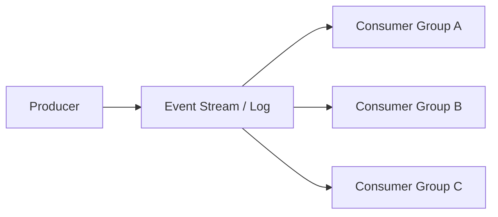
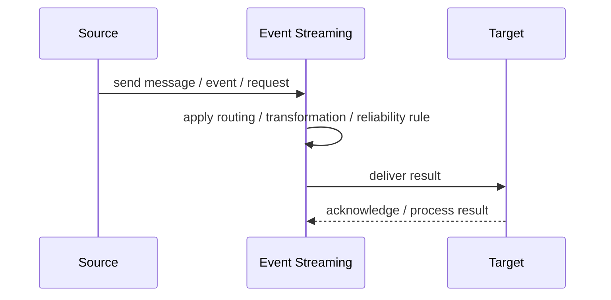
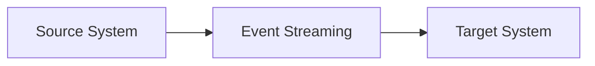

# Event Streaming

## Core Idea

Event Streaming stores ordered streams of events that consumers can read, replay, and process independently.

---

## Problem It Solves

Systems need durable event history, scalable consumption, replay, and real-time processing.

---

## 3 Concrete Examples

### Example 1: Clickstream Analytics

User clicks are streamed to analytics and personalization consumers.

### Example 2: Order Event Log

Order lifecycle events are stored and replayed for projections.

### Example 3: IoT Telemetry

Device readings stream continuously into processing and storage.

---

## Architect Questions

- What events belong in the stream?
- What partition key preserves needed ordering?
- How long are events retained?
- Do consumers need replay?
- How are schemas versioned?
- How is consumer lag monitored?

---

## Main Diagram



---

## Runtime / Responsibility Flow



---

## Implementation Shape

```txt
1. Identify the integration problem: delivery, routing, transformation, ordering, correlation, reliability, or decoupling.
2. Define the message contract: fields, schema, headers, metadata, IDs, and versioning.
3. Define the channel: queue, topic, stream, bus, broker, or direct integration.
4. Define failure behavior: retries, dead letters, timeouts, duplicates, replay, and poison messages.
5. Define ownership: who owns schemas, topics, routing rules, and operational support.
6. Add observability: correlation IDs, logs, metrics, tracing, message age, consumer lag, and DLQ alerts.
7. Keep the pattern focused. Do not hide unclear business workflow inside messaging infrastructure.
```

---

## When to Use

- Durable event history and replay are needed.
- Consumers process events independently.
- High-throughput ordered event logs are useful.

---

## When Not to Use

- Only current state matters.
- Replay is not needed.
- Operational complexity is not justified.

---

## Common Smell That Suggests This Pattern

```txt
Systems are becoming tightly coupled through point-to-point calls,
message formats do not match,
consumers need asynchronous decoupling,
or failures are being lost instead of handled.
```

---

## Common Mistakes

```txt
Using messaging when a simple direct call is clearer.

Forgetting idempotency.

Ignoring duplicate messages.

Ignoring ordering and correlation.

Letting messages become undocumented contracts.

Treating the broker as magic instead of designing failure behavior.

Putting business rules in routing glue where nobody owns them.
```

---

## Best Visual Summary



## Final Meaning

Event Streaming is useful when it solves a real integration pressure. If the integration problem is simple, adding messaging machinery can make the system harder to understand.
