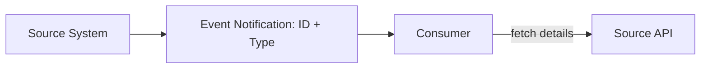
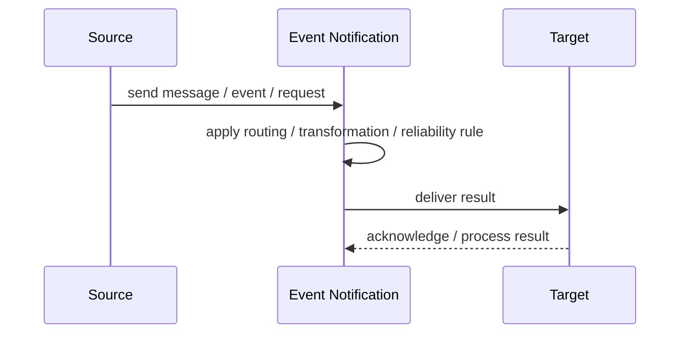
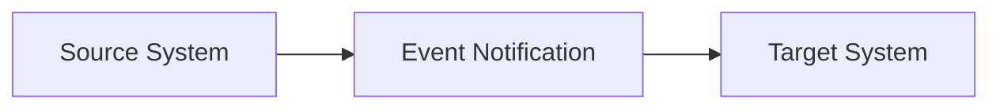

# Event Notification

## Core Idea

Event Notification sends a lightweight message that something happened, without carrying all the related state.

---

## Problem It Solves

Consumers need to know that a change occurred but can fetch details from the source system if needed.

---

## 3 Concrete Examples

### Example 1: UserUpdated Notification

A notification says user U123 changed; consumers fetch current user details if needed.

### Example 2: InvoiceCreated Signal

Billing publishes invoice ID, and consumers request full invoice data later.

### Example 3: DocumentReady Notice

Conversion service announces a document is ready using a document ID.

---

## Architect Questions

- What minimum information must the notification carry?
- Where do consumers fetch details?
- Can the source state change before consumers fetch it?
- Do consumers need historical state or latest state?
- What if the detail lookup fails?
- Is event-carried state transfer better?

---

## Main Diagram



---

## Runtime / Responsibility Flow



---

## Implementation Shape

```txt
1. Identify the integration problem: delivery, routing, transformation, ordering, correlation, reliability, or decoupling.
2. Define the message contract: fields, schema, headers, metadata, IDs, and versioning.
3. Define the channel: queue, topic, stream, bus, broker, or direct integration.
4. Define failure behavior: retries, dead letters, timeouts, duplicates, replay, and poison messages.
5. Define ownership: who owns schemas, topics, routing rules, and operational support.
6. Add observability: correlation IDs, logs, metrics, tracing, message age, consumer lag, and DLQ alerts.
7. Keep the pattern focused. Do not hide unclear business workflow inside messaging infrastructure.
```

---

## When to Use

- Consumers only need to know something changed.
- Consumers can fetch details from the source.
- Events should stay small.

---

## When Not to Use

- Consumers need full event state.
- Fetching details would overload the source.
- Latest-state lookup creates race conditions.

---

## Common Smell That Suggests This Pattern

```txt
Systems are becoming tightly coupled through point-to-point calls,
message formats do not match,
consumers need asynchronous decoupling,
or failures are being lost instead of handled.
```

---

## Common Mistakes

```txt
Using messaging when a simple direct call is clearer.

Forgetting idempotency.

Ignoring duplicate messages.

Ignoring ordering and correlation.

Letting messages become undocumented contracts.

Treating the broker as magic instead of designing failure behavior.

Putting business rules in routing glue where nobody owns them.
```

---

## Best Visual Summary



## Final Meaning

Event Notification is useful when it solves a real integration pressure. If the integration problem is simple, adding messaging machinery can make the system harder to understand.
