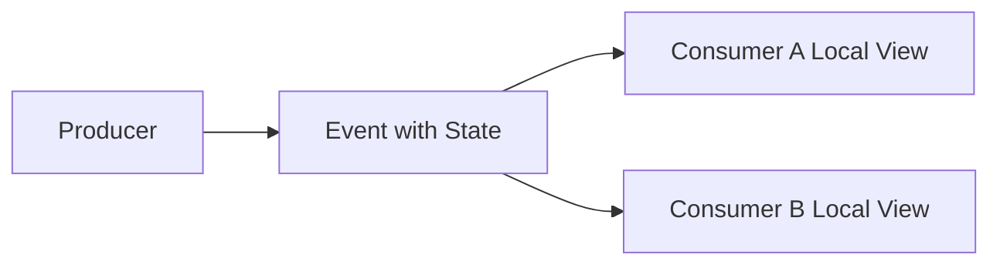
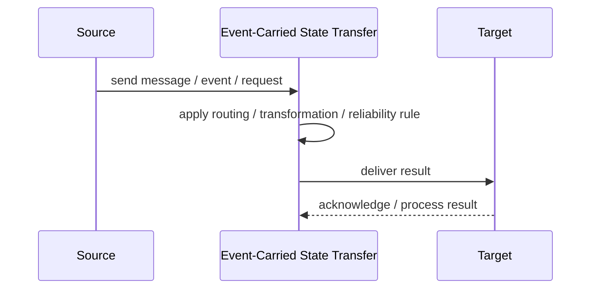
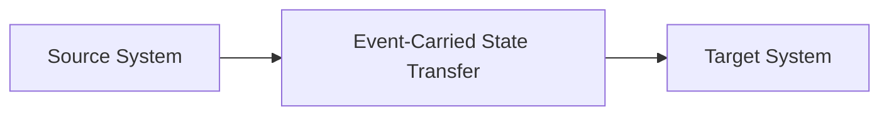

# Event-Carried State Transfer

## Core Idea

Event-Carried State Transfer includes enough state in the event so consumers do not need to query the producer for details.

---

## Problem It Solves

Consumers need data to update local views or react independently, and repeated lookups to the source would create coupling or load.

---

## 3 Concrete Examples

### Example 1: CustomerUpdated Event

The event includes customer name, email, and status so CRM projections update locally.

### Example 2: ProductPriceChanged

The event includes product ID, new price, currency, and effective date.

### Example 3: OrderPlaced

The event includes order ID, items, customer ID, and total for downstream processing.

---

## Architect Questions

- What state do consumers need?
- How large can events become?
- Who owns event schema versioning?
- Can sensitive data be included?
- Do consumers need full state or a partial projection?
- How are stale projections corrected?

---

## Main Diagram



---

## Runtime / Responsibility Flow



---

## Implementation Shape

```txt
1. Identify the integration problem: delivery, routing, transformation, ordering, correlation, reliability, or decoupling.
2. Define the message contract: fields, schema, headers, metadata, IDs, and versioning.
3. Define the channel: queue, topic, stream, bus, broker, or direct integration.
4. Define failure behavior: retries, dead letters, timeouts, duplicates, replay, and poison messages.
5. Define ownership: who owns schemas, topics, routing rules, and operational support.
6. Add observability: correlation IDs, logs, metrics, tracing, message age, consumer lag, and DLQ alerts.
7. Keep the pattern focused. Do not hide unclear business workflow inside messaging infrastructure.
```

---

## When to Use

- Consumers need enough data to update local state.
- Avoiding producer lookups matters.
- Eventual consistency is acceptable.

---

## When Not to Use

- Events would expose sensitive data.
- Payloads become too large.
- Consumers only need a change signal.

---

## Common Smell That Suggests This Pattern

```txt
Systems are becoming tightly coupled through point-to-point calls,
message formats do not match,
consumers need asynchronous decoupling,
or failures are being lost instead of handled.
```

---

## Common Mistakes

```txt
Using messaging when a simple direct call is clearer.

Forgetting idempotency.

Ignoring duplicate messages.

Ignoring ordering and correlation.

Letting messages become undocumented contracts.

Treating the broker as magic instead of designing failure behavior.

Putting business rules in routing glue where nobody owns them.
```

---

## Best Visual Summary



## Final Meaning

Event-Carried State Transfer is useful when it solves a real integration pressure. If the integration problem is simple, adding messaging machinery can make the system harder to understand.
