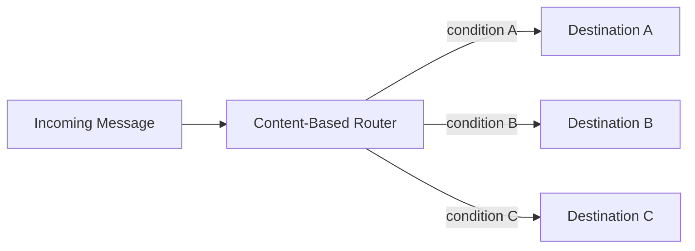
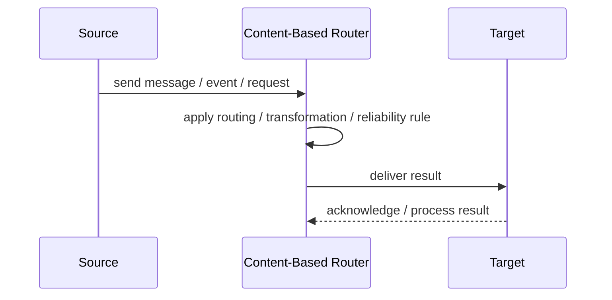
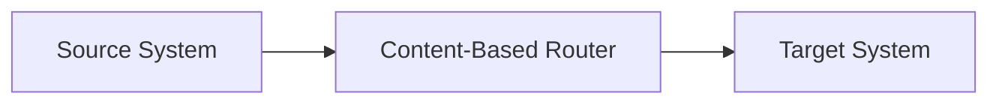

# Content-Based Router

## Core Idea

A Content-Based Router routes messages to different destinations based on message content.

---

## Problem It Solves

Messages of the same general type need to go to different systems depending on fields, rules, or attributes.

---

## 3 Concrete Examples

### Example 1: Order Region Routing

Orders are routed to US, EU, or APAC fulfillment based on shipping country.

### Example 2: Priority Support

Support tickets with severity critical go to the urgent queue.

### Example 3: Payment Type Routing

Card payments go to one processor and bank transfers go to another.

---

## Architect Questions

- Which message fields determine routing?
- Are routing rules stable or configurable?
- Can one message go to multiple destinations?
- What happens when no route matches?
- How are rules tested?
- Who owns route changes?

---

## Main Diagram



---

## Runtime / Responsibility Flow



---

## Implementation Shape

```txt
1. Identify the integration problem: delivery, routing, transformation, ordering, correlation, reliability, or decoupling.
2. Define the message contract: fields, schema, headers, metadata, IDs, and versioning.
3. Define the channel: queue, topic, stream, bus, broker, or direct integration.
4. Define failure behavior: retries, dead letters, timeouts, duplicates, replay, and poison messages.
5. Define ownership: who owns schemas, topics, routing rules, and operational support.
6. Add observability: correlation IDs, logs, metrics, tracing, message age, consumer lag, and DLQ alerts.
7. Keep the pattern focused. Do not hide unclear business workflow inside messaging infrastructure.
```

---

## When to Use

- Messages need routing based on content.
- Routing rules are meaningful and owned.
- Different destinations process different message types or conditions.

---

## When Not to Use

- Routing rules are unstable or unclear.
- All messages go to the same place.
- Routing logic becomes hidden business policy.

---

## Common Smell That Suggests This Pattern

```txt
Systems are becoming tightly coupled through point-to-point calls,
message formats do not match,
consumers need asynchronous decoupling,
or failures are being lost instead of handled.
```

---

## Common Mistakes

```txt
Using messaging when a simple direct call is clearer.

Forgetting idempotency.

Ignoring duplicate messages.

Ignoring ordering and correlation.

Letting messages become undocumented contracts.

Treating the broker as magic instead of designing failure behavior.

Putting business rules in routing glue where nobody owns them.
```

---

## Best Visual Summary



## Final Meaning

Content-Based Router is useful when it solves a real integration pressure. If the integration problem is simple, adding messaging machinery can make the system harder to understand.
