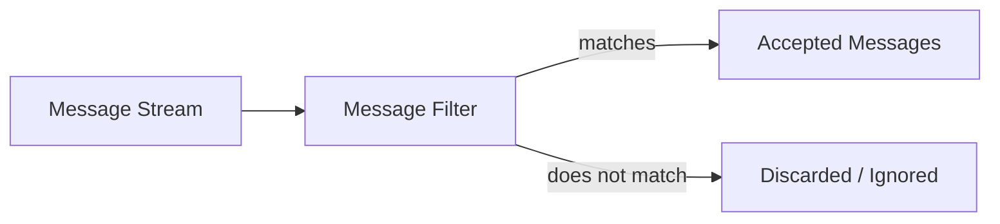
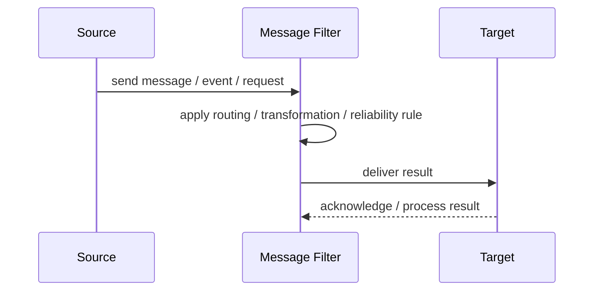
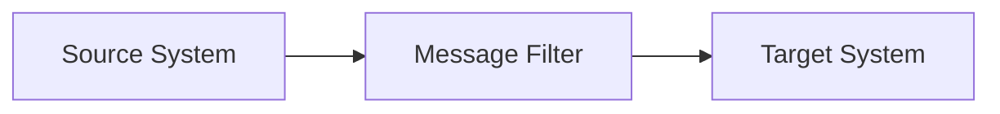

# Message Filter

## Core Idea

A Message Filter removes messages that do not meet specified criteria.

---

## Problem It Solves

A consumer or downstream system should receive only relevant messages, not all messages from a channel.

---

## 3 Concrete Examples

### Example 1: High-Value Orders

Only orders over $1,000 continue to fraud review.

### Example 2: Region Filter

A regional service receives only events for its region.

### Example 3: Noise Reduction

Debug-level telemetry is filtered before reaching expensive storage.

---

## Architect Questions

- What criteria make a message relevant?
- Should filtered messages be discarded or sent elsewhere?
- Where should filtering happen?
- Can filtering accidentally remove needed events?
- Are filter rules configurable?
- How will filtering be monitored?

---

## Main Diagram



---

## Runtime / Responsibility Flow



---

## Implementation Shape

```txt
1. Identify the integration problem: delivery, routing, transformation, ordering, correlation, reliability, or decoupling.
2. Define the message contract: fields, schema, headers, metadata, IDs, and versioning.
3. Define the channel: queue, topic, stream, bus, broker, or direct integration.
4. Define failure behavior: retries, dead letters, timeouts, duplicates, replay, and poison messages.
5. Define ownership: who owns schemas, topics, routing rules, and operational support.
6. Add observability: correlation IDs, logs, metrics, tracing, message age, consumer lag, and DLQ alerts.
7. Keep the pattern focused. Do not hide unclear business workflow inside messaging infrastructure.
```

---

## When to Use

- Downstream consumers should receive only relevant messages.
- Filtering criteria are clear.
- Dropping or diverting messages is acceptable.

---

## When Not to Use

- Filtered messages may be needed later.
- Rules are unclear.
- Filtering should happen at the producer instead.

---

## Common Smell That Suggests This Pattern

```txt
Systems are becoming tightly coupled through point-to-point calls,
message formats do not match,
consumers need asynchronous decoupling,
or failures are being lost instead of handled.
```

---

## Common Mistakes

```txt
Using messaging when a simple direct call is clearer.

Forgetting idempotency.

Ignoring duplicate messages.

Ignoring ordering and correlation.

Letting messages become undocumented contracts.

Treating the broker as magic instead of designing failure behavior.

Putting business rules in routing glue where nobody owns them.
```

---

## Best Visual Summary



## Final Meaning

Message Filter is useful when it solves a real integration pressure. If the integration problem is simple, adding messaging machinery can make the system harder to understand.
