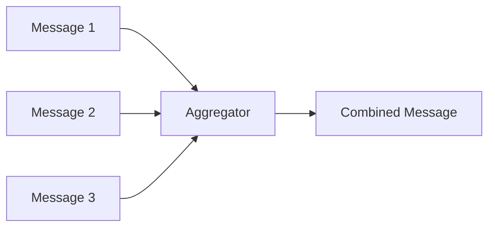
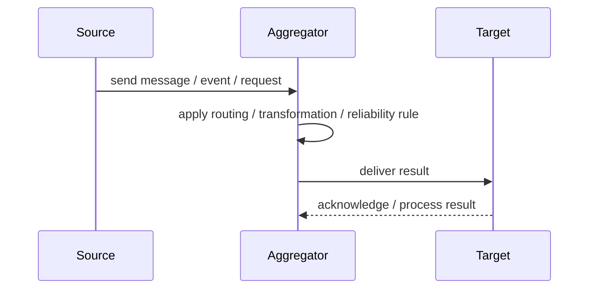
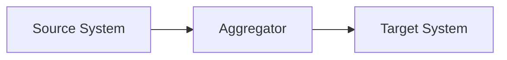

# Aggregator

## Core Idea

An Aggregator collects related messages and combines them into one complete message or result.

---

## Problem It Solves

A complete result requires multiple messages that arrive separately.

---

## 3 Concrete Examples

### Example 1: Order Shipment Aggregation

Separate package shipment confirmations are aggregated into one order-shipped status.

### Example 2: Travel Quote Aggregation

Flight, hotel, and car quotes are combined into one trip quote.

### Example 3: Batch Sensor Summary

Multiple sensor readings are aggregated into a time-window summary.

---

## Architect Questions

- Which messages belong together?
- What correlation key groups them?
- How does the aggregator know the group is complete?
- What timeout should be used?
- What happens with missing messages?
- Is partial aggregation acceptable?

---

## Main Diagram



---

## Runtime / Responsibility Flow



---

## Implementation Shape

```txt
1. Identify the integration problem: delivery, routing, transformation, ordering, correlation, reliability, or decoupling.
2. Define the message contract: fields, schema, headers, metadata, IDs, and versioning.
3. Define the channel: queue, topic, stream, bus, broker, or direct integration.
4. Define failure behavior: retries, dead letters, timeouts, duplicates, replay, and poison messages.
5. Define ownership: who owns schemas, topics, routing rules, and operational support.
6. Add observability: correlation IDs, logs, metrics, tracing, message age, consumer lag, and DLQ alerts.
7. Keep the pattern focused. Do not hide unclear business workflow inside messaging infrastructure.
```

---

## When to Use

- Multiple related messages form one logical result.
- A correlation key exists.
- Completion rules and timeouts are clear.

---

## When Not to Use

- Messages do not have a reliable correlation key.
- Completion cannot be determined.
- Waiting for all parts would create unacceptable delays.

---

## Common Smell That Suggests This Pattern

```txt
Systems are becoming tightly coupled through point-to-point calls,
message formats do not match,
consumers need asynchronous decoupling,
or failures are being lost instead of handled.
```

---

## Common Mistakes

```txt
Using messaging when a simple direct call is clearer.

Forgetting idempotency.

Ignoring duplicate messages.

Ignoring ordering and correlation.

Letting messages become undocumented contracts.

Treating the broker as magic instead of designing failure behavior.

Putting business rules in routing glue where nobody owns them.
```

---

## Best Visual Summary



## Final Meaning

Aggregator is useful when it solves a real integration pressure. If the integration problem is simple, adding messaging machinery can make the system harder to understand.
