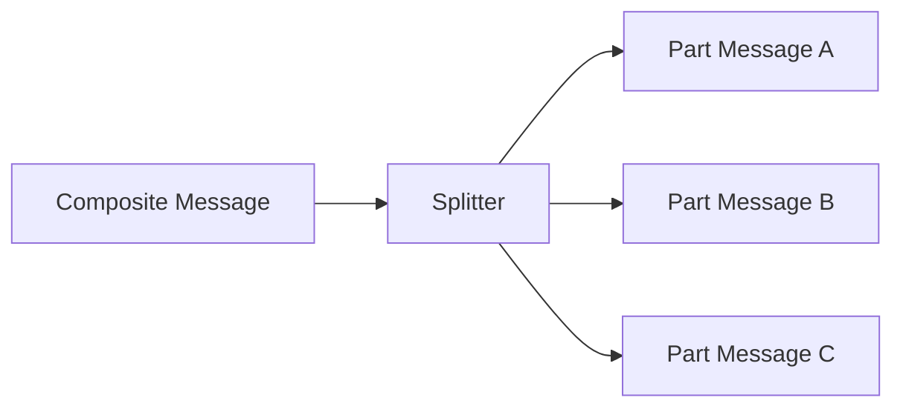
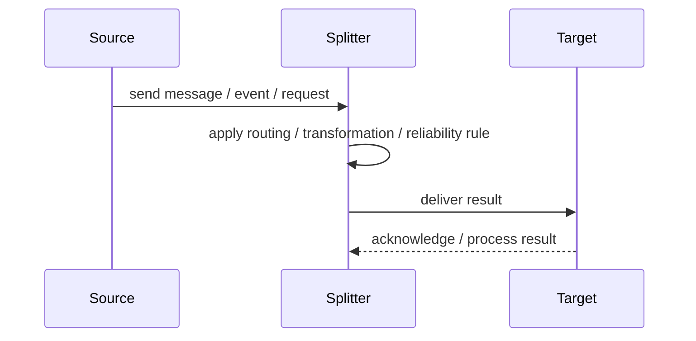
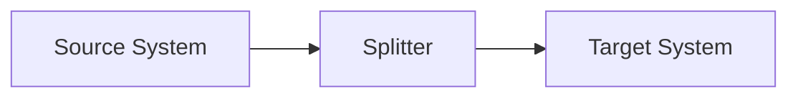

# Splitter

## Core Idea

A Splitter breaks one complex message into multiple smaller messages that can be processed independently.

---

## Problem It Solves

A large message contains multiple items that need separate routing, processing, or scaling.

---

## 3 Concrete Examples

### Example 1: Order Line Items

One order message is split into one message per item for warehouse picking.

### Example 2: CSV Import

One uploaded file is split into row-level processing messages.

### Example 3: Batch Invoice

A batch invoice message is split into individual invoice messages.

---

## Architect Questions

- What is the unit of splitting?
- Do split messages need correlation back to the original?
- Can split items be processed independently?
- Does order matter?
- How are failures for individual items handled?
- Is aggregation needed later?

---

## Main Diagram



---

## Runtime / Responsibility Flow



---

## Implementation Shape

```txt
1. Identify the integration problem: delivery, routing, transformation, ordering, correlation, reliability, or decoupling.
2. Define the message contract: fields, schema, headers, metadata, IDs, and versioning.
3. Define the channel: queue, topic, stream, bus, broker, or direct integration.
4. Define failure behavior: retries, dead letters, timeouts, duplicates, replay, and poison messages.
5. Define ownership: who owns schemas, topics, routing rules, and operational support.
6. Add observability: correlation IDs, logs, metrics, tracing, message age, consumer lag, and DLQ alerts.
7. Keep the pattern focused. Do not hide unclear business workflow inside messaging infrastructure.
```

---

## When to Use

- A large message contains independent parts.
- Parts can be processed separately.
- Correlation to the original can be maintained.

---

## When Not to Use

- Parts cannot be processed independently.
- Splitting destroys required context.
- Re-aggregation is impossible but required.

---

## Common Smell That Suggests This Pattern

```txt
Systems are becoming tightly coupled through point-to-point calls,
message formats do not match,
consumers need asynchronous decoupling,
or failures are being lost instead of handled.
```

---

## Common Mistakes

```txt
Using messaging when a simple direct call is clearer.

Forgetting idempotency.

Ignoring duplicate messages.

Ignoring ordering and correlation.

Letting messages become undocumented contracts.

Treating the broker as magic instead of designing failure behavior.

Putting business rules in routing glue where nobody owns them.
```

---

## Best Visual Summary



## Final Meaning

Splitter is useful when it solves a real integration pressure. If the integration problem is simple, adding messaging machinery can make the system harder to understand.
