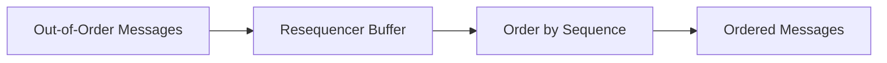
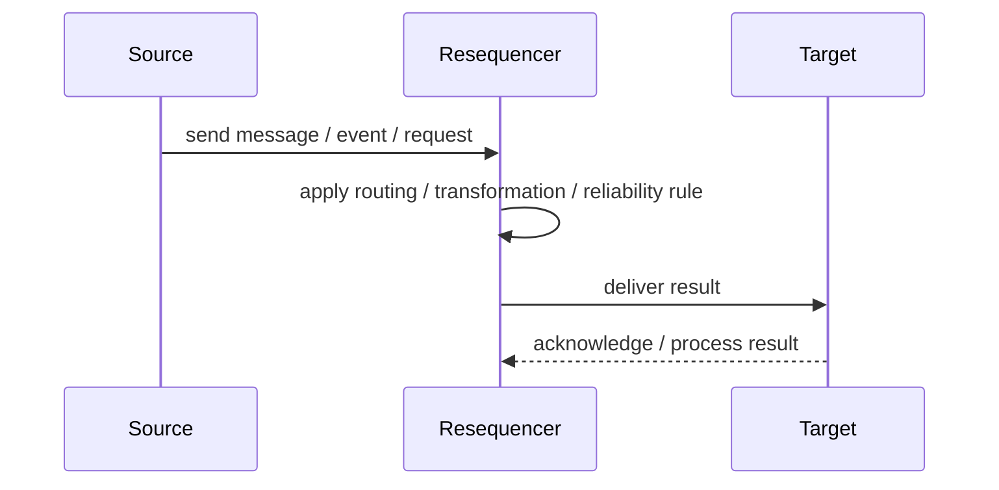
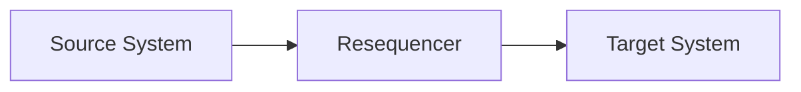

# Resequencer

## Core Idea

A Resequencer reorders messages that arrive out of sequence before forwarding them.

---

## Problem It Solves

A downstream system requires messages in a specific order, but the messaging infrastructure may deliver them out of order.

---

## 3 Concrete Examples

### Example 1: Account Transactions

Transactions must be applied in sequence number order.

### Example 2: Workflow Steps

StepCompleted events are resequenced before state projection.

### Example 3: File Chunk Assembly

File chunks arrive out of order and must be processed in order.

---

## Architect Questions

- What sequence field determines order?
- How long should the resequencer wait for missing messages?
- What happens when a message never arrives?
- Can messages be processed partially?
- Is ordering required globally or per key?
- How much buffering is acceptable?

---

## Main Diagram



---

## Runtime / Responsibility Flow



---

## Implementation Shape

```txt
1. Identify the integration problem: delivery, routing, transformation, ordering, correlation, reliability, or decoupling.
2. Define the message contract: fields, schema, headers, metadata, IDs, and versioning.
3. Define the channel: queue, topic, stream, bus, broker, or direct integration.
4. Define failure behavior: retries, dead letters, timeouts, duplicates, replay, and poison messages.
5. Define ownership: who owns schemas, topics, routing rules, and operational support.
6. Add observability: correlation IDs, logs, metrics, tracing, message age, consumer lag, and DLQ alerts.
7. Keep the pattern focused. Do not hide unclear business workflow inside messaging infrastructure.
```

---

## When to Use

- Messages can arrive out of order.
- Downstream processing requires order.
- Sequence IDs and buffering rules exist.

---

## When Not to Use

- Ordering is not actually required.
- Missing messages are common and block progress.
- Buffering creates unacceptable latency.

---

## Common Smell That Suggests This Pattern

```txt
Systems are becoming tightly coupled through point-to-point calls,
message formats do not match,
consumers need asynchronous decoupling,
or failures are being lost instead of handled.
```

---

## Common Mistakes

```txt
Using messaging when a simple direct call is clearer.

Forgetting idempotency.

Ignoring duplicate messages.

Ignoring ordering and correlation.

Letting messages become undocumented contracts.

Treating the broker as magic instead of designing failure behavior.

Putting business rules in routing glue where nobody owns them.
```

---

## Best Visual Summary



## Final Meaning

Resequencer is useful when it solves a real integration pressure. If the integration problem is simple, adding messaging machinery can make the system harder to understand.
