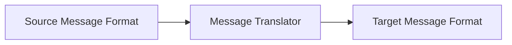
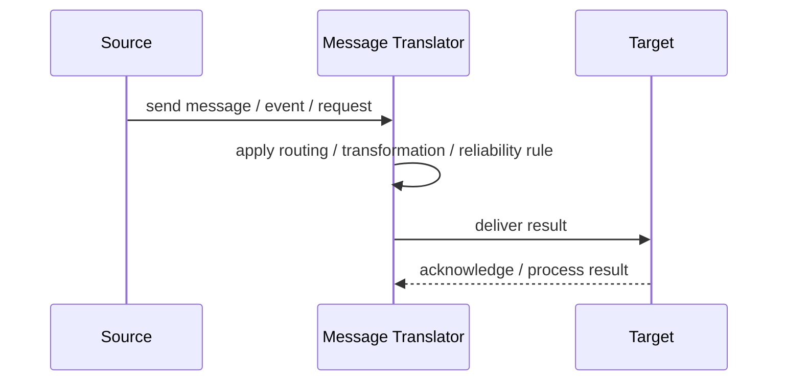
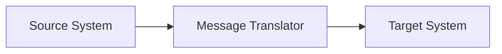

# Message Translator

## Core Idea

A Message Translator converts one message format, schema, or protocol into another.

---

## Problem It Solves

Two systems need to communicate but use different data formats or naming conventions.

---

## 3 Concrete Examples

### Example 1: Legacy Customer Record

Legacy customer fields are translated into modern CustomerDTO fields.

### Example 2: XML to JSON

An old SOAP/XML message is translated into JSON for a REST service.

### Example 3: Vendor Status Mapping

External payment statuses are translated into internal payment states.

---

## Architect Questions

- What source and target formats exist?
- Which fields map directly?
- Which fields need transformation or defaults?
- How are validation errors handled?
- Who owns mapping rules?
- How are schema changes versioned?

---

## Main Diagram



---

## Runtime / Responsibility Flow



---

## Implementation Shape

```txt
1. Identify the integration problem: delivery, routing, transformation, ordering, correlation, reliability, or decoupling.
2. Define the message contract: fields, schema, headers, metadata, IDs, and versioning.
3. Define the channel: queue, topic, stream, bus, broker, or direct integration.
4. Define failure behavior: retries, dead letters, timeouts, duplicates, replay, and poison messages.
5. Define ownership: who owns schemas, topics, routing rules, and operational support.
6. Add observability: correlation IDs, logs, metrics, tracing, message age, consumer lag, and DLQ alerts.
7. Keep the pattern focused. Do not hide unclear business workflow inside messaging infrastructure.
```

---

## When to Use

- Systems use different message formats.
- Mapping rules are stable enough.
- You want format conversion at integration boundaries.

---

## When Not to Use

- Both systems can already share a contract.
- Mapping rules are constantly changing.
- Translator becomes a home for business logic.

---

## Common Smell That Suggests This Pattern

```txt
Systems are becoming tightly coupled through point-to-point calls,
message formats do not match,
consumers need asynchronous decoupling,
or failures are being lost instead of handled.
```

---

## Common Mistakes

```txt
Using messaging when a simple direct call is clearer.

Forgetting idempotency.

Ignoring duplicate messages.

Ignoring ordering and correlation.

Letting messages become undocumented contracts.

Treating the broker as magic instead of designing failure behavior.

Putting business rules in routing glue where nobody owns them.
```

---

## Best Visual Summary



## Final Meaning

Message Translator is useful when it solves a real integration pressure. If the integration problem is simple, adding messaging machinery can make the system harder to understand.
