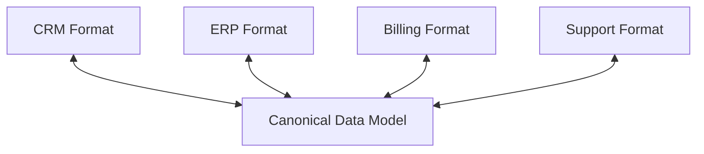
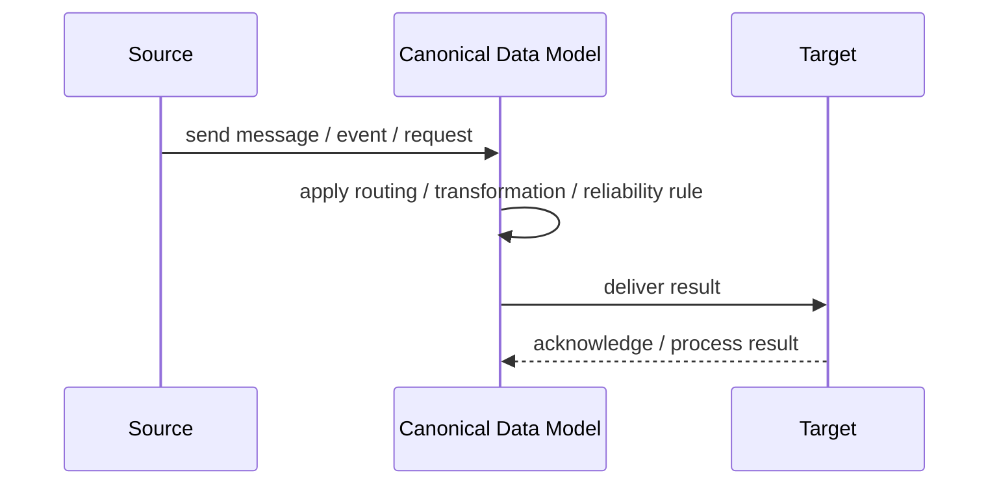
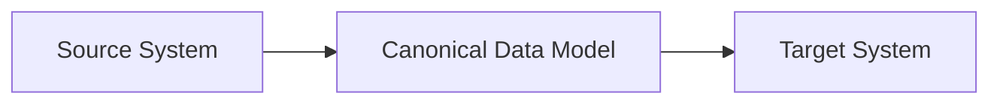

# Canonical Data Model

## Core Idea

Canonical Data Model defines a shared enterprise message format so integrations do not need custom pairwise translations between every system.

---

## Problem It Solves

Many systems have different data formats, creating too many point-to-point mappings.

---

## 3 Concrete Examples

### Example 1: Canonical Customer

CRM, billing, and support all map to one enterprise customer format.

### Example 2: Canonical Order

E-commerce, warehouse, and accounting exchange a shared order format.

### Example 3: Canonical Product

PIM, storefront, and ERP use a standard product message.

---

## Architect Questions

- Which concepts deserve canonical models?
- Who governs the canonical schema?
- Can the model avoid becoming too generic?
- How are versions handled?
- Do systems map to canonical at the boundary?
- Is canonical worth the governance cost?

---

## Main Diagram



---

## Runtime / Responsibility Flow



---

## Implementation Shape

```txt
1. Identify the integration problem: delivery, routing, transformation, ordering, correlation, reliability, or decoupling.
2. Define the message contract: fields, schema, headers, metadata, IDs, and versioning.
3. Define the channel: queue, topic, stream, bus, broker, or direct integration.
4. Define failure behavior: retries, dead letters, timeouts, duplicates, replay, and poison messages.
5. Define ownership: who owns schemas, topics, routing rules, and operational support.
6. Add observability: correlation IDs, logs, metrics, tracing, message age, consumer lag, and DLQ alerts.
7. Keep the pattern focused. Do not hide unclear business workflow inside messaging infrastructure.
```

---

## When to Use

- Many systems need common enterprise message formats.
- Governance is possible.
- You want to reduce pairwise mapping complexity.

---

## When Not to Use

- Only two systems integrate.
- Governance is impossible.
- The canonical model becomes bloated and abstract.

---

## Common Smell That Suggests This Pattern

```txt
Systems are becoming tightly coupled through point-to-point calls,
message formats do not match,
consumers need asynchronous decoupling,
or failures are being lost instead of handled.
```

---

## Common Mistakes

```txt
Using messaging when a simple direct call is clearer.

Forgetting idempotency.

Ignoring duplicate messages.

Ignoring ordering and correlation.

Letting messages become undocumented contracts.

Treating the broker as magic instead of designing failure behavior.

Putting business rules in routing glue where nobody owns them.
```

---

## Best Visual Summary



## Final Meaning

Canonical Data Model is useful when it solves a real integration pressure. If the integration problem is simple, adding messaging machinery can make the system harder to understand.
