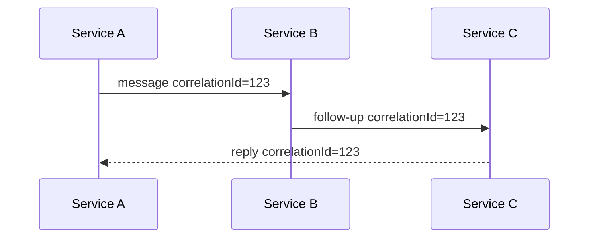
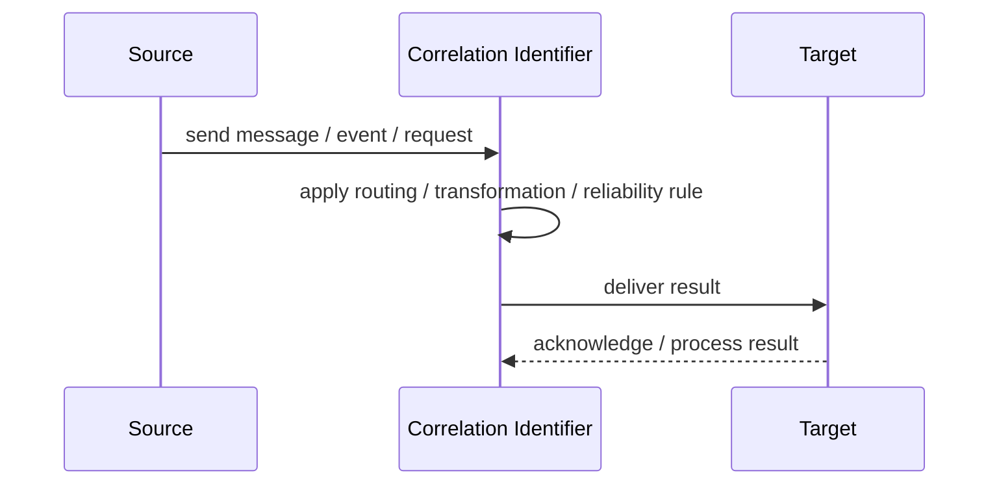
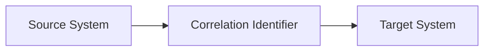

# Correlation Identifier

## Core Idea

A Correlation Identifier is an ID included in related messages so they can be matched across asynchronous flows.

---

## Problem It Solves

A system needs to know which response, event, or follow-up message belongs to which original request or workflow.

---

## 3 Concrete Examples

### Example 1: Request-Reply

A reply includes the request's correlation ID.

### Example 2: Order Saga

All messages in the order workflow share a saga correlation ID.

### Example 3: Distributed Trace

Events across services carry a trace or correlation ID for debugging.

---

## Architect Questions

- What ID links related messages?
- Who creates the correlation ID?
- Is it propagated through every message?
- Is it distinct from message ID?
- How is it logged?
- How is correlation used for aggregation or tracing?

---

## Main Diagram



---

## Runtime / Responsibility Flow



---

## Implementation Shape

```txt
1. Identify the integration problem: delivery, routing, transformation, ordering, correlation, reliability, or decoupling.
2. Define the message contract: fields, schema, headers, metadata, IDs, and versioning.
3. Define the channel: queue, topic, stream, bus, broker, or direct integration.
4. Define failure behavior: retries, dead letters, timeouts, duplicates, replay, and poison messages.
5. Define ownership: who owns schemas, topics, routing rules, and operational support.
6. Add observability: correlation IDs, logs, metrics, tracing, message age, consumer lag, and DLQ alerts.
7. Keep the pattern focused. Do not hide unclear business workflow inside messaging infrastructure.
```

---

## When to Use

- Messages belong to a larger workflow.
- Replies need to match requests.
- Tracing and aggregation need shared IDs.

---

## When Not to Use

- There is no multi-message workflow.
- Messages already have adequate trace context.
- IDs are not propagated consistently.

---

## Common Smell That Suggests This Pattern

```txt
Systems are becoming tightly coupled through point-to-point calls,
message formats do not match,
consumers need asynchronous decoupling,
or failures are being lost instead of handled.
```

---

## Common Mistakes

```txt
Using messaging when a simple direct call is clearer.

Forgetting idempotency.

Ignoring duplicate messages.

Ignoring ordering and correlation.

Letting messages become undocumented contracts.

Treating the broker as magic instead of designing failure behavior.

Putting business rules in routing glue where nobody owns them.
```

---

## Best Visual Summary



## Final Meaning

Correlation Identifier is useful when it solves a real integration pressure. If the integration problem is simple, adding messaging machinery can make the system harder to understand.
