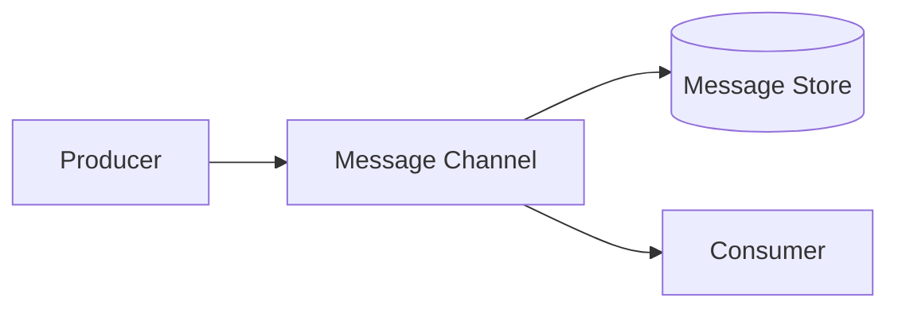
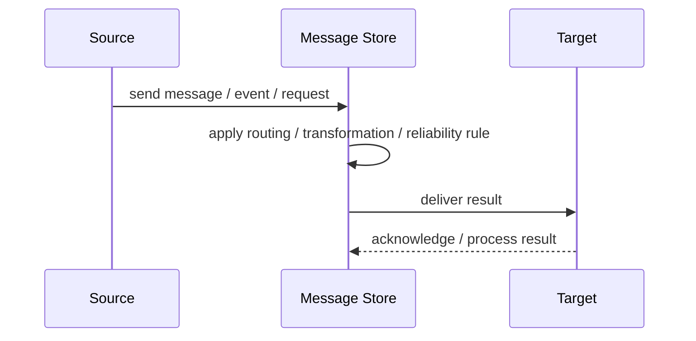
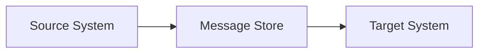

# Message Store

## Core Idea

A Message Store persists messages for auditing, replay, debugging, or recovery.

---

## Problem It Solves

Messages passing through the system need to be retained instead of disappearing after delivery.

---

## 3 Concrete Examples

### Example 1: Audit Trail

Every payment event is stored for compliance.

### Example 2: Replay Support

Events are stored so projections can be rebuilt.

### Example 3: Debugging Integration Failures

Inbound and outbound messages are stored for diagnosis.

---

## Architect Questions

- Which messages need to be stored?
- Is the store for audit, replay, or debugging?
- How long are messages retained?
- Can sensitive data be stored?
- How are stored messages searched?
- Can messages be replayed safely?

---

## Main Diagram



---

## Runtime / Responsibility Flow



---

## Implementation Shape

```txt
1. Identify the integration problem: delivery, routing, transformation, ordering, correlation, reliability, or decoupling.
2. Define the message contract: fields, schema, headers, metadata, IDs, and versioning.
3. Define the channel: queue, topic, stream, bus, broker, or direct integration.
4. Define failure behavior: retries, dead letters, timeouts, duplicates, replay, and poison messages.
5. Define ownership: who owns schemas, topics, routing rules, and operational support.
6. Add observability: correlation IDs, logs, metrics, tracing, message age, consumer lag, and DLQ alerts.
7. Keep the pattern focused. Do not hide unclear business workflow inside messaging infrastructure.
```

---

## When to Use

- Messages need audit, replay, or debugging.
- Retention and search are required.
- Stored messages can be secured properly.

---

## When Not to Use

- Message retention creates privacy or compliance risk.
- Messages are huge and storage is unjustified.
- No one needs audit or replay.

---

## Common Smell That Suggests This Pattern

```txt
Systems are becoming tightly coupled through point-to-point calls,
message formats do not match,
consumers need asynchronous decoupling,
or failures are being lost instead of handled.
```

---

## Common Mistakes

```txt
Using messaging when a simple direct call is clearer.

Forgetting idempotency.

Ignoring duplicate messages.

Ignoring ordering and correlation.

Letting messages become undocumented contracts.

Treating the broker as magic instead of designing failure behavior.

Putting business rules in routing glue where nobody owns them.
```

---

## Best Visual Summary



## Final Meaning

Message Store is useful when it solves a real integration pressure. If the integration problem is simple, adding messaging machinery can make the system harder to understand.
