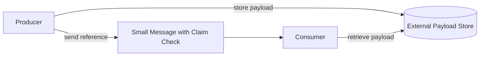
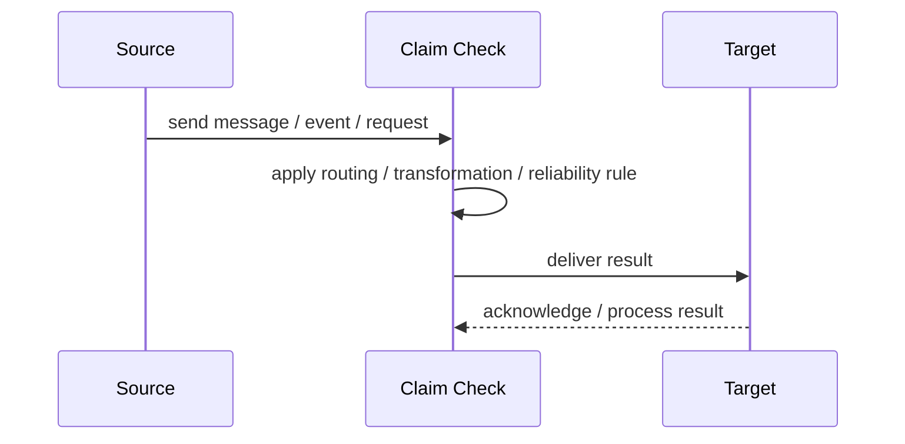
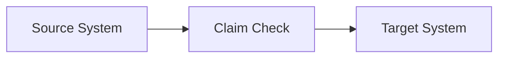

# Claim Check

## Core Idea

Claim Check stores large message payloads externally and sends only a reference through the messaging system.

---

## Problem It Solves

Messages are too large or sensitive to send directly through the broker.

---

## 3 Concrete Examples

### Example 1: Large Document Processing

The document is stored in object storage and the message carries a file reference.

### Example 2: Medical Image Workflow

Large images stay in secure storage while messages carry claim IDs.

### Example 3: Batch Import

A large CSV is stored externally and processing messages reference it.

---

## Architect Questions

- Where is the large payload stored?
- What reference is included in the message?
- Who can access the payload?
- How long should the payload be retained?
- What happens if the payload is missing?
- How is cleanup handled?

---

## Main Diagram



---

## Runtime / Responsibility Flow



---

## Implementation Shape

```txt
1. Identify the integration problem: delivery, routing, transformation, ordering, correlation, reliability, or decoupling.
2. Define the message contract: fields, schema, headers, metadata, IDs, and versioning.
3. Define the channel: queue, topic, stream, bus, broker, or direct integration.
4. Define failure behavior: retries, dead letters, timeouts, duplicates, replay, and poison messages.
5. Define ownership: who owns schemas, topics, routing rules, and operational support.
6. Add observability: correlation IDs, logs, metrics, tracing, message age, consumer lag, and DLQ alerts.
7. Keep the pattern focused. Do not hide unclear business workflow inside messaging infrastructure.
```

---

## When to Use

- Payloads are too large or sensitive for the broker.
- External payload storage is available.
- Consumers can retrieve payloads by reference.

---

## When Not to Use

- Payloads are small.
- Consumers cannot access external storage.
- Reference lifecycle and cleanup are unclear.

---

## Common Smell That Suggests This Pattern

```txt
Systems are becoming tightly coupled through point-to-point calls,
message formats do not match,
consumers need asynchronous decoupling,
or failures are being lost instead of handled.
```

---

## Common Mistakes

```txt
Using messaging when a simple direct call is clearer.

Forgetting idempotency.

Ignoring duplicate messages.

Ignoring ordering and correlation.

Letting messages become undocumented contracts.

Treating the broker as magic instead of designing failure behavior.

Putting business rules in routing glue where nobody owns them.
```

---

## Best Visual Summary



## Final Meaning

Claim Check is useful when it solves a real integration pressure. If the integration problem is simple, adding messaging machinery can make the system harder to understand.
