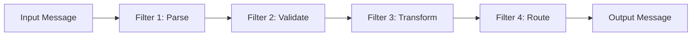
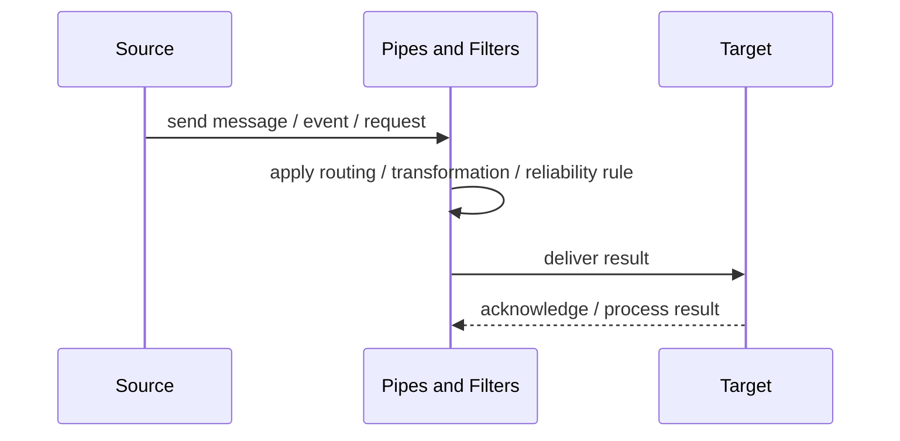
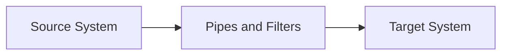

# Pipes and Filters

## Core Idea

Pipes and Filters decomposes message processing into independent filters connected by pipes.

---

## Problem It Solves

A message must pass through multiple transformation or processing steps that should be reusable and independently testable.

---

## 3 Concrete Examples

### Example 1: ETL Processing

Extracted data is validated, normalized, enriched, and loaded.

### Example 2: Order Import Pipeline

Incoming orders are parsed, validated, translated, routed, and stored.

### Example 3: Telemetry Pipeline

Raw telemetry is filtered, aggregated, enriched, and written to storage.

---

## Architect Questions

- What are the processing stages?
- What message format flows between filters?
- Can filters be reused?
- Does filter order matter?
- How are errors handled between filters?
- Can filters run independently or in parallel?

---

## Main Diagram



---

## Runtime / Responsibility Flow



---

## Implementation Shape

```txt
1. Identify the integration problem: delivery, routing, transformation, ordering, correlation, reliability, or decoupling.
2. Define the message contract: fields, schema, headers, metadata, IDs, and versioning.
3. Define the channel: queue, topic, stream, bus, broker, or direct integration.
4. Define failure behavior: retries, dead letters, timeouts, duplicates, replay, and poison messages.
5. Define ownership: who owns schemas, topics, routing rules, and operational support.
6. Add observability: correlation IDs, logs, metrics, tracing, message age, consumer lag, and DLQ alerts.
7. Keep the pattern focused. Do not hide unclear business workflow inside messaging infrastructure.
```

---

## When to Use

- Processing can be split into stages.
- Filters should be reusable or testable.
- Data transformation pipeline is natural.

---

## When Not to Use

- Processing requires heavy shared mutable state.
- Steps are tightly coupled.
- A simple function is enough.

---

## Common Smell That Suggests This Pattern

```txt
Systems are becoming tightly coupled through point-to-point calls,
message formats do not match,
consumers need asynchronous decoupling,
or failures are being lost instead of handled.
```

---

## Common Mistakes

```txt
Using messaging when a simple direct call is clearer.

Forgetting idempotency.

Ignoring duplicate messages.

Ignoring ordering and correlation.

Letting messages become undocumented contracts.

Treating the broker as magic instead of designing failure behavior.

Putting business rules in routing glue where nobody owns them.
```

---

## Best Visual Summary



## Final Meaning

Pipes and Filters is useful when it solves a real integration pressure. If the integration problem is simple, adding messaging machinery can make the system harder to understand.
