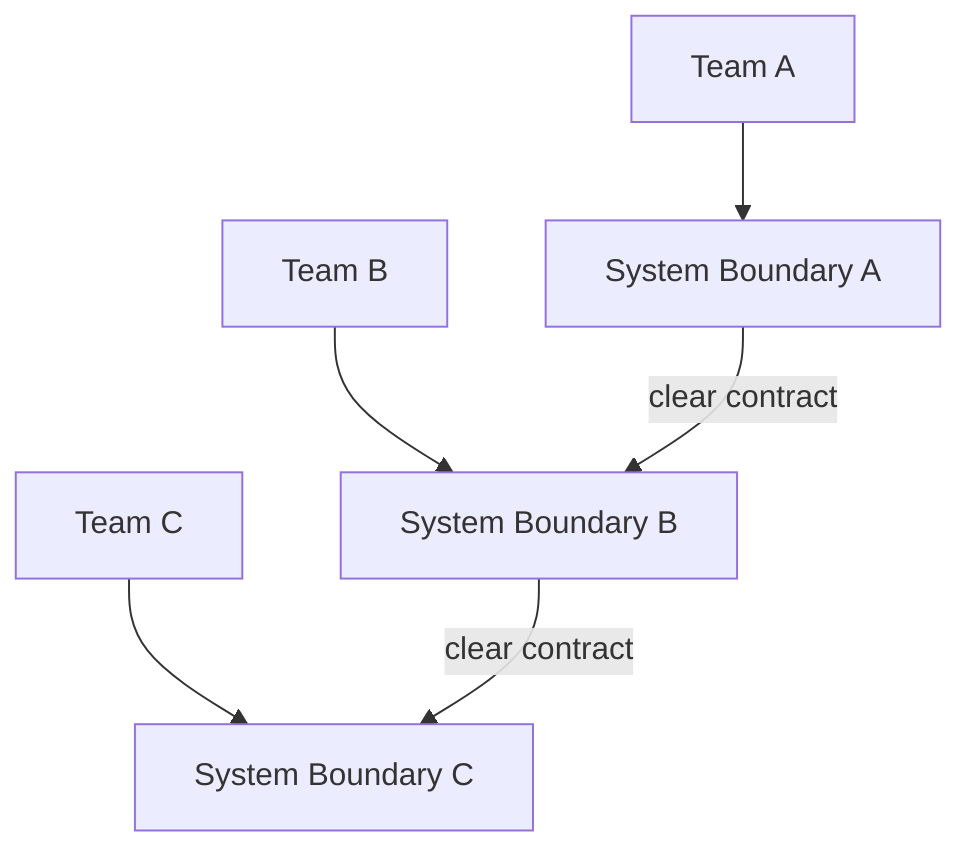
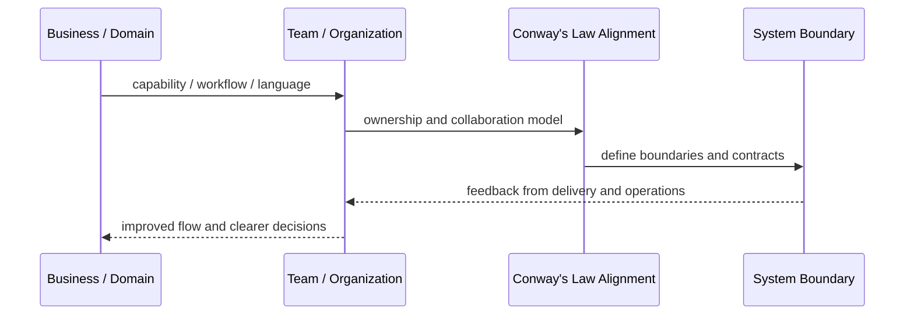

# Conway's Law Alignment

## Core Idea

Conway's Law Alignment designs system boundaries to match the communication structure and ownership model of the organization.

---

## Problem It Solves

Architecture fights the organization: teams constantly coordinate across unclear boundaries, creating slow delivery and tangled systems.

---

## 3 Concrete Examples

### Example 1: Checkout Team Owns Checkout Boundary

A dedicated checkout team owns checkout UI, checkout API, payment coordination, and checkout reliability instead of splitting work across many unrelated teams.

### Example 2: Platform Boundary Mirrors Platform Team

A platform team owns shared CI/CD, observability, deployment templates, and developer tooling used by product teams.

### Example 3: Avoid Split Ownership Service

A service used by five teams but owned by none is redesigned into clear team-owned capabilities.

---

## Architect Questions

- Which teams own which business capabilities?
- Does the software architecture match communication paths?
- Where do teams block each other?
- Which services or modules have unclear ownership?
- Are team boundaries causing architectural coupling?
- Should the organization change, the architecture change, or both?

---

## Main Diagram



---

## Runtime / Systems Thinking Flow



---

## Implementation Shape

```txt
1. Identify the systems problem: unclear ownership, overloaded teams, confused language, duplicated capabilities, or legacy contamination.
2. Map the business domain, value streams, teams, and current system boundaries.
3. Identify mismatches between team structure, domain boundaries, and software architecture.
4. Define ownership boundaries and collaboration contracts.
5. Decide what changes: teams, modules, services, platform capabilities, shared services, or integration boundaries.
6. Add feedback loops: delivery lead time, handoff count, incident ownership, cognitive load, dependency wait time, and customer impact.
7. Keep the pattern strategic. Do not turn systems thinking into diagrams nobody uses.
```

---

## When to Use

- Team communication is slowing delivery.
- Architecture boundaries and team ownership do not match.
- Services/modules have unclear owners.

---

## When Not to Use

- The organization cannot change and architecture changes alone will not help.
- The system is tiny and owned by one team.
- Boundaries are drawn politically instead of around flow.

---

## Common Smell That Suggests This Pattern

```txt
Delivery is slow not because engineers are weak,
but because ownership, language, team boundaries,
business capabilities, and software boundaries are misaligned.
```

---

## Common Mistakes

```txt
Drawing architecture without changing ownership.

Creating shared services that nobody truly owns.

Using DDD tactical patterns without understanding the domain.

Treating team topology as an org-chart rename.

Creating bounded contexts around technical layers instead of business language.

Letting legacy models leak into new systems.

Running workshops that produce sticky notes but no decisions.
```

---

## Best Visual Summary


## Final Meaning

Conway's Law Alignment is useful when it improves alignment between business reality, team ownership, and software boundaries. If it does not change decisions or ownership, it is just a diagram.
