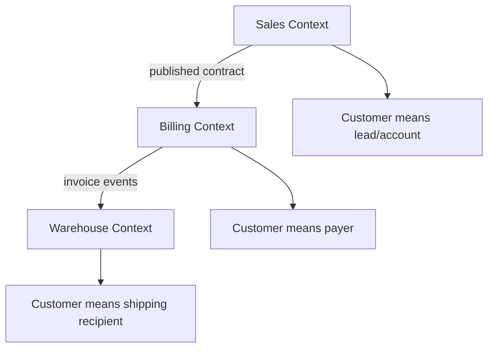
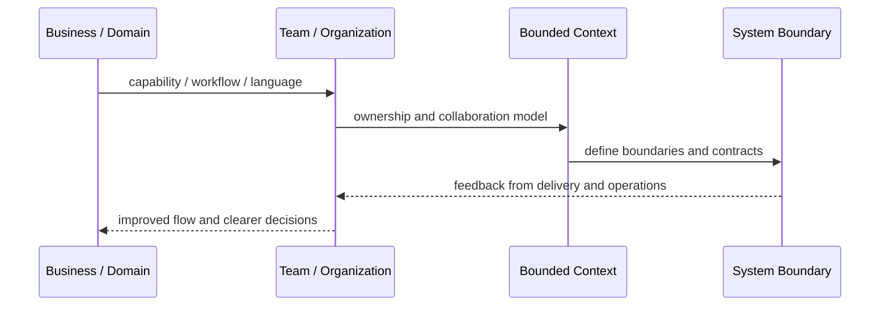
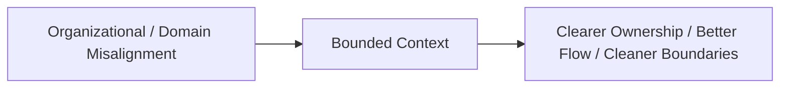

# Bounded Context

## Core Idea

Bounded Context defines a boundary where a domain model, language, and rules are internally consistent.

---

## Problem It Solves

Different parts of the business use the same words differently, causing confused models, bad integrations, and duplicated rules.

---

## 3 Concrete Examples

### Example 1: Customer in Sales vs Billing

Sales sees Customer as a lead/account relationship; Billing sees Customer as a payer with invoices and payment terms.

### Example 2: Product in Catalog vs Warehouse

Catalog owns product descriptions and marketing attributes; Warehouse owns SKU, stock location, and pickability.

### Example 3: Order in Checkout vs Fulfillment

Checkout sees order as purchase intent; Fulfillment sees order as work to pick, pack, and ship.

---

## Architect Questions

- Where does this business language apply?
- Do different teams mean different things by the same term?
- What model is valid inside this context?
- What concepts cross context boundaries?
- What integration contract is needed between contexts?
- Which context owns which rules and data?

---

## Main Diagram



---

## Runtime / Systems Thinking Flow



---

## Implementation Shape

```txt
1. Identify the systems problem: unclear ownership, overloaded teams, confused language, duplicated capabilities, or legacy contamination.
2. Map the business domain, value streams, teams, and current system boundaries.
3. Identify mismatches between team structure, domain boundaries, and software architecture.
4. Define ownership boundaries and collaboration contracts.
5. Decide what changes: teams, modules, services, platform capabilities, shared services, or integration boundaries.
6. Add feedback loops: delivery lead time, handoff count, incident ownership, cognitive load, dependency wait time, and customer impact.
7. Keep the pattern strategic. Do not turn systems thinking into diagrams nobody uses.
```

---

## When to Use

- Business terms mean different things in different areas.
- One model is becoming too large or contradictory.
- Team/domain boundaries need clarity.

---

## When Not to Use

- The model is simple and consistent everywhere.
- The team uses contexts as arbitrary folders.
- Boundaries are created without domain language differences.

---

## Common Smell That Suggests This Pattern

```txt
Delivery is slow not because engineers are weak,
but because ownership, language, team boundaries,
business capabilities, and software boundaries are misaligned.
```

---

## Common Mistakes

```txt
Drawing architecture without changing ownership.

Creating shared services that nobody truly owns.

Using DDD tactical patterns without understanding the domain.

Treating team topology as an org-chart rename.

Creating bounded contexts around technical layers instead of business language.

Letting legacy models leak into new systems.

Running workshops that produce sticky notes but no decisions.
```

---

## Best Visual Summary



## Final Meaning

Bounded Context is useful when it improves alignment between business reality, team ownership, and software boundaries. If it does not change decisions or ownership, it is just a diagram.
